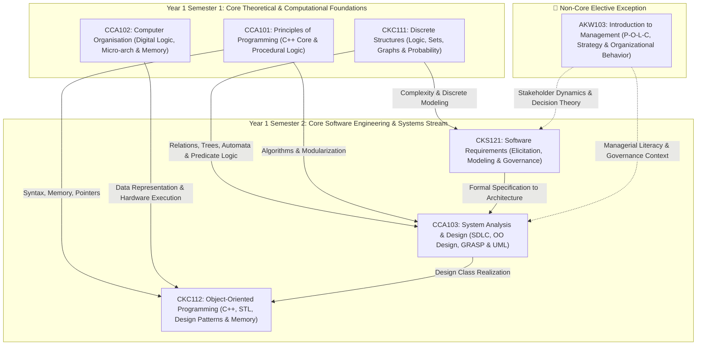
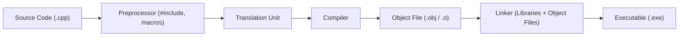
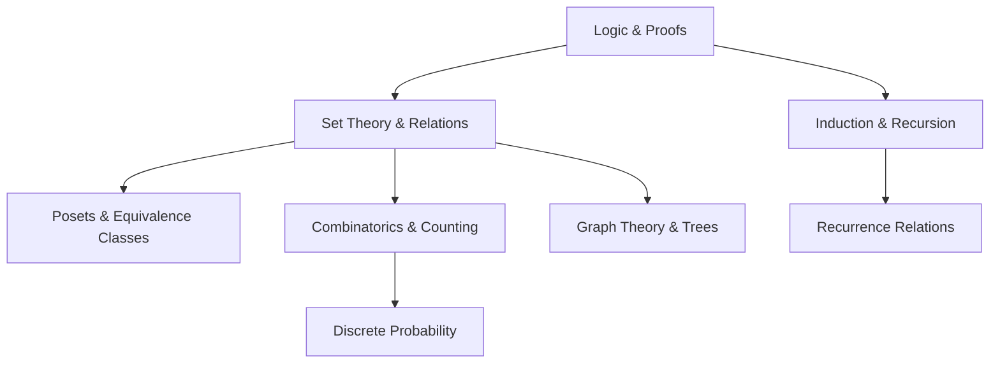
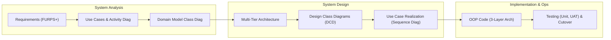
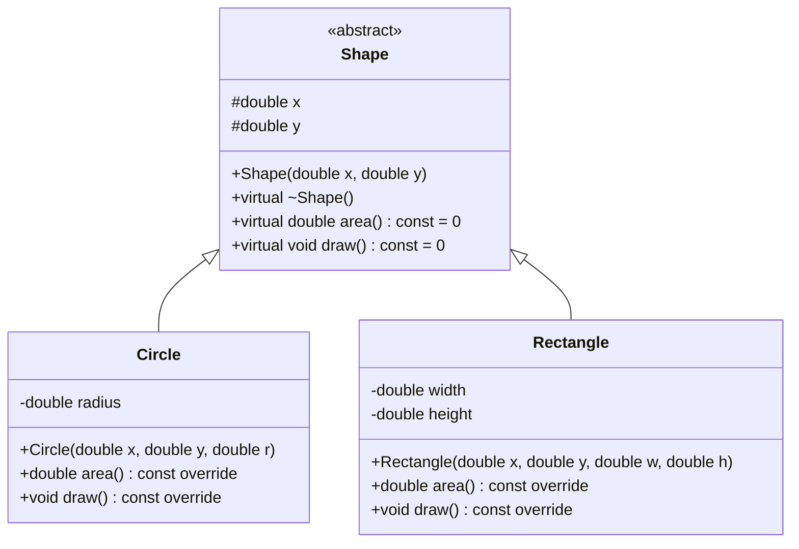
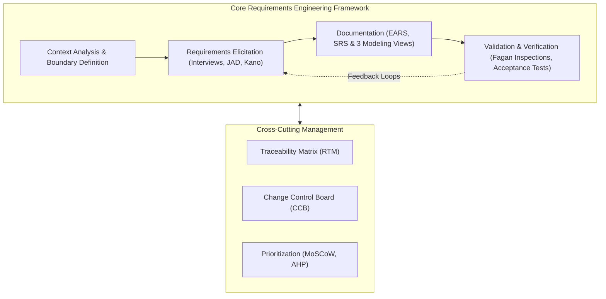
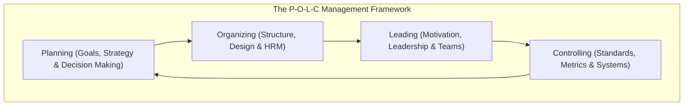
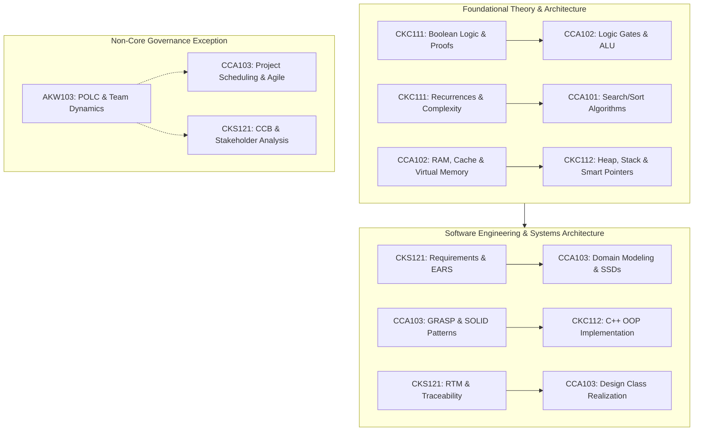

# 🧠 Year 1 Computer Science & Software Engineering Master Knowledge Base

> [!abstract] Overview & Navigation
> This master document provides a rigorous, interconnected synthesis of all knowledge learned across **Year 1 Semester 1 (Y1S1)** and **Year 1 Semester 2 (Y1S2)**.
> 
> Every section and topic in this document links directly into the exact chapters and sections of your original vault notes:
> 
> ### 💻 Core Computer Science & Software Engineering Curriculum:
> - **Y1S1 Core**:
>   - [[Y1S1/CCA101 Principle of Programming|CCA101: Principle of Programming]]
>   - [[Y1S1/CCA102 Computer Organisation|CCA102: Computer Organisation]]
>   - [[Y1S1/CKC111 Discrete Structures|CKC111: Discrete Structures]]
> - **Y1S2 Core**:
>   - [[Y1S2/CKC112 Object Oriented Programming|CKC112: Object Oriented Programming]]
>   - [[Y1S2/CCA103 System Analysis and Design|CCA103: System Analysis and Design]]
>   - [[Y1S2/CKS121 Software Requirements|CKS121: Software Requirements]]
> 
> ---
> > [!warning] 🌟 Non-Core Course Exception
> > **[[Y1S2/AKW103 Introduction to Management|AKW103: Introduction to Management]]** is classified as a **Non-Core / Management Elective Exception**. While valuable for managerial literacy and team governance, it sits outside the core technical Computer Science & Software Engineering stream and is documented in its own dedicated section: [[#🌟 Non-Core Elective Exception AKW103 Introduction to Management|AKW103 Management Summary]].

---

## 🗺️ Academic Roadmap & Interdisciplinary Architecture



---

# 📘 Part I: Year 1 Semester 1 (Y1S1 Core)

---

## 1. 💻 [[Y1S1/CCA101 Principle of Programming|CCA101: Principle of Programming]]

Focuses on procedural problem solving, memory foundations, algorithm design, and core programming in C++.



### 1.1 [[Y1S1/CCA101 Principle of Programming#Introduction to Computers and Programming|Core Computation & Translation Pipeline]]
- **Hardware Architecture**: [[Y1S1/CCA101 Principle of Programming#Key Concepts & Definitions|CPU (Control Unit + ALU)]], [[Y1S1/CCA101 Principle of Programming#Key Concepts & Definitions|Main Memory (RAM: volatile, byte-addressable)]], Secondary Storage, and I/O devices.
- **Compilation Pipeline**: [[Y1S1/CCA101 Principle of Programming#Key Concepts & Definitions|From Source to Executable]]:
  1. *Preprocessor*: Resolves directives (`#include`, `#define`).
  2. *Compiler*: Translates C++ source code into machine instructions / object files (`.obj`/`.o`).
  3. *Linker*: Combines object files with system and C++ standard libraries into an executable (`.exe`).
- **Paradigms**: [[Y1S1/CCA101 Principle of Programming#Programming Paradigms|Procedural Programming]] (algorithms acting on data) vs [[Y1S1/CCA101 Principle of Programming#Programming Paradigms|Object-Oriented Programming (OOP)]] (encapsulated data and operations).

### 1.2 [[Y1S1/CCA101 Principle of Programming#Introduction to C++|C++ Data Representation & Type System]]
- **Program Anatomy**: [[Y1S1/CCA101 Principle of Programming#Parts of a C++ Program|Headers, Namespaces, `main()` entry point, output streams, return codes]].
- **Type Primitives**:
  - *Integral Types*: [[Y1S1/CCA101 Principle of Programming#Integer Data Types|`short` (2B), `int` (4B), `long` (4B/8B), `long long` (8B), signed vs unsigned]].
  - *Character Type*: [[Y1S1/CCA101 Principle of Programming#Character Data Type (`char`)|`char` (1B ASCII byte)]].
  - *Floating-Point*: [[Y1S1/CCA101 Principle of Programming#Floating-Point Data Types|`float` (4B), `double` (8B), `long double`]].
  - *Boolean & String*: [[Y1S1/CCA101 Principle of Programming#The `bool` Data Type|`bool` (`true`/`false`)]], [[Y1S1/CCA101 Principle of Programming#The `string` Class|`std::string` class vs C-strings (null-terminated `\0`)]].
- **Type Conversion & Coercion**: [[Y1S1/CCA101 Principle of Programming#Mathematical Expressions|Promotion, Demotion, and Explicit Type Casting]].
- **Scope & Constants**: [[Y1S1/CCA101 Principle of Programming#Scope|Local vs Global Variable Scope]] and [[Y1S1/CCA101 Principle of Programming#Comments & Style|Named Constants (`const`)]].

### 1.3 [[Y1S1/CCA101 Principle of Programming#Expressions and Interactivity|Interactivity, Formatting & Math]]
- **Stream I/O**: [[Y1S1/CCA101 Principle of Programming#The `cin` Object|Standard Input (`cin >>`)]], [[Y1S1/CCA101 Principle of Programming#Working with Characters and Strings|`cin.get()`, `getline(cin, str)`, and `cin.ignore()`]].
- **Stream Formatting**: [[Y1S1/CCA101 Principle of Programming#Formatting Output|`<iomanip>` manipulators (`setw`, `setprecision`, `fixed`, `showpoint`, `left`, `right`)]].
- **Mathematical Functions**: [[Y1S1/CCA101 Principle of Programming#Mathematical Library Functions|`<cmath>` library (`pow`, `sqrt`, `sin`, `cos`, `log`, `abs`)]].

### 1.4 [[Y1S1/CCA101 Principle of Programming#Making Decisions (Selection Structures)|Selection Structures & Decision Making]]
- **Relational & Logical Operations**: [[Y1S1/CCA101 Principle of Programming#Relational Operators|Relational operators]] and [[Y1S1/CCA101 Principle of Programming#Logical Operators|Logical operators (`&&`, `||`, `!`) with Short-Circuit evaluation]].
- **Branching Statements**: [[Y1S1/CCA101 Principle of Programming#The `if` Statement|`if`]], [[Y1S1/CCA101 Principle of Programming#The `if/else` Statement|`if/else`]], [[Y1S1/CCA101 Principle of Programming#Nested `if` Statements|Nested `if` & `if-else if` ladders]].
- **Ternary Operator**: [[Y1S1/CCA101 Principle of Programming#The Conditional Operator (`?:`)|Conditional ternary operator `?:`]].
- **Switch Selection**: [[Y1S1/CCA101 Principle of Programming#The `switch` Statement|`switch-case` with strict `break` and `default` branch]].
- **Design Patterns**: [[Y1S1/CCA101 Principle of Programming#Menus|Interactive Menus]] and [[Y1S1/CCA101 Principle of Programming#Validating User Input|Defensive Input Validation]].

### 1.5 [[Y1S1/CCA101 Principle of Programming#Loops|Repetition Structures & Loop Mechanics]]
- **Loop Types**: [[Y1S1/CCA101 Principle of Programming#The `while` Loop|`while` (pre-test)]], [[Y1S1/CCA101 Principle of Programming#The `do-while` Loop|`do-while` (post-test)]], and [[Y1S1/CCA101 Principle of Programming#The `for` Loop|`for` (count-controlled)]].
- **Loop Control & Patterns**: [[Y1S1/CCA101 Principle of Programming#Running Totals & Accumulators|Accumulators & Running Totals]], [[Y1S1/CCA101 Principle of Programming#Sentinels|Sentinel-controlled loops]], [[Y1S1/CCA101 Principle of Programming#Nested Loops|Nested loops]], and [[Y1S1/CCA101 Principle of Programming#Breaking and Continuing|`break` & `continue` statements]].

### 1.6 [[Y1S1/CCA101 Principle of Programming#File Processing|File Stream Processing]]
- **File Streams**: [[Y1S1/CCA101 Principle of Programming#Setting Up File Stream Objects|`ifstream` (input), `ofstream` (output), `fstream` (bi-directional)]].
- **Lifecycle & Validation**: [[Y1S1/CCA101 Principle of Programming#Opening and Closing Files|Opening/closing files]], [[Y1S1/CCA101 Principle of Programming#Detecting the End of the File|Testing stream state (`is_open()`, `fail()`, `eof()`)]], and [[Y1S1/CCA101 Principle of Programming#Passing File Stream Objects to Functions|Passing streams by reference `&` to functions]].

### 1.7 [[Y1S1/CCA101 Principle of Programming#Computational Thinking|Computational Thinking Framework]]
- **Four Pillars**: [[Y1S1/CCA101 Principle of Programming#Four Pillars of Computational Thinking|Decomposition, Pattern Recognition, Abstraction, and Algorithm Design]].
- **Specification Tools**: [[Y1S1/CCA101 Principle of Programming#Flowcharts and Pseudocode|Flowcharts (standard ANSI symbols) and Pseudocode conventions]].

### 1.8 [[Y1S1/CCA101 Principle of Programming#Functions|Modular Programming & Functions]]
- **Function Architecture**: [[Y1S1/CCA101 Principle of Programming#Function Prototypes|Function prototypes]], [[Y1S1/CCA101 Principle of Programming#Defining and Calling Functions|Definitions]], and [[Y1S1/CCA101 Principle of Programming#The return Statement and Returning a Value|Return statements]].
- **Parameter Passing**:
  - *Pass-by-Value*: [[Y1S1/CCA101 Principle of Programming#Passing Data by Value|Copies value into local function stack frame]].
  - *Pass-by-Reference*: [[Y1S1/CCA101 Principle of Programming#Passing by Reference|Direct memory aliasing via `Type &var`]].
  - *Default Arguments*: [[Y1S1/CCA101 Principle of Programming#Default Arguments|Parameters with default values assigned in prototypes]].
- **Variable Lifetime**: [[Y1S1/CCA101 Principle of Programming#Local and Global Variables|Automatic stack duration]] vs [[Y1S1/CCA101 Principle of Programming#Static Local Variables|`static` local variables]].
- **Function Overloading**: [[Y1S1/CCA101 Principle of Programming#Overloading Functions|Overloaded function signatures resolved at compile time]].

### 1.9 [[Y1S1/CCA101 Principle of Programming#Arrays|Arrays, Searching & Sorting Algorithms]]
- **1D & 2D Array Structures**: [[Y1S1/CCA101 Principle of Programming#Arrays Hold Multiple Values|Contiguous array memory layout]], [[Y1S1/CCA101 Principle of Programming#Accessing Array Elements|Subscript bounds]], and [[Y1S1/CCA101 Principle of Programming#Two-Dimensional Arrays|Row-major 2D arrays]].
- **Passing Arrays**: [[Y1S1/CCA101 Principle of Programming#Arrays as Function Arguments|Array decay to pointer (`Type*`)]].
- **C++11 Features**: [[Y1S1/CCA101 Principle of Programming#The Range-Based for Loop (C++11)|Range-based `for (auto& item : arr)` loops]].
- **Algorithms**: Linear search, binary search, bubble sort, selection sort.

### 1.10 [[Y1S1/CCA101 Principle of Programming#Pointers|Pointers & Dynamic Memory Foundations]]
- **Pointer Mechanics**: [[Y1S1/CCA101 Principle of Programming#The Address Operator (&)|Address-of operator (`&`)]], [[Y1S1/CCA101 Principle of Programming#Pointer Variables (*)|Dereference operator (`*`)]], and [[Y1S1/CCA101 Principle of Programming#Pointer Arithmetic|Pointer arithmetic offset calculations]].
- **Pointer-Array Equivalence**: [[Y1S1/CCA101 Principle of Programming#The Relationship Between Arrays and Pointers|`arr[i]` $\equiv$ `*(arr + i)`]].
- **Dynamic Allocation**: [[Y1S1/CCA101 Principle of Programming#Dynamic Memory Allocation (new and delete)|Heap allocation with `new` and deallocation with `delete` / `delete[]`]].
- **Hazards**: Memory leaks, dangling pointers, double freeing.

---

## 2. 🖥️ [[Y1S1/CCA102 Computer Organisation|CCA102: Computer Organisation]]

Explores computer architecture, digital logic, processor internals, instruction sets, cache hierarchies, virtual memory, and multiprocessing.

```mermaid
flowchart TD
    subgraph CPU ["Central Processing Unit"]
        CU["Control Unit"]
        ALU["Arithmetic Logic Unit"]
        Regs["Registers (PC, IR, MAR, MBR, AC)"]
    end
    subgraph Mem ["Memory Hierarchy"]
        L1["L1 / L2 / L3 Cache"]
        RAM["Main Memory (DRAM)"]
        Disk["Secondary Storage"]
    end
    CPU <-->|System Bus (Control, Address, Data)| L1
    L1 <--> RAM
    RAM <--> Disk
```

### 2.1 [[Y1S1/CCA102 Computer Organisation#Topic 1: Introduction to Computer Organisation and Architecture|Organisation vs Architecture & Von Neumann Foundations]]
- **Architecture vs Organisation**: Architectural attributes visible to programmer (ISA) vs operational units and hardware interconnections (micro-architecture).
- **Von Neumann Machine (IAS)**: Stored-program concept; components include MAR, MBR, PC, IR, IBR, AC, and MQ.
- **Generations & Law**: Vacuum tubes $\to$ Transistors $\to$ Integrated Circuits (VLSI/ULSI); Moore's Law.

### 2.2 [[Y1S1/CCA102 Computer Organisation#Topic 2: Number Systems|Number Systems & Integer Representation]]
- **Base Conversions**: Binary, Octal, Decimal, and Hexadecimal.
- **Signed Integer Representation**: Signed-magnitude, One's complement, Two's complement (Range: $[-2^{n-1}, 2^{n-1}-1]$).
- **Overflow Detection**: Arithmetic overflow occurs when the carry into the sign bit differs from the carry out of the sign bit.

### 2.3 [[Y1S1/CCA102 Computer Organisation#Topic 3: Computer Arithmetic|Computer Arithmetic & IEEE 754 Floating-Point]]
- **Multiplication & Division**:
  - *Booth's Algorithm*: Speeds up signed two's complement multiplication by encoding consecutive blocks of 1s.
  - *Restoring & Non-Restoring Division*: Iterative quotient and remainder generation.
- **IEEE 754 Standard**:
  $$V = (-1)^S \times (1.M) \times 2^{E - \text{Bias}}$$
  - *Single Precision (32-bit)*: $S = 1\text{b}$, $E = 8\text{b}$ ($\text{Bias} = 127$), $M = 23\text{b}$.
  - *Double Precision (64-bit)*: $S = 1\text{b}$, $E = 11\text{b}$ ($\text{Bias} = 1023$), $M = 52\text{b}$.
  - *Special Values*: $\pm 0$, $\pm \infty$, $\text{NaN}$ (Not a Number), and Denormalized numbers.

### 2.4 [[Y1S1/CCA102 Computer Organisation#Topic 4: Digital Logic|Digital Logic, Gates & Karnaugh Maps]]
- **Boolean Algebra**: Identities, De Morgan's laws, and Universal Gates (NAND / NOR).
- **Karnaugh Maps (K-Maps)**: SOP and POS logic simplification using 2, 3, and 4-variable Gray code adjacency.
- **Circuits**:
  - *Combinational*: Half/Full Adders, Decoders, Encoders, Multiplexers (MUX).
  - *Sequential*: Latches, Flip-Flops (SR, D, JK, T), Registers, Counters.

### 2.5 [[Y1S1/CCA102 Computer Organisation#Topic 5: Addressing and Instruction Set Characteristics & Functions|Instruction Set Architecture (ISA) & Data Types]]
- **Instruction Fields**: Opcode, Source Operand Reference, Result Operand Reference, Next Instruction Reference.
- **Endianness**: Big-Endian (Most Significant Byte at lowest address) vs Little-Endian (Least Significant Byte at lowest address).

### 2.6 [[Y1S1/CCA102 Computer Organisation#Topic 6: Addressing Modes and Instruction Formats|Addressing Modes & Formats]]
- **Core Addressing Modes**: Immediate, Direct, Indirect, Register, Register Indirect, Displacement (Relative, Base-Register, Indexing), and Stack.
- **RISC vs CISC**:
  - *CISC (Complex Instruction Set)*: Variable-length instructions, rich addressing modes, multi-cycle execution.
  - *RISC (Reduced Instruction Set)*: Fixed-length instructions, load-store architecture, single-cycle pipelined execution.

### 2.7 [[Y1S1/CCA102 Computer Organisation#Topic 7: Central Processing Unit|CPU Structure, Instruction Cycles & Pipelining]]
- **Register Set**: User-Visible Registers (Data, Address, Flags) and Control/Status Registers (PC, IR, MAR, MBR, PSW).
- **Instruction Cycle**: Fetch $\to$ Indirect $\to$ Execute $\to$ Interrupt.
- **Pipelining & Hazards**:
  - *Structural Hazards*: Hardware resource conflicts.
  - *Data Hazards*: RAW (Read After Write), WAR (Write After Read), WAW (Write After Write); mitigated via forwarding and stalling.
  - *Control Hazards*: Branching instructions; mitigated via static/dynamic branch prediction and Branch Target Buffers (BTB).

### 2.8 [[Y1S1/CCA102 Computer Organisation#Topic 8: Control Unit|Control Unit: Hardwired vs Microprogrammed]]
- **Micro-Operations**: Elementary CPU operations occurring during each clock cycle.
- **Implementation Types**:
  - *Hardwired Control*: Combinational logic gates and state flip-flops; ultra-fast but inflexible.
  - *Microprogrammed Control*: Control words stored in Control Memory ROM. Horizontal (wide, high parallelism) vs Vertical (encoded, narrow).

### 2.9 [[Y1S1/CCA102 Computer Organisation#Topic 9: Interfacing and Communication|I/O Interfacing, Interrupts & DMA]]
- **I/O Techniques**: Programmed I/O (polling), Interrupt-Driven I/O (daisy chain / vectored), Direct Memory Access (DMA: cycle stealing).
- **RAID Configurations**: RAID 0 (Striping), RAID 1 (Mirroring), RAID 5 (Block-level distributed parity), RAID 6 (Dual parity).

### 2.10 [[Y1S1/CCA102 Computer Organisation#Topic 10: Memory Systems|Semiconductor Memory & Error Correction]]
- **Memory Types**: SRAM (cache, 6 transistors, fast) vs DRAM (main memory, 1 transistor + 1 capacitor, requires periodic refresh).
- **ROM Types**: ROM, PROM, EPROM, EEPROM, Flash Memory.
- **Error Correction**: Hamming SEC-DED (Single Error Correction, Double Error Detection) codes.

### 2.11 [[Y1S1/CCA102 Computer Organisation#Topic 11: Cache Memory Architecture|Cache Memory Architecture]]
- **Principles of Locality**: Temporal Locality and Spatial Locality.
- **Cache Mapping Functions**:
  - *Direct Mapping*: Line $= \text{Block} \pmod m$.
  - *Fully Associative Mapping*: Block placed in any line; parallel tag comparison.
  - *$K$-Way Set Associative*: Set $= \text{Block} \pmod S$.
- **Write Policies**: Write-Through vs Write-Back (with Dirty Bit); Write-Allocate vs No-Write-Allocate.
- **Replacement Policies**: LRU (Least Recently Used), FIFO, LFU, Random.

### 2.12 [[Y1S1/CCA102 Computer Organisation#Topic 12: Memory Management and Virtual Memory|Memory Management & Virtual Memory]]
- **Virtual Memory Architecture**: Paging, Page Tables, Page Faults, and Translation Lookaside Buffer (TLB).
- **Page Replacement**: FIFO, Optimal, LRU, Clock Policy; Thrashing dynamics.

### 2.13 [[Y1S1/CCA102 Computer Organisation#Topic 13: Multiprocessor Organisation|Multiprocessor Systems & Cache Coherence]]
- **Flynn's Taxonomy**: SISD, SIMD, MISD, MIMD.
- **Symmetric Multiprocessing (SMP) & MESI Protocol**: Cache states:
  - **M** (Modified): Dirty, exclusive.
  - **E** (Exclusive): Clean, exclusive.
  - **S** (Shared): Clean, shared across multiple caches.
  - **I** (Invalid): Stale line.
- **Architectures**: NUMA (Non-Uniform Memory Access), Clusters, and Multicore Organizations.

---

## 3. 📐 [[Y1S1/CKC111 Discrete Structures|CKC111: Discrete Structures]]

Mathematical foundations of computation: logic, proof methods, set theory, relations, combinatorics, graph theory, trees, and probability.



### 3.1 [[Y1S1/CKC111 Discrete Structures#📖 Chapter 1: Logic and Proofs|Logic, Inference Rules & Proof Methods]]
- **Propositional Logic**: Truth tables, connectives ($\neg, \wedge, \vee, \oplus, \to, \leftrightarrow$), tautologies, contradictions, and De Morgan's laws.
- **Predicate Logic**: Quantifiers ($\forall, \exists$), nested quantification, and negation rules.
- **Inference Rules**: Modus Ponens, Modus Tollens, Hypothetical Syllogism, Disjunctive Syllogism, Resolution.
- **Proof Techniques**: Direct Proof, Proof by Contraposition ($p \to q \iff \neg q \to \neg p$), Proof by Contradiction ($p \wedge \neg q \to \mathbf{F}$), Proof by Cases, Existence & Uniqueness proofs.

### 3.2 [[Y1S1/CKC111 Discrete Structures#💻 Chapter 2: Algorithm Examples|Algorithm Analysis & Asymptotic Complexity]]
- **Algorithm Properties**: Definiteness, Correctness, Finiteness, Input/Output.
- **Searching & Sorting**: Linear Search ($O(n)$), Binary Search ($O(\log n)$), Bubble Sort ($O(n^2)$), Insertion Sort ($O(n^2)$).
- **Asymptotic Notation**: Big-$O$ (upper bound), Big-$\Omega$ (lower bound), Big-$\Theta$ (tight bound).

### 3.3 [[Y1S1/CKC111 Discrete Structures#🔗 Chapter 3: Relations|Relations, Posets & Equivalence Classes]]
- **Relation Properties**: Reflexive, Symmetric, Antisymmetric, Transitive.
- **Closures & Warshall's Algorithm**: Reflexive closure, Symmetric closure, Transitive closure ($W = M_R \vee M_R^{[2]} \vee \dots \vee M_R^{[n]}$).
- **Equivalence Relations**: Relations that are Reflexive, Symmetric, and Transitive (partitions set into disjoint equivalence classes).
- **Partial Orderings (Posets)**: Relations that are Reflexive, Antisymmetric, and Transitive; visual representation via **Hasse Diagrams** and Topological Sorting.

### 3.4 [[Y1S1/CKC111 Discrete Structures#🕸️ Chapter 4: Graphs|Graph Theory & Network Traversal]]
- **Graph Fundamentals**: Directed vs Undirected, Simple graphs, Multigraphs, Vertex Degrees.
- **The Handshaking Theorem**:
  $$\sum_{v \in V} \deg(v) = 2|E|$$
- **Special Graph Classes**: Complete graphs $K_n$, Cycles $C_n$, Wheels $W_n$, Bipartite graphs $K_{m,n}$, Hall's Marriage Theorem.
- **Traversals & Theorems**:
  - *Eulerian Circuits/Paths*: Traverses every edge exactly once (exists iff connected and all/two vertices have even degree).
  - *Hamiltonian Cycles/Paths*: Visits every vertex exactly once (Dirac's and Ore's Theorems).
  - *Dijkstra's Algorithm*: Shortest path in weighted graphs with non-negative edges ($O(|E| + |V| \log |V|)$).
  - *Planar Graphs & Coloring*: Euler's Formula ($V - E + F = 2$), Kuratowski's Theorem ($K_5, K_{3,3}$ homeomorphisms), Chromatic Number $\chi(G)$, Four Color Theorem.

### 3.5 [[Y1S1/CKC111 Discrete Structures#🌳 Chapter 5: Trees|Trees, Search Structures & Spanning Algorithms]]
- **Tree Axioms**: An undirected graph of $n$ vertices is a tree iff it is connected and has $n-1$ edges.
- **Traversals**: Pre-order, In-order, Post-order.
- **Binary Search Trees (BST)**: Ordered insertion and lookup properties.
- **Minimum Spanning Trees (MST)**:
  - *Prim's Algorithm*: Grows tree from starting node vertex-by-vertex.
  - *Kruskal's Algorithm*: Greedily adds minimum weight edges avoiding cycles using Union-Find.

### 3.6 [[Y1S1/CKC111 Discrete Structures#🔢Chapter 6: Basic Structures|Sets, Functions, Sequences & Matrices]]
- **Set Operations**: Union, Intersection, Difference, Symmetric Difference, Cartesian Product ($A \times B$), Power Set ($|\mathcal{P}(A)| = 2^{|A|}$).
- **Function Properties**: Injective (One-to-One), Surjective (Onto), Bijective (Invertible), Composition ($f \circ g$).
- **Boolean Matrix Operations**: Matrix Join ($\vee$), Meet ($\wedge$), Boolean Product ($\odot$).

### 3.7 [[Y1S1/CKC111 Discrete Structures#🔄 Chapter 7: Induction and Recursion|Induction, Recursion & Structural Proofs]]
- **Mathematical Induction**: Base Step $\to$ Inductive Hypothesis $\to$ Inductive Step.
- **Strong Induction & Structural Induction**: Proving recursively defined sets and trees.
- **Divide-and-Conquer Recurrences**: Merge Sort analysis and the Master Theorem.

### 3.8 [[Y1S1/CKC111 Discrete Structures#🎲 Chapter 8: Counting|Combinatorics & Counting Principles]]
- **Fundamental Principles**: Product Rule, Sum Rule, Subtraction Rule, Division Rule.
- **Pigeonhole Principle (PHP)**: If $N$ objects occupy $k$ bins, at least one bin holds $\lceil N/k \rceil$ objects.
- **Permutations & Combinations**:
  - Permutations: $P(n, r) = \frac{n!}{(n-r)!}$
  - Combinations: $C(n, r) = \binom{n}{r} = \frac{n!}{r!(n-r)!}$
  - Combinations with Repetition: $\binom{n+r-1}{r}$ (Stars and Bars model).

### 3.9 [[Y1S1/CKC111 Discrete Structures#📈 Chapter 9: Advanced Counting Techniques|Recurrence Relations & Generating Functions]]
- **Linear Homogeneous Recurrence Relations**: Solving $a_n = c_1 a_{n-1} + c_2 a_{n-2}$ via the characteristic equation $r^2 - c_1 r - c_2 = 0$.
- **Principle of Inclusion-Exclusion (PIE)**: Calculating derangements ($D_n$) and surjective function counts.

### 3.10 [[Y1S1/CKC111 Discrete Structures#🎲 Chapter 10: Discrete Probability|Discrete Probability, Bayes' Theorem & Expectation]]
- **Laplace Probability**: $P(E) = |E|/|S|$.
- **Conditional Probability & Bayes' Theorem**:
  $$P(A|B) = \frac{P(A \cap B)}{P(B)}, \quad P(A_i|B) = \frac{P(B|A_i)P(A_i)}{\sum_j P(B|A_j)P(A_j)}$$
- **Random Variables**: Expected Value ($E[X] = \sum x P(X=x)$), Linearity of Expectation, Variance ($\text{Var}(X) = E[X^2] - (E[X])^2$).

---

# 📙 Part II: Year 1 Semester 2 (Y1S2 Core)

---

## 4. 🏗️ [[Y1S2/CCA103 System Analysis and Design|CCA103: System Analysis and Design]]

Covers SDLC methodologies, requirements modeling, UML design, 3-tier architecture, GRASP design patterns, SOLID principles, and system implementation.



### 4.1 [[Y1S2/CCA103 System Analysis and Design#Chapter 1: An Overview of System Analysis and Design|Overview of System Analysis & SDLC Methodologies]]
- **The Systems Analyst Role**: Technical, business, and interpersonal skills.
- **SDLC Lifecycles**:
  - *Predictive (Waterfall)*: Sequential, plan-driven; best for fixed, well-understood requirements.
  - *Adaptive (Agile / Scrum / XP)*: Iterative, incremental, value-driven; accommodates evolving scope.

### 4.2 [[Y1S2/CCA103 System Analysis and Design#Chapter 2: Investigating System Requirements|Investigating System Requirements & FURPS+]]
- **FURPS+ Classification**:
  - **F**unctionality, **U**sability, **R**eliability, **P**erformance, **S**upportability + Technical/Physical Constraints.
- **Fact-Finding Techniques**: Stakeholder interviews, questionnaires, document review, observation, and benchmarking.
- **User Stories**: Format: `As a <role>, I want <feature>, so that <benefit>`.

### 4.3 [[Y1S2/CCA103 System Analysis and Design#Chapter 3: Use Cases|Use Case Modeling & Workflow Analysis]]
- **Use Case Identification**: User Goal Technique and Event Decomposition (External, Temporal, State events).
- **Use Case Diagrams**: System boundary, Actors, Use Cases, `<<includes>>`, `<<extends>>`, and Generalization.
- **Use Case Specifications**: Brief, intermediate, and fully-developed descriptions; Activity Diagrams.

### 4.4 [[Y1S2/CCA103 System Analysis and Design#Chapter 4: Domain Modeling|Domain Modeling & Class Relationships]]
- **Domain Model Class Diagrams (DMCD)**: Conceptual domain classes, attributes, multiplicities (`1`, `0..1`, `*`).
- **Whole-Part Relationships**:
  - *Aggregation (`o--`)*: Weak whole-part; parts exist independently.
  - *Composition (`*--`)*: Strong whole-part; parts bound to container lifecycle.

### 4.5 [[Y1S2/CCA103 System Analysis and Design#Chapter 5: Extending the Requirements Models|Dynamic Modeling: SSDs & State Machines]]
- **System Sequence Diagrams (SSD)**: Black-box system boundary, actor lifelines, input events, return values.
- **State Machine Diagrams**: Object states, state transitions, triggering events, guard conditions `[guard]`, actions.

### 4.6 [[Y1S2/CCA103 System Analysis and Design#Chapter 6: Approaches to System Development|Development Methodologies: Structured vs OO]]
- **Traditional Structured**: Data Flow Diagrams (DFD), Process Specifications, Structure Charts.
- **Object-Oriented**: Unified Modeling Language (UML), Model-Driven Architecture.

### 4.7 [[Y1S2/CCA103 System Analysis and Design#Chapter 7: Project Planning and Project Management|Project Planning, Feasibility & Critical Path]]
- **Feasibility Analysis**: Economic (CBA, ROI, NPV, Payback Period), Technical, Operational, Schedule, Legal.
- **Project Scheduling**: Work Breakdown Structure (WBS), Gantt Charts, PERT/CPM Critical Path Method.

### 4.8 [[Y1S2/CCA103 System Analysis and Design#Chapter 8: Essentials of Design and Design Activities|System Architecture & Design Activities]]
- **Architectural Styles**: Client-Server, Multi-Tier (3-Tier: Presentation, Domain Logic, Data Access), Microservices.
- **Core Design Activities**: UI design, Database schema design, System interface design, Security and controls.

### 4.9 [[Y1S2/CCA103 System Analysis and Design#Chapter 9: Designing the User and System Interfaces|User Interface & System Interface Design]]
- **HCI & UI Principles**: Norman's principles (Affordance, Feedback, Mapping), Shneiderman's 8 Golden Rules.
- **System Interfaces**: RESTful APIs, JSON, XML, Web Services, System integrity controls (Audit trails, Input validation).

### 4.10 [[Y1S2/CCA103 System Analysis and Design#Chapter 10: Object-Oriented Design: Principles (Part 1)|Object-Oriented Design Principles (GRASP)]]
- **Three-Layer Architecture**: View Layer $\to$ Domain Layer $\to$ Data Access Layer.
- **GRASP Patterns (Part 1)**:
  - *Information Expert*: Assign responsibility to the class possessing the necessary data.
  - *Creator*: Assign class $B$ to create $A$ if $B$ aggregates or contains $A$.
  - *Controller*: Non-UI coordinator receiving system operations and delegating work.
  - *Low Coupling & High Cohesion*: Maximize class focus while minimizing cross-system dependencies.

### 4.11 [[Y1S2/CCA103 System Analysis and Design#Chapter 11: Object-Oriented Design: Principles (Part 2)|Advanced GRASP Patterns & SOLID Principles]]
- **GRASP Patterns (Part 2)**: Polymorphism, Pure Fabrication, Indirection, Protected Variations.
- **SOLID Principles**: Single Responsibility (SRP), Open/Closed (OCP), Liskov Substitution (LSP), Interface Segregation (ISP), Dependency Inversion (DIP).

### 4.12 [[Y1S2/CCA103 System Analysis and Design#Chapter 12: Object-Oriented Design: Use Case Realization|Use Case Realization & Design Class Diagrams]]
- **Interaction Realization**: Detailed Multi-layer Sequence Diagrams showing messages exchanged between View, Controller, Domain Objects, and Repositories.
- **Design Class Diagrams (DCD)**: Attributes with visibility (`+`, `-`, `#`), method signatures, navigation arrows.

### 4.13 [[Y1S2/CCA103 System Analysis and Design#Chapter 13: Making the System Operational|System Implementation, Testing & Deployment]]
- **Testing Pyramid**: Unit Testing, Integration Testing, System Testing, User Acceptance Testing (UAT).
- **Deployment Strategies**: Direct Cutover (Plunge), Parallel Operation, Phased Rollout, Pilot Rollout.

---

## 5. ⚙️ [[Y1S2/CKC112 Object Oriented Programming|CKC112: Object Oriented Programming (C++)]]

Explores advanced C++, object-oriented encapsulation, inheritance, polymorphism, dynamic memory management, exception safety, STL containers, iterators, and template metaprogramming.



### 5.1 [[Y1S2/CKC112 Object Oriented Programming#Chapter 1: Structured Data|Structured Data & Memory Alignment]]
- **`struct` Mechanics**: Member access (`.`), pointer to member (`->`), memory layout, structs inside structs.
- **Function Interfacing**: Passing structs by `const Type&` to avoid copying overhead; `enum class` scoped enumerations.

### 5.2 [[Y1S2/CKC112 Object Oriented Programming#Chapter 2: Introduction to Classes|Class Foundations & Encapsulation]]
- **Encapsulation & Access Specifiers**: `public`, `private`, `protected`.
- **Constructors & Destructors**: Default constructors, parameterized constructors, member initializer lists, destructors (`~Class()`).
- **Inline vs Out-of-Line**: Scope resolution operator `::`, separating interface (`.h`) from implementation (`.cpp`).

### 5.3 [[Y1S2/CKC112 Object Oriented Programming#Chapter 3: More About Classes|Advanced Class Mechanics & Operator Overloading]]
- **`const` Correctness & `static`**: `const` member functions guarantee immutability; `static` variables and methods exist independently of object instances.
- **The `this` Pointer & `friend` Declarations**: Self-referencing via `this`; granting private access to non-member functions.
- **Operator Overloading**: Overloading binary arithmetic, relational, and stream operators (`operator<<`, `operator>>`).
- **The Rule of Three / Rule of Five**: Destructor, Copy Constructor, Copy Assignment Operator, Move Constructor, Move Assignment Operator.

```cpp
#include <iostream>
#include <utility>

class DynamicBuffer {
private:
    int* buffer;
    size_t size;
public:
    explicit DynamicBuffer(size_t s) : size(s), buffer(new int[s]()) {}
    ~DynamicBuffer() { delete[] buffer; }

    // Deep Copy Constructor
    DynamicBuffer(const DynamicBuffer& other) : size(other.size), buffer(new int[other.size]) {
        for (size_t i = 0; i < size; ++i) buffer[i] = other.buffer[i];
    }

    // Copy Assignment Operator (Copy-and-Swap idiom)
    DynamicBuffer& operator=(DynamicBuffer other) {
        swap(*this, other);
        return *this;
    }

    // Move Constructor (C++11)
    DynamicBuffer(DynamicBuffer&& other) noexcept : buffer(nullptr), size(0) {
        swap(*this, other);
    }

    friend void swap(DynamicBuffer& first, DynamicBuffer& second) noexcept {
        using std::swap;
        swap(first.buffer, second.buffer);
        swap(first.size, second.size);
    }
};
```

### 5.4 [[Y1S2/CKC112 Object Oriented Programming#Chapter 4: Inheritance, Polymorphism, and Virtual Functions|Inheritance, Polymorphism & Virtual Functions]]
- **Inheritance Specifiers**: `public`, `protected`, `private` inheritance; constructor/destructor execution order.
- **Virtual Functions & Dynamic Binding**: Runtime polymorphism via **vtable** (Virtual Table) and **vptr** (Virtual Pointer).
- **Virtual Destructors**: Essential in base classes to prevent undefined behavior and memory leaks when deleting derived objects via base pointers.
- **Pure Virtual Functions & ABCs**: `virtual void fn() = 0;` creates an Abstract Base Class (interface).
- **Diamond Problem**: Resolved via `virtual` base inheritance (`class B : virtual public A`).

### 5.5 [[Y1S2/CKC112 Object Oriented Programming#Chapter 5: Recursion|Recursion & Stack Frame Execution]]
- **Recursive Mechanics**: Base case vs recursive step; stack frame activation records.
- **Recursive Algorithms**: Factorial, Fibonacci, Binary Search, QuickSort partition, Towers of Hanoi.
- **Recursion vs Iteration**: Overhead, stack depth limits, tail recursion optimization.

### 5.6 [[Y1S2/CKC112 Object Oriented Programming#Chapter 6: Strings and Vectors|Strings & Vector Dynamic Arrays]]
- **`std::string`**: Substrings (`.substr()`), finding (`.find()`), capacity management, `.c_str()`.
- **`std::vector`**: Dynamic arrays, `.push_back()`, `.pop_back()`, `.size()`, `.capacity()`, `.reserve()`, iterator access.

### 5.7 [[Y1S2/CKC112 Object Oriented Programming#Chapter 7: Pointers and Dynamic Variables|Dynamic Memory, Pointers & Smart Pointers]]
- **Stack vs Heap**: Free store dynamic allocation with `new` and `delete[]`.
- **Smart Pointers (`<memory>`)**:
  - `std::unique_ptr<T>`: Single-owner exclusive pointer (zero-cost abstraction).
  - `std::shared_ptr<T>`: Reference-counted shared ownership pointer.
  - `std::weak_ptr<T>`: Non-owning observer breaking cyclical references.
- **RAII Idiom**: Resource Acquisition Is Initialization binds resource lifecycles strictly to object scope.

### 5.8 [[Y1S2/CKC112 Object Oriented Programming#Chapter 8: Exceptions|Exception Handling & Safety Guarantees]]
- **Mechanisms**: `try`, `catch`, `throw`, catch-all `catch(...)`, rethrowing.
- **Stack Unwinding**: Automatic destruction of local stack objects during exception propagation.
- **Exception Hierarchy**: Standard library `<stdexcept>` (`std::runtime_error`, `std::logic_error`, `std::out_of_range`).

### 5.9 [[Y1S2/CKC112 Object Oriented Programming#Chapter 9: Testing and Debugging|Testing Strategies & Debugging]]
- **Bug Categories**: Syntax errors, Runtime exceptions, Logic errors.
- **Testing Methods**: Black-box testing (Equivalence Partitioning, Boundary Value Analysis) vs White-box testing (Statement, Branch, Path Coverage).

### 5.10 [[Y1S2/CKC112 Object Oriented Programming#Chapter 10: Templates and STL|Templates & STL Architecture]]
- **Templates**: Function templates (`template <typename T>`), Class templates, template specialization.
- **STL Pillars**: Containers, Iterators, Algorithms, Function Objects / Lambdas.

### 5.11 [[Y1S2/CKC112 Object Oriented Programming#Chapter 11: Containers and Iterators|Containers, Iterators & Generic Algorithms]]
- **Sequence Containers**: `std::vector`, `std::list`, `std::deque`.
- **Associative Containers**: `std::set`, `std::map`, `std::unordered_map`.
- **Iterators**: `begin()`, `end()`, iterator invalidation rules.
- **Algorithms**: `std::sort`, `std::find`, `std::for_each`, `std::count_if` with modern lambda expressions (`[capture](params){ body }`).

---

## 6. 📋 [[Y1S2/CKS121 Software Requirements|CKS121: Software Requirements]]

Focuses on the Requirements Engineering framework, stakeholder elicitation, natural language standards (EARS), model-based documentation, and governance.



### 6.1 [[Y1S2/CKS121 Software Requirements#Chapter 1: Introduction & Fundamentals of Requirements Engineering|Fundamentals of Requirements Engineering]]
- **Definition & Standards**: ISO/IEC/IEEE 29148 requirements definition.
- **Boehm's Cost Multiplier**: The exponential cost increase ($100\times-200\times$) of fixing requirement errors late in software maintenance.
- **Requirement Classification**: Functional Requirements (FR), Non-Functional Requirements (NFR / ISO 25010 Quality Models), and Constraints.

### 6.2 [[Y1S2/CKS121 Software Requirements#Chapter 2: The Requirements Engineering Framework|The Requirements Engineering Framework]]
- **Core Activities**: Context Analysis $\to$ Elicitation $\to$ Documentation $\to$ Validation & Negotiation.
- **Cross-Cutting Activities**: Requirements Management (Traceability, Change Control).

### 6.3 [[Y1S2/CKS121 Software Requirements#Chapter 3: Context|System Context & Boundary Modeling]]
- **Context Boundaries**: Differentiating system scope from external environment.
- **Context Modeling**: Context Diagrams (Level 0 DFD) and UML Use Case Boundary Diagrams.

### 6.4 [[Y1S2/CKS121 Software Requirements#Chapter 4: Elicitation|Requirements Elicitation & The Kano Model]]
- **Stakeholder Analysis**: Power-Interest Matrix (Manage Closely vs Keep Satisfied).
- **Techniques**: Structured/Semi-structured Interviews, Joint Application Design (JAD) Workshops, Observation (Ethnography), Prototyping (Throwaway vs Evolutionary).
- **Kano Model**: Must-be qualities, One-dimensional performance qualities, Attractive delighters, Indifferent, Reverse.

### 6.5 [[Y1S2/CKS121 Software Requirements#Chapter 5: Documentation of Requirements|Natural Language Documentation & EARS Patterns]]
- **Specification Quality**: Unambiguous, Complete, Consistent, Verifiable/Testable, Modifiable, Traceable.
- **EARS Syntax Patterns**:
  - *Ubiquitous*: `The <system> shall <response>.`
  - *Event-Driven*: `WHEN <trigger>, the <system> shall <response>.`
  - *State-Driven*: `WHILE <in state>, the <system> shall <response>.`
  - *Option-Driven*: `WHERE <feature included>, the <system> shall <response>.`
  - *Unwanted Event*: `IF <error condition>, THEN the <system> shall <response>.`

### 6.6 [[Y1S2/CKS121 Software Requirements#Chapter 6: Model-based Documentation of Requirements|Model-Based Requirements Documentation]]
- **Three Modeling Views**:
  1. *Functional View*: [[Y1S2/CKS121 Software Requirements#Chapter 7: Functional Modelling|Use Cases, Data Flow Diagrams (DFD), Activity Diagrams]].
  2. *Data / Information View*: [[Y1S2/CKS121 Software Requirements#Chapter 8: Data Modelling|Entity-Relationship Diagrams (ERD), Conceptual Class Diagrams]].
  3. *Behavioral View*: [[Y1S2/CKS121 Software Requirements#Chapter 9: Behavioral Modelling|State Machine Diagrams, Sequence Diagrams]].

### 6.7 [[Y1S2/CKS121 Software Requirements#Chapter 10: Requirements Management|Requirements Management, Traceability & Quality Assurance]]
- **Traceability Management**: Forward and backward traceability maintained through the **Requirements Traceability Matrix (RTM)**.
- **Change Management Workflow**:
  $$\text{Change Request (CR)} \to \text{Impact Analysis} \to \text{Change Control Board (CCB)} \to \text{Decision} \to \text{Baseline Update}$$
- **Prioritization Methods**: MoSCoW (**M**ust, **S**hould, **C**ould, **W**on't), Analytic Hierarchy Process (AHP), 100-Point Cumulative Voting.
- **Formal Verification**: Fagan Inspections (Planning, Overview, Preparation, Inspection Meeting, Rework, Follow-up).

---

# 🌟 Part III: Non-Core Elective Exception

---

## 7. 🏛️ [[Y1S2/AKW103 Introduction to Management|AKW103: Introduction to Management]]

> [!important] ⚠️ Non-Core Course Exception Status
> **AKW103** is an **Elective / Non-Core Management Course**. It does not form part of the technical Computer Science / Software Engineering foundation (CCA101, CCA102, CKC111, CCA103, CKC112, CKS121), but provides valuable knowledge in organizational structure, leadership, strategic decision-making, and team dynamics that support software project governance and management.



### 7.1 [[Y1S2/AKW103 Introduction to Management#Chapter 1: Managing in Today's World|Management in Modern Organizations & P-O-L-C]]
- **The P-O-L-C Framework**: Planning, Organizing, Leading, and Controlling.
- **Managerial Competencies**: Katz model (Technical, Human, Conceptual skills) and Mintzberg's 10 Managerial Roles (Interpersonal, Informational, Decisional).

### 7.2 [[Y1S2/AKW103 Introduction to Management#Chapter 3: Management, its Environment and Culture|Management Environment & Organizational Culture]]
- **Environmental Scanning**: PESTEL Framework (Macro) and Task Environment (Micro: Customers, Competitors, Suppliers).
- **Organizational Culture**: Edgar Schein's 3 Levels (Artifacts, Espoused Values, Basic Underlying Assumptions); Competing Values Framework; Kotter's 8-Step Change Model.

### 7.3 [[Y1S2/AKW103 Introduction to Management#Chapter 4: Managing in the Global Economy|Global Management & Cultural Intelligence]]
- **Global Strategy**: Entry modes (Exporting, Licensing, Joint Ventures, Wholly Owned Subsidiaries).
- **Hofstede's Cultural Dimensions**: Power Distance, Individualism vs Collectivism, Masculinity vs Femininity, Uncertainty Avoidance, Long-term Orientation, Indulgence.

### 7.4 [[Y1S2/AKW103 Introduction to Management#Chapter 5: Ethics and Corporate Social Responsibility|Ethics & Corporate Social Responsibility (CSR)]]
- **Ethical Frameworks**: Utilitarian, Rights, Justice, and Virtue ethics.
- **CSR Models**: Carroll's Pyramid of CSR (Economic, Legal, Ethical, Philanthropic responsibilities); Triple Bottom Line (People, Planet, Profit).

### 7.5 [[Y1S2/AKW103 Introduction to Management#Chapter 8: Planning in Organisation|Planning & Goal Setting]]
- **Goal Formulations**: SMART Goal criteria; Management by Objectives (MBO); Strategic vs Tactical vs Operational plans.

### 7.6 [[Y1S2/AKW103 Introduction to Management#Chapter 9: Fundamentals of Strategic Management|Strategic Management & Competitive Models]]
- **Strategic Tools**: SWOT Analysis, Porter's Five Forces, Porter's Generic Strategies (Cost Leadership, Differentiation, Focus), BCG Matrix (Stars, Cash Cows, Question Marks, Dogs).

### 7.7 [[Y1S2/AKW103 Introduction to Management#Chapter 10: Decision Making|Decision Making & Cognitive Biases]]
- **Decision Models**: Rational Decision-Making Model vs Herbert Simon's Bounded Rationality and **Satisficing**.
- **Biases**: Overconfidence, Sunk Cost Fallacy, Confirmation Bias, Anchoring, Groupthink.

### 7.8 [[Y1S2/AKW103 Introduction to Management#Chapter 10 Part 2: Change and Innovation|Organizational Change & Innovation]]
- **Change Models**: Kurt Lewin's 3-Step Model (Unfreeze $\to$ Change $\to$ Refreeze); Resistance to change management; Human-Centered Design Thinking.

### 7.9 [[Y1S2/AKW103 Introduction to Management#Chapter 11: Organisation Structure and Design|Organizational Structure & Design]]
- **Six Design Elements**: Work Specialization, Departmentalization, Chain of Command, Span of Control, Centralization/Decentralization, Formalization.
- **Organizational Forms**: Functional, Divisional, Matrix, Team-based, Network structures.

### 7.10 [[Y1S2/AKW103 Introduction to Management#Chapter 13: Human Resource Management|Human Resource Management (HRM)]]
- **HR Lifecycle**: Job Analysis (Description vs Specification) $\to$ Recruitment & Selection $\to$ Training & Development $\to$ Performance Appraisals (360-Degree, BARS) $\to$ Compensation.

### 7.11 [[Y1S2/AKW103 Introduction to Management#Chapter 14: Elements of Behaviour in Organisation|Organizational Behavior & Personality]]
- **Individual Dimensions**: Big Five Personality (OCEAN), Attribution Theory (Distinctiveness, Consensus, Consistency), Goleman's Emotional Intelligence (EQ).

### 7.12 [[Y1S2/AKW103 Introduction to Management#Chapter 15: Motivation|Motivation Theories & Practice]]
- **Need Theories**: Maslow's Hierarchy, Herzberg's Motivator-Hygiene Theory, McClelland's Three Needs.
- **Process Theories**: Vroom's Expectancy Theory ($\text{Expectancy} \times \text{Instrumentality} \times \text{Valence}$), Adams' Equity Theory, Hackman & Oldham's Job Characteristics Model.

### 7.13 [[Y1S2/AKW103 Introduction to Management#Chapter 16: Leadership|Leadership & Influence Theories]]
- **Leadership Paradigms**: Fiedler's Contingency Model, Hersey-Blanchard Situational Leadership, Transformational vs Transactional Leadership, Servant Leadership.

### 7.14 [[Y1S2/AKW103 Introduction to Management#Chapter 17: Communication|Organizational Communication]]
- **Mechanisms**: Communication Process Model, Channel Richness, Communication Barriers (Filtering, Information Overload, Jargon), Active Listening.

### 7.15 [[Y1S2/AKW103 Introduction to Management#Chapter 18: Teamwork|High-Performance Teamwork & Conflict Resolution]]
- **Team Dynamics**: Bruce Tuckman's 5 Stages (Forming $\to$ Storming $\to$ Norming $\to$ Performing $\to$ Adjourning).
- **Conflict Management**: Thomas-Kilmann Conflict Modes (Competing, Collaborating, Compromising, Avoiding, Accommodating).

---

# 🔗 Part IV: Cross-Disciplinary Synthesis & Concept Matrix

---

## 8. 🌐 The Interconnected Matrix of First-Year Computing

Understanding the unified nature of computer science is critical: software abstractions in higher-level languages directly map onto discrete mathematics and physical hardware circuits, while large-scale software engineering requires structured requirements, architectural patterns, and organizational governance.



### 8.1 Direct Conceptual Mappings Across Courses

| Concept Dimension | Foundational / Theoretical Source | Applied Engineering Destination | Synthesis / Direct Mapping |
| :--- | :--- | :--- | :--- |
| **Logic & Control Flow** | [[Y1S1/CKC111 Discrete Structures#📖 Chapter 1: Logic and Proofs\|CKC111 (Logic & Truth Tables)]] | [[Y1S1/CCA102 Computer Organisation#Topic 4: Digital Logic\|CCA102 (Digital Logic)]] & [[Y1S1/CCA101 Principle of Programming#Making Decisions (Selection Structures)\|CCA101 (Control Flow)]] | Propositional logic operators ($\wedge, \vee, \neg$) map to hardware logic gates (AND, OR, NOT) and software branching (`&&`, `\|\|`, `!`). |
| **Memory Architecture** | [[Y1S1/CCA102 Computer Organisation#Topic 10: Memory Systems\|CCA102 (DRAM, Cache & Hierarchy)]] | [[Y1S2/CKC112 Object Oriented Programming#Chapter 7: Pointers and Dynamic Variables\|CKC112 (Stack vs Heap, Smart Pointers)]] | Hardware memory addresses and paging correspond to raw C++ pointers, dynamic allocation (`new`/`delete`), and cache-friendly contiguous `std::vector` traversal. |
| **Data Structures** | [[Y1S1/CKC111 Discrete Structures#🌳 Chapter 5: Trees\|CKC111 (Trees, Graphs & Relations)]] | [[Y1S2/CKC112 Object Oriented Programming#Chapter 11: Containers and Iterators\|CKC112 (STL Containers)]] & [[Y1S2/CCA103 System Analysis and Design#Chapter 4: Domain Modeling\|CCA103 (Domain Classes)]] | Mathematical relations and graph theory define object associations in domain models and underlie STL associative containers (Red-Black Trees in `std::map`, Hash tables in `std::unordered_map`). |
| **System Modeling** | [[Y1S2/CKS121 Software Requirements#Chapter 6: Model-based Documentation of Requirements\|CKS121 (Requirements Views)]] | [[Y1S2/CCA103 System Analysis and Design#Chapter 3: Use Cases\|CCA103 (Use Cases & SSDs)]] | Elicited stakeholder needs and EARS statements formalize into Use Case Specifications, SSDs, and Design Class Realizations. |
| **Design to Code** | [[Y1S2/CCA103 System Analysis and Design#Chapter 10: Object-Oriented Design: Principles (Part 1)\|CCA103 (GRASP & SOLID)]] | [[Y1S2/CKC112 Object Oriented Programming#Chapter 4: Inheritance, Polymorphism, and Virtual Functions\|CKC112 (Polymorphism & vtables)]] | High Cohesion and Dependency Inversion in SAD translate directly to C++ Abstract Base Classes (Pure Virtual Functions) and RAII containers. |
| **Governance & Process**| [[Y1S2/AKW103 Introduction to Management#Chapter 1: Managing in Today's World\|AKW103 (POLC & Leadership)]] *(Non-core)* | [[Y1S2/CCA103 System Analysis and Design#Chapter 7: Project Planning and Project Management\|CCA103 (SDLC, WBS, Feasibility)]] & [[Y1S2/CKS121 Software Requirements#Chapter 10: Requirements Management\|CKS121 (CCB, Traceability)]] | Management principles govern agile Scrum teams, stakeholder power-interest management, change control boards, and economic ROI/NPV feasibility analyses. |

---

## 9. 📊 High-Yield Master Comparative Reference

### 9.1 Programming Paradigms: Procedural vs Object-Oriented

| Dimension | Procedural Programming ([[Y1S1/CCA101 Principle of Programming#Programming Paradigms\|CCA101]]) | Object-Oriented Programming ([[Y1S2/CKC112 Object Oriented Programming#Chapter 2: Introduction to Classes\|CKC112]] / [[Y1S2/CCA103 System Analysis and Design#Chapter 10: Object-Oriented Design: Principles (Part 1)\|CCA103]]) |
| :--- | :--- | :--- |
| **Primary Focus** | Algorithms and procedural action sequence ("Verb-oriented") | Interacting entities containing data and behavior ("Noun-oriented") |
| **Data Organization** | Separated: functions receive and manipulate external passive data structures | Unified: objects encapsulate private data and public member methods |
| **Modularity Mechanism**| Functions, header files, translation units | Classes, packages, namespaces, inheritance hierarchies |
| **Extensibility** | Modifying existing functions or adding new branching logic (`switch`/`if`) | Polymorphism, overriding virtual methods, open for extension (OCP) |
| **State Protection** | Weak; data exposed globally or via pointer references | Strong; encapsulation via `private`/`protected` access specifiers |

### 9.2 Memory Management Strategies in C++

| Paradigm | Allocation Syntax | Deallocation Syntax | Ownership Model | Failure Modes / Hazards |
| :--- | :--- | :--- | :--- | :--- |
| **Stack Allocation** | Automatic (`Type var;`) | Automatic (out-of-scope) | Scope-bound (LIFO) | Stack Overflow (excessive recursion/large arrays) |
| **Raw Heap (C++98)**| `ptr = new Type();` | `delete ptr;` / `delete[]` | Manual explicit | Memory Leaks, Dangling Pointers, Double Free |
| **`unique_ptr` (C++11)**| `std::make_unique<T>()` | Automatic (destructor) | Exclusive, Move-only | Overhead of dereferencing; cannot share ownership |
| **`shared_ptr` (C++11)**| `std::make_shared<T>()` | Automatic (ref-count $= 0$)| Shared reference-counted | Circular reference leaks (resolved via `std::weak_ptr`) |

### 9.3 System Development Life Cycle (SDLC) Approaches

| Characteristic | Predictive / Waterfall ([[Y1S2/CCA103 System Analysis and Design#Chapter 1: An Overview of System Analysis and Design\|CCA103]]) | Agile / Scrum ([[Y1S2/CCA103 System Analysis and Design#Chapter 6: Approaches to System Development\|CCA103]] / [[Y1S2/CKS121 Software Requirements#Chapter 2: The Requirements Engineering Framework\|CKS121]]) |
| :--- | :--- | :--- |
| **Requirement Volatility**| Low; requirements frozen upfront before design phase | High; expected to evolve iteratively based on sprint feedback |
| **Delivery Model** | Single monolithic deployment at project conclusion | Continuous, working increments every 2–4 week sprint |
| **Customer Engagement** | High at project initiation and sign-off, low in-between | Constant collaboration with Product Owner throughout |
| **Risk Profile** | High late-stage integration and scope-mismatch risk | Early risk discovery; continuous verification and validation |

---

## 10. 📖 Master Glossary of Core Terminology

- **Abstract Base Class (ABC)**: [[Y1S2/CKC112 Object Oriented Programming#Chapter 4: Inheritance, Polymorphism, and Virtual Functions|A class containing at least one pure virtual function (`= 0`), serving as a non-instantiable structural interface]].
- **Booth's Algorithm**: [[Y1S1/CCA102 Computer Organisation#Topic 3: Computer Arithmetic|A hardware multiplication algorithm multiplying two signed binary numbers in two's complement notation by encoding strings of 1s]].
- **Cache Coherence**: [[Y1S1/CCA102 Computer Organisation#Topic 13: Multiprocessor Organisation|The synchronization of data across multiple local caches in a multiprocessor system to guarantee a consistent global memory view (MESI protocol)]].
- **Change Control Board (CCB)**: [[Y1S2/CKS121 Software Requirements#Chapter 10: Requirements Management|A formally constituted committee responsible for reviewing, evaluating, approving, or rejecting proposed changes to project baselines]].
- **De Morgan's Laws**: [[Y1S1/CKC111 Discrete Structures#📖 Chapter 1: Logic and Proofs|Fundamental theorems in Boolean logic and set theory relating conjunction and disjunction through negation]]: $\overline{A \cdot B} = \overline{A} + \overline{B}$.
- **Dependency Inversion Principle (DIP)**: [[Y1S2/CCA103 System Analysis and Design#Chapter 11: Object-Oriented Design: Principles (Part 2)|A SOLID design guideline stating high-level modules should depend on abstractions (interfaces) rather than concrete low-level implementations]].
- **Direct Memory Access (DMA)**: [[Y1S1/CCA102 Computer Organisation#Topic 9: Interfacing and Communication|A specialized hardware module allowing I/O peripherals to transfer data directly to/from main memory without continuous CPU intervention]].
- **EARS (Easy Approach to Requirements Syntax)**: [[Y1S2/CKS121 Software Requirements#Chapter 5: Documentation of Requirements|A standardized rule set for authoring unambiguous requirements using structured syntactic patterns (Ubiquitous, Event-driven, State-driven, Option-driven, Unwanted Event)]].
- **Encapsulation**: [[Y1S2/CKC112 Object Oriented Programming#Chapter 2: Introduction to Classes|The bundling of data attributes and methods within a class, restricting direct outside access via access specifiers]].
- **FURPS+**: [[Y1S2/CCA103 System Analysis and Design#Chapter 2: Investigating System Requirements|A requirements classification framework categorizing capabilities into Functionality, Usability, Reliability, Performance, Supportability, and supplementary constraints]].
- **GRASP Patterns**: [[Y1S2/CCA103 System Analysis and Design#Chapter 10: Object-Oriented Design: Principles (Part 1)|General Responsibility Assignment Software Patterns guiding object-oriented design]].
- **Hasse Diagram**: [[Y1S1/CKC111 Discrete Structures#🔗 Chapter 3: Relations|A simplified topological drawing representing a finite partially ordered set (Poset), omitting reflexive loops and transitive edges]].
- **IEEE 754**: [[Y1S1/CCA102 Computer Organisation#Topic 3: Computer Arithmetic|The international industry standard for encoding floating-point numbers in binary formats]].
- **Locality of Reference**: [[Y1S1/CCA102 Computer Organisation#Topic 11: Cache Memory Architecture|The phenomenon whereby programs access localized portions of address space (Spatial and Temporal)]].
- **Mintzberg's Roles**: [[Y1S2/AKW103 Introduction to Management#Chapter 1: Managing in Today's World|Ten distinct managerial roles grouped into Interpersonal, Informational, and Decisional categories]].
- **P-O-L-C Framework**: [[Y1S2/AKW103 Introduction to Management#Chapter 1: Managing in Today's World|The foundational management taxonomy encompassing Planning, Organizing, Leading, and Controlling]].
- **Polymorphism**: [[Y1S2/CKC112 Object Oriented Programming#Chapter 4: Inheritance, Polymorphism, and Virtual Functions|The object-oriented capability allowing entities of different types to be invoked through a uniform interface via virtual method tables (`vtables`)]].
- **RAII (Resource Acquisition Is Initialization)**: [[Y1S2/CKC112 Object Oriented Programming#Chapter 7: Pointers and Dynamic Variables|A core C++ idiom tying the lifecycle of resources to object scope and destructor invocation]].
- **Requirements Traceability Matrix (RTM)**: [[Y1S2/CKS121 Software Requirements#Chapter 10: Requirements Management|A cross-referencing table mapping business requirements forward to architectural designs, source code, and test verification cases]].
- **SOLID Principles**: [[Y1S2/CCA103 System Analysis and Design#Chapter 11: Object-Oriented Design: Principles (Part 2)|Five foundational object-oriented design principles: Single Responsibility, Open/Closed, Liskov Substitution, Interface Segregation, and Dependency Inversion]].
- **Translation Lookaside Buffer (TLB)**: [[Y1S1/CCA102 Computer Organisation#Topic 12: Memory Management and Virtual Memory|A high-speed associative hardware cache in the MMU storing recent virtual-to-physical page table translations]].
- **Use Case Realization**: [[Y1S2/CCA103 System Analysis and Design#Chapter 12: Object-Oriented Design: Use Case Realization|The modeling process illustrating how domain objects collaborate in sequence diagrams to execute a use case]].
- **vtable (Virtual Table)**: [[Y1S2/CKC112 Object Oriented Programming#Chapter 4: Inheritance, Polymorphism, and Virtual Functions|An internal lookup table created by C++ compilers containing function pointers to virtual methods for dynamic dispatch]].

---
> [!tip] Direct Vault Navigation
> Jump to any dedicated subject note directly:
> - **Y1S1 Core**: [[Y1S1/CCA101 Principle of Programming|CCA101 Principle of Programming]] | [[Y1S1/CCA102 Computer Organisation|CCA102 Computer Organisation]] | [[Y1S1/CKC111 Discrete Structures|CKC111 Discrete Structures]]
> - **Y1S2 Core**: [[Y1S2/CKC112 Object Oriented Programming|CKC112 Object Oriented Programming]] | [[Y1S2/CCA103 System Analysis and Design|CCA103 System Analysis and Design]] | [[Y1S2/CKS121 Software Requirements|CKS121 Software Requirements]]
> - **Non-Core Elective Exception**: [[Y1S2/AKW103 Introduction to Management|AKW103 Introduction to Management]]
