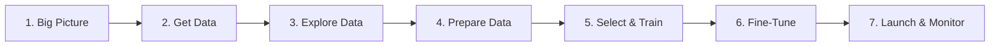
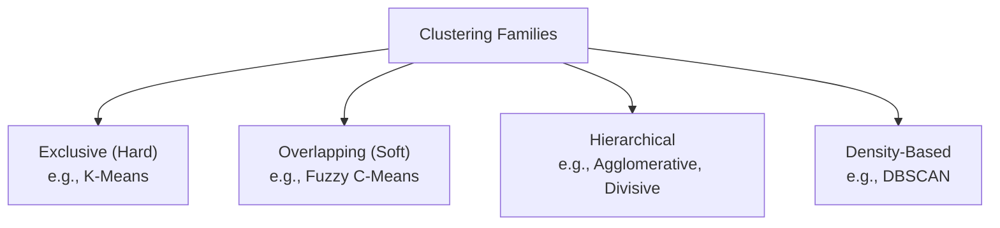
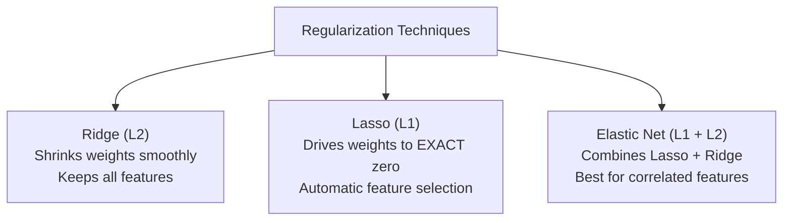

# UCCD2063 Artificial Intelligence Techniques — Comprehensive Short Notes

> [!abstract] Course Summary Overview
> These short notes synthesize all 8 core lecture topics of **UCCD2063 Artificial Intelligence Techniques** into a clear, high-yield reference directly based on the lecture slides.

---

## Quick Navigation
- [[#Topic 1 The Regression Pipeline Part I]]
- [[#Topic 2 The Regression Pipeline Part II]]
- [[#Topic 3 The Classification Pipeline]]
- [[#Topic 4 Logistic Regression & Probabilistic Classification]]
- [[#Topic 5 Unsupervised Learning & Clustering Architectures]]
- [[#Topic 6 Optimization for Linear Models Normal Equation & Gradient Descent]]
- [[#Topic 7 Polynomial Regression & Regularization Techniques]]
- [[#Topic 8 Classical & Heuristic Search Algorithms]]

---

# Topic 1: The Regression Pipeline Part I

## 1.1 Regression Definition & Framing
- **Regression**: Supervised machine learning where the model learns a mapping function $h(\mathbf{x})$ from an input feature vector $\mathbf{X} = [x_1, x_2, \dots, x_n]$ to a **continuous numerical target** $y \in \mathbb{R}$ (e.g., house price, temperature, delivery time).
- **Difference from Classification**: Classification outputs discrete categories (e.g., Spam / Not Spam); Regression outputs continuous, ordered numerical values.

## 1.2 The 7-Stage Machine Learning Pipeline

- **Part I Scope**: Covers Stages 1 to 4 (Data-centric stages prior to modeling).

## 1.3 Stage 1: Look at the Big Picture
1. **Understand Objective**: What business problem are we solving? How will predictions be used?
2. **Current Baseline**: How is it currently handled (e.g., manual human rules)? What is the benchmark performance?
3. **Problem Framing**:
   - Supervised (labeled $y$) vs. Unsupervised (unlabeled).
   - Task: Regression vs. Classification.
   - Learning Mode: Batch learning (offline on full dataset) vs. Online learning (incremental on data streams).

## 1.4 Stage 2: Get Data
- **Custom Acquisition**: Web scraping (`BeautifulSoup`, `Selenium`), REST APIs, IoT sensors, manual surveys.
- **Benchmark Repositories**: Kaggle, UCI Machine Learning Repository, Google Dataset Search, OpenML.

## 1.5 Stage 3: Explore Data (EDA)
- **Inspection Functions**:
  - `df.head()`: First 5 rows to verify structure.
  - `df.info()`: Row count, column data types, non-null counts (detect missing data).
  - `df.describe()`: Summary statistics (mean, std, min, 25%, 50%, 75%, max).
- **Visual Exploration**: Histograms (check skewness, tails), scatter plots (bivariate relationships), correlation matrix (`df.corr()`) to identify linear relationships with target $y$.

## 1.6 Stage 4: Prepare Data (Preprocessing)
> [!important] Golden Rule to Prevent Data Leakage
> Split dataset into **Training Set (80%)** and **Test Set (20%)** *before* any preprocessing. Fit scalers and encoders **only on the training set**, then transform both training and test sets!

### 1. Handling Missing Values
| Strategy | Description | When to Use |
| :--- | :--- | :--- |
| **Drop Rows** (`dropna()`) | Discard records with missing values | Very few missing values (<5%) |
| **Drop Columns** (`drop()`) | Discard entire feature | Majority of column is missing (>50%) |
| **Imputation** (`SimpleImputer`) | Fill with statistics | Preferred to preserve sample size |

- **Numerical Imputation**: Use **Median** if distribution is skewed (robust to outliers); use **Mean** if normal.
- **Categorical Imputation**: Use **Mode** (most frequent value).

### 2. Categorical Encoding
- **Ordinal Encoding**: Maps categories to ordered integers ($0, 1, 2, \dots$). Use **only** when intrinsic ranking exists (e.g., Low < Medium < High).
- **One-Hot Encoding**: Creates binary indicator columns ($0$ or $1$) for each category. Use for unordered nominal data (e.g., Red, Blue, Green).
  - **Dummy Variable Trap**: Multicollinearity from redundant columns. Set `drop='first'` to drop one category ($k-1$ dummy columns for $k$ categories).

### 3. Feature Scaling
Algorithms relying on distances or gradient updates require feature scaling.
- **Min-Max Normalization**:
  $$x' = \frac{x - x_{\min}}{x_{\max} - x_{\min}} \in [0, 1]$$
  - Scales values into a fixed $[0, 1]$ range. Sensitive to outliers.
- **Standardization (Z-Score)**:
  $$z = \frac{x - \mu}{\sigma}$$
  - Transforms distribution to mean $\mu = 0$ and standard deviation $\sigma = 1$. Not bounded to a range; robust to outliers.

---

# Topic 2: The Regression Pipeline Part II

## 2.1 Stage 5: Select & Train Regression Models
- **Linear Regression (LR)**: Fits a linear hyperplane minimizing Residual Sum of Squares. Fast, interpretable, but high bias (underfits non-linear patterns).
- **Decision Tree Regressor (DT)**: Partitions feature space into orthogonal rectangles; predicts the mean target of the leaf. Captures non-linearities without scaling, but prone to high variance (overfitting).
- **Random Forest Regressor (RF)**: Ensemble of bagged decision trees. Averages predictions across trees, drastically reducing variance and overfitting.
- **No Free Lunch (NFL) Theorem**: No single machine learning algorithm is universally superior across all possible datasets. You must empirically test and compare multiple models.

## 2.2 Regression Performance Evaluation Metrics
| Metric | Formula | Key Properties |
| :--- | :--- | :--- |
| **MAE** (Mean Absolute Error) | $\frac{1}{m}\sum_{i=1}^m \|y_i - \hat{y}_i\|$ | Same unit as $y$. Linear penalty; robust to outliers. |
| **MSE** (Mean Squared Error) | $\frac{1}{m}\sum_{i=1}^m (y_i - \hat{y}_i)^2$ | Squared unit ($y^2$). Heavily penalizes large errors. |
| **RMSE** (Root Mean Squared Error) | $\sqrt{\text{MSE}}$ | Same unit as $y$. Preferred for penalizing large outlier errors. |
| **$R^2$ Score** (Coefficient of Determination) | $1 - \frac{\sum (y_i - \hat{y}_i)^2}{\sum (y_i - \bar{y})^2} = 1 - \frac{SS_{\text{res}}}{SS_{\text{tot}}}$ | Proportion of variance explained by model. $1.0 = \text{perfect}$, $0.0 = \text{predicts mean}$, $<0 = \text{worse than mean}$. |

## 2.3 Generalization: Underfitting vs. Overfitting
- **Underfitting (High Bias)**:
  - *Symptoms*: High training error AND high test/validation error.
  - *Causes*: Model is too simple to capture patterns.
  - *Remedies*: Use a more complex model, engineer new features, reduce regularization.
- **Overfitting (High Variance)**:
  - *Symptoms*: Low training error, but high test/validation error.
  - *Causes*: Model memorizes noise and sample-specific idiosyncrasies.
  - *Remedies*: Collect more training data, simplify model (limit tree depth), apply regularization, remove noise.

## 2.4 Cross-Validation (CV)
- **$K$-Fold Cross-Validation**: Splits data into $K$ equal subsets (folds). Trains on $K-1$ folds and validates on the remaining fold; repeats $K$ times so every fold serves as validation once.
- **Advantage**: Provides a robust, variance-reduced estimate of out-of-sample generalization performance.

## 2.5 Stage 6: Fine-Tune the Model (Hyperparameter Tuning)
- **Grid Search (`GridSearchCV`)**: Exhaustively evaluates all combinations in a user-defined hyperparameter grid. Thorough but computationally expensive ($O(\prod |values|)$).
- **Random Search (`RandomizedSearchCV`)**: Randomly samples fixed number of hyperparameter combinations from probability distributions. Much faster; better for exploring large configuration spaces.

## 2.6 Stage 7: Launch, Monitor, and Maintain
- Deploy pipeline to production environment.
- Continuously monitor input data drift and performance decay.
- Periodically retrain models with fresh ground truth data.

---

# Topic 3: The Classification Pipeline

## 3.1 Overview & Taxonomy
- **Classification**: Supervised learning predicting a **discrete categorical class label** $y \in \{C_1, C_2, \dots, C_k\}$.
- **Learner Types**:
  - **Lazy Learners (Instance-Based)**: Store training instances; postpone computation until prediction time (e.g., $k$-NN). Training is $O(1)$, prediction is slow ($O(m)$).
  - **Eager Learners (Model-Based)**: Construct an abstract generalization model during training (e.g., Decision Tree, Logistic Regression). Training is slower, prediction is fast ($O(1)$).
- **Task Types**:
  - **Binary**: Exactly 2 mutually exclusive classes (e.g., Benign vs. Malignant).
  - **Multiclass**: $>2$ mutually exclusive classes (e.g., handwritten digits 0–9).
  - **Multi-label**: Each instance can be assigned multiple classes simultaneously (e.g., article tags: `[Tech, AI, Business]`).

## 3.2 Multiclass Decomposition Strategies
1. **One-vs-Rest (OvR / OvA)**:
   - Trains $N$ binary classifiers (Class $i$ vs. All other classes).
   - Prediction selects the class whose classifier outputs the highest confidence score.
2. **One-vs-One (OvO)**:
   - Trains $\frac{N(N-1)}{2}$ binary classifiers (one for every pair of classes).
   - Prediction uses majority voting across all pairwise comparisons.

## 3.3 $k$-Nearest Neighbors ($k$-NN)
- Classifies a query sample based on the majority vote of its $k$ closest training points.
- **Distance Metrics**:
  - Euclidean ($L_2$): $d(\mathbf{p}, \mathbf{q}) = \sqrt{\sum_{i=1}^n (p_i - q_i)^2}$
  - Manhattan ($L_1$): $d(\mathbf{p}, \mathbf{q}) = \sum_{i=1}^n |p_i - q_i|$
- **Hyperparameter $k$**:
  - Small $k$ (e.g., $k=1$): Highly flexible boundary, low bias, high variance (sensitive to noise/overfitting).
  - Large $k$: Smoother boundary, low variance, high bias (may obscure small classes/underfitting).
  - *Mandatory*: Must apply feature scaling prior to distance computation.

## 3.4 Decision Tree Splitting Criteria
Given class probabilities $p_i$ in node $D$ across $C$ classes:
- **Gini Impurity**:
  $$G = 1 - \sum_{i=1}^C p_i^2 \quad (\text{Range: } [0, 0.5] \text{ for binary})$$
- **Entropy**:
  $$H = -\sum_{i=1}^C p_i \log_2(p_i) \quad (\text{Range: } [0, 1] \text{ for binary})$$
- **Information Gain (IG)**:
  $$IG(D, A) = H(D) - \sum_{v \in \text{Values}(A)} \frac{|D_v|}{|D|} H(D_v)$$
  - Select feature split $A$ that maximizes Information Gain (or minimizes weighted Gini).
  - Purity = $0$ when all samples in node belong to a single class.

## 3.5 Classification Evaluation Metrics
### Confusion Matrix
| | Predicted Positive | Predicted Negative |
| :--- | :--- | :--- |
| **Actual Positive** | **TP** (True Positive) | **FN** (False Negative - Type II error) |
| **Actual Negative** | **FP** (False Positive - Type I error) | **TN** (True Negative) |

### Core Metrics
- **Accuracy**: $\frac{TP + TN}{TP + TN + FP + FN}$ (Misleading under imbalanced class distributions).
- **Precision**: $\frac{TP}{TP + FP}$ (Quality of positive predictions; crucial when FP is costly, e.g., Spam filter).
- **Recall (Sensitivity / TPR)**: $\frac{TP}{TP + FN}$ (Coverage of actual positives; crucial when FN is dangerous, e.g., cancer diagnosis).
- **Specificity (TNR)**: $\frac{TN}{TN + FP}$ (Coverage of actual negatives).
- **$F_1$-Score**: Harmonic mean balancing Precision and Recall:
  $$F_1 = 2 \times \frac{\text{Precision} \times \text{Recall}}{\text{Precision} + \text{Recall}} = \frac{2TP}{2TP + FP + FN}$$

### Curves & Multiclass Aggregation
- **ROC Curve**: Plots **TPR (Recall)** vs. **FPR ($1 - \text{Specificity} = \frac{FP}{TN+FP}$)** across all decision thresholds.
  - **AUC-ROC**: Area Under ROC Curve ($1.0 = \text{perfect classifier}$, $0.5 = \text{random guessing}$).
- **Multiclass Averaging**:
  - **Macro-average**: Unweighted arithmetic mean across class scores. Treats all classes equally (highlights minority class performance).
  - **Weighted-average**: Scores weighted by each class's support/frequency (reflects dataset proportions).

---

# Topic 4: Logistic Regression & Probabilistic Classification

## 4.1 Foundations & The Sigmoid Function
- **Logistic Regression**: A supervised linear model for binary classification ($y \in \{0, 1\}$).
- Calculates linear score: $z = \boldsymbol{\theta}^T \mathbf{x} = \theta_0 + \theta_1 x_1 + \dots + \theta_n x_n$.
- Maps score $z \in (-\infty, \infty)$ to probability $\hat{p} \in (0, 1)$ via the **Sigmoid Function**:
  $$\sigma(z) = \frac{1}{1 + e^{-z}}$$
- **Properties**: $\sigma(0) = 0.5$, $\sigma(\infty) \to 1$, $\sigma(-\infty) \to 0$.
- **Hypothesis**:
  $$h_{\boldsymbol{\theta}}(\mathbf{x}) = P(y = 1 \mid \mathbf{x}; \boldsymbol{\theta}) = \sigma(\boldsymbol{\theta}^T \mathbf{x})$$

## 4.2 Decision Boundary
- Default classification threshold is $0.5$:
  $$\hat{y} = \begin{cases} 1 & \text{if } h_{\boldsymbol{\theta}}(\mathbf{x}) \ge 0.5 \iff \boldsymbol{\theta}^T \mathbf{x} \ge 0 \\ 0 & \text{if } h_{\boldsymbol{\theta}}(\mathbf{x}) < 0.5 \iff \boldsymbol{\theta}^T \mathbf{x} < 0 \end{cases}$$
- The decision boundary is the hyperplane defined by $\boldsymbol{\theta}^T \mathbf{x} = 0$.

## 4.3 Cost Function: Binary Cross-Entropy (Log Loss)
> [!note] Why Not Use MSE?
> Squaring the non-linear sigmoid hypothesis produces a **non-convex** cost function with numerous local minima. Binary Cross-Entropy is mathematically proven to be **strictly convex**, guaranteeing gradient descent finds the global minimum!

- **Single Sample Cost**:
  $$\text{Cost}(h_{\boldsymbol{\theta}}(\mathbf{x}), y) = \begin{cases} -\log(h_{\boldsymbol{\theta}}(\mathbf{x})) & \text{if } y = 1 \\ -\log(1 - h_{\boldsymbol{\theta}}(\mathbf{x})) & \text{if } y = 0 \end{cases}$$
- **Overall Log Loss**:
  $$J(\boldsymbol{\theta}) = -\frac{1}{m} \sum_{i=1}^m \left[ y^{(i)} \log(\hat{p}^{(i)}) + (1 - y^{(i)}) \log(1 - \hat{p}^{(i)}) \right]$$

## 4.4 Parameter Optimization via Gradient Descent
- **Gradient Vector**:
  $$\nabla_{\boldsymbol{\theta}} J(\boldsymbol{\theta}) = \frac{1}{m} \mathbf{X}^T (\hat{\mathbf{p}} - \mathbf{y})$$
- **Weight Update Rule**:
  $$\boldsymbol{\theta} \leftarrow \boldsymbol{\theta} - \alpha \nabla_{\boldsymbol{\theta}} J(\boldsymbol{\theta})$$

---

# Topic 5: Unsupervised Learning & Clustering Architectures

## 5.1 Foundations of Unsupervised Learning
- Analyzes datasets containing **only input features $\mathbf{X}$** without target labels $y$.
- **Four Primary Tasks**:
  1. **Clustering**: Grouping similar instances together.
  2. **Dimensionality Reduction**: Compressing feature dimensions while preserving variance (e.g., PCA).
  3. **Anomaly Detection**: Identifying abnormal, rare outliers.
  4. **Density Estimation**: Estimating underlying probability distribution generating the data.

## 5.2 Taxonomy of Clustering Families


## 5.3 Exclusive Clustering: $K$-Means
- **Objective**: Minimize Within-Cluster Sum of Squares (**WCSS / Inertia**):
  $$J = \sum_{k=1}^K \sum_{\mathbf{x} \in C_k} \|\mathbf{x} - \boldsymbol{\mu}_k\|^2$$
- **Iterative Algorithm**:
  1. Randomly initialize $K$ cluster centroids $\boldsymbol{\mu}_1, \dots, \boldsymbol{\mu}_K$.
  2. **Assignment Step**: Assign each sample $\mathbf{x}_i$ to the nearest centroid (minimum Euclidean distance).
  3. **Update Step**: Recompute each centroid as the arithmetic mean of all points assigned to that cluster: $\boldsymbol{\mu}_k = \frac{1}{|C_k|} \sum_{\mathbf{x} \in C_k} \mathbf{x}$.
  4. Repeat steps 2 and 3 until centroids stabilize (convergence).
- **Choosing $K$**: **Elbow Method** (plot WCSS vs. $K$, select point where rate of WCSS reduction sharply bends).
- **Weaknesses**: Must specify $K$ upfront; sensitive to initialization (local minima); assumes spherical clusters of equal size; sensitive to outliers.

## 5.4 Overlapping Clustering: Fuzzy $C$-Means (FCM)
- Allows soft cluster membership: sample $i$ belongs to cluster $k$ with membership degree $u_{ik} \in [0, 1]$, where $\sum_{k=1}^C u_{ik} = 1$.
- **Objective**: Minimize $\sum_{i=1}^n \sum_{k=1}^C (u_{ik})^m \|\mathbf{x}_i - \mathbf{c}_k\|^2$, where $m > 1$ is the fuzzifier (typically $m = 2$).
- Centroid update: $\mathbf{c}_k = \frac{\sum_{i=1}^n (u_{ik})^m \mathbf{x}_i}{\sum_{i=1}^n (u_{ik})^m}$.

## 5.5 Hierarchical Clustering
Constructs nested tree of clusters visualized via a **Dendrogram**. Cutting the dendrogram horizontally yields clusters.
- **Approaches**:
  - **Agglomerative (Bottom-Up)**: Starts with each point as its own cluster; sequentially merges closest clusters.
  - **Divisive (Top-Down)**: Starts with one universal cluster; sequentially subdivides.
- **Linkage Criteria (Inter-Cluster Distance)**:
  - **Single Linkage (MIN)**: Distance between closest points: $\min d(a, b)$. Can produce chained, elongated clusters.
  - **Complete Linkage (MAX)**: Distance between farthest points: $\max d(a, b)$. Yields compact, spherical clusters.
  - **Average Linkage**: Average distance between all point pairs.

## 5.6 Density-Based Clustering: DBSCAN
- Discovers arbitrary-shaped clusters and automatically isolates noise.
- **Parameters**:
  - $\varepsilon$ (Epsilon): Radius of neighborhood.
  - $\text{MinPts}$: Minimum samples within $\varepsilon$-ball to form a dense region.
- **Point Categories**:
  - **Core Point**: Has $\ge \text{MinPts}$ within distance $\varepsilon$.
  - **Border Point**: Has $< \text{MinPts}$ within $\varepsilon$, but falls inside the $\varepsilon$-neighborhood of a Core point.
  - **Noise Point (Outlier)**: Neither a Core nor a Border point.
- **Advantages**: No need to specify $K$; discovers non-linear arbitrary shapes; handles noise robustly.

## 5.7 Clustering Validation Metrics
- **Internal Metrics (No ground truth labels)**:
  - **Silhouette Coefficient**: $s = \frac{b - a}{\max(a, b)} \in [-1, 1]$
    - $a$: Mean intra-cluster distance; $b$: Mean nearest-cluster distance.
    - $+1$: Dense, well-separated; $0$: Overlapping; negative: Misclassified.
  - **Davies-Bouldin Index (DBI)**: Ratio of within-cluster scatter to separation. **Lower is better**.
  - **Calinski-Harabasz Index (CH)**: Ratio of between-cluster to within-cluster dispersion. **Higher is better**.
- **External Metrics (Ground truth labels available)**:
  - **Adjusted Rand Index (ARI)**: Agreement between clusters and true labels corrected for chance ($\in [-1, 1]$, $1.0 = \text{perfect}$).
  - **Normalized Mutual Information (NMI)**: Information shared between clusters and true classes ($\in [0, 1]$).

---

# Topic 6: Optimization for Linear Models: Normal Equation & Gradient Descent

## 6.1 Vectorized Linear Regression & MSE
- **Vectorized Prediction**: $\hat{y} = \boldsymbol{\theta}^T \mathbf{x}$ (with bias $x_0 = 1$).
- **Design Matrix**: $\hat{\mathbf{y}} = \mathbf{X}\boldsymbol{\theta}$, where $\mathbf{X}$ is $m \times (n+1)$ and $\boldsymbol{\theta}$ is $(n+1) \times 1$.
- **Vectorized Mean Squared Error Cost**:
  $$J(\boldsymbol{\theta}) = \frac{1}{2m} (\mathbf{X}\boldsymbol{\theta} - \mathbf{y})^T (\mathbf{X}\boldsymbol{\theta} - \mathbf{y})$$

## 6.2 Closed-Form Solution: The Normal Equation
Setting $\nabla_{\boldsymbol{\theta}} J(\boldsymbol{\theta}) = 0$ yields the exact analytical solution:
$$\boldsymbol{\theta} = (\mathbf{X}^T \mathbf{X})^{-1} \mathbf{X}^T \mathbf{y}$$

| Strengths | Weaknesses |
| :--- | :--- |
| Exact analytic solution in one step | Inverting $(n+1) \times (n+1)$ matrix costs $O(n^3)$ |
| No learning rate $\alpha$ to tune | Impractical for huge feature spaces ($n > 10,000$) |
| No iterative loops or convergence checks | Fails if $\mathbf{X}^T \mathbf{X}$ is non-invertible/singular (multicollinearity or $m < n$) |

## 6.3 Iterative Optimization: Gradient Descent
- **General Update Formula**:
  $$\boldsymbol{\theta}^{(t+1)} = \boldsymbol{\theta}^{(t)} - \alpha \nabla_{\boldsymbol{\theta}} J(\boldsymbol{\theta})$$
  where $\nabla_{\boldsymbol{\theta}} J(\boldsymbol{\theta}) = \frac{1}{m} \mathbf{X}^T (\mathbf{X}\boldsymbol{\theta} - \mathbf{y})$.
- **Learning Rate Dynamics**:
  - Too small: Glacially slow convergence.
  - Too large: Oscillates, overshoots minimum, diverges.
- **Stopping Criteria**:
  1. Maximum iterations reached.
  2. Cost reduction $|J^{(t+1)} - J^{(t)}| < \epsilon$.
  3. Gradient vector norm $\|\nabla J\| < \epsilon$.

## 6.4 The Three Variants of Gradient Descent
| Dimension | Batch Gradient Descent (BGD) | Stochastic Gradient Descent (SGD) | Mini-Batch Gradient Descent (MBGD) |
| :--- | :--- | :--- | :--- |
| **Data per Step** | All $m$ training samples | Exactly 1 random sample | Mini-batch of size $B$ (e.g., 32–128) |
| **Step Stability** | Smooth, monotonic, deterministic | Highly erratic, noisy oscillations | Balanced, moderate variance |
| **Speed per Step** | Slow on large datasets | Very fast, minimal memory | Fast, exploits GPU vectorization |
| **Convergence** | Reaches exact global minimum | Fluctuate around minimum; needs decaying $\alpha$ | Stable convergence near minimum |
| **Local Minima** | Can get trapped in non-convex surfaces | Escapes shallow local minima due to noise | Good balance of escaping and settling |

---

# Topic 7: Polynomial Regression & Regularization Techniques

## 7.1 Polynomial Regression
- Models non-linear patterns by augmenting features with polynomial powers:
  $$\hat{y} = \theta_0 + \theta_1 x + \theta_2 x^2 + \dots + \theta_p x^p$$
- Linear regression machinery is still used because the equation remains linear with respect to parameters $\boldsymbol{\theta}$.
- **Degree $p$ Risk**: High degree polynomials overfit drastically, oscillating wildly between data points.

## 7.2 Regularization Foundations
- Regularization adds a penalty term on weight magnitudes to cost function $J(\boldsymbol{\theta})$ to restrain overfitting.
- Controlled by hyperparameter **$\alpha \ge 0$** (penalty weight):
  - $\alpha = 0$: Standard unconstrained linear regression.
  - $\alpha \to \infty$: All weights flattened toward zero; predicts constant mean.
- *Mandatory*: Bias parameter $\theta_0$ is **never** regularized. Features **must be scaled** before applying regularization.

## 7.3 Regularization Methods Comparison


| Technique | Cost Function $J(\boldsymbol{\theta})$ | Penalty Term | Key Characteristics & Behavior |
| :--- | :--- | :--- | :--- |
| **Ridge Regression** ($L_2$) | $\text{MSE}(\boldsymbol{\theta}) + \frac{\alpha}{2} \sum_{j=1}^n \theta_j^2$ | $\frac{1}{2} \|\boldsymbol{\theta}_{1:n}\|_2^2$ | • Shrinks weights smoothly toward zero.<br>• Never sets weights to exact zero.<br>• Analytic solution: $\boldsymbol{\theta} = (\mathbf{X}^T \mathbf{X} + \alpha \mathbf{A})^{-1}\mathbf{X}^T \mathbf{y}$ (always invertible!). |
| **Lasso Regression** ($L_1$) | $\text{MSE}(\boldsymbol{\theta}) + \alpha \sum_{j=1}^n \|\theta_j\|$ | $\|\boldsymbol{\theta}_{1:n}\|_1$ | • Forces unimportant feature weights to **exact zero**.<br>• Produces sparse models (acts as automatic feature selector).<br>• Uses subgradient descent (non-differentiable at $0$). |
| **Elastic Net** ($L_1 + L_2$) | $\text{MSE}(\boldsymbol{\theta}) + r\alpha \sum_{j=1}^n \|\theta_j\| + \frac{1-r}{2}\alpha \sum_{j=1}^n \theta_j^2$ | $r L_1 + (1-r) L_2$ | • Combines strengths of Lasso and Ridge via ratio $r \in [0, 1]$.<br>• Solves Lasso instability when features are strongly correlated. |

### Selection Guide
1. **Ridge** is generally the preferred default regularizer.
2. Use **Lasso** if you suspect only a few features are genuinely informative.
3. Use **Elastic Net** over Lasso when features are correlated or number of features $n >$ number of samples $m$.

---

# Topic 8: Classical & Heuristic Search Algorithms

## 8.1 Formulation of Search Problems
A formal search problem consists of **5 components**:
1. **Initial State ($s_0$)**: Starting state of agent.
2. **Actions ($A(s)$)**: Set of legal actions executable from state $s$.
3. **Transition Model ($\text{Result}(s, a)$)**: State $s'$ resulting from taking action $a$ in state $s$.
4. **Goal Test**: Predicate checking whether a state is a goal state.
5. **Path Cost ($c(s, a, s')$)**: Step cost; total cost is sum of individual step costs.

## 8.2 General Search Architecture & Metrics
- **Frontier (Open List)**: Discovered nodes awaiting expansion.
- **Explored Set (Closed List)**: Expanded nodes (prevents infinite loops in cyclic graphs).
- **Evaluation Criteria**:
  - **Completeness**: Guaranteed to find a solution if one exists?
  - **Optimality**: Finds the lowest path-cost solution?
  - **Time Complexity**: Number of nodes generated.
  - **Space Complexity**: Maximum memory required.
  - Parameters: $b$ (branching factor), $d$ (depth of shallowest goal), $m$ (maximum search tree depth).

## 8.3 Uninformed (Blind) Search Strategies
| Algorithm | Frontier Data Structure | Node Selection Rule | Complete? | Optimal? | Time Complexity | Space Complexity |
| :--- | :--- | :--- | :--- | :--- | :--- | :--- |
| **BFS** (Breadth-First Search) | FIFO Queue | Shallowest node first | **Yes** (if $b$ finite) | **Yes** (if step costs equal) | $O(b^d)$ | $O(b^d)$ (Memory bottleneck) |
| **DFS** (Depth-First Search) | LIFO Stack | Deepest node first | **No** (fails in infinite paths/cycles) | **No** | $O(b^m)$ | $O(b \cdot m)$ (Linear memory!) |
| **UCS** (Uniform-Cost Search) | Priority Queue ordered by $g(n)$ | Lowest path-cost $g(n)$ first | **Yes** (if step cost $\ge \epsilon > 0$) | **Yes** | $O(b^{1 + \lfloor C^* / \epsilon \rfloor})$ | $O(b^{1 + \lfloor C^* / \epsilon \rfloor})$ |

## 8.4 Informed (Heuristic) Search & $A^*$ Search
- **Heuristic Function $h(n)$**: Estimated remaining cost from node $n$ to goal ($h(\text{goal}) = 0$).
- **$A^*$ Evaluation Function**:
  $$f(n) = g(n) + h(n)$$
  - $g(n)$: Exact accumulated path cost from start to $n$.
  - $h(n)$: Estimated remaining heuristic cost from $n$ to goal.
  - $f(n)$: Estimated total cost of path passing through node $n$.
- **Admissibility Condition**:
  - A heuristic $h(n)$ is **admissible** if it never overestimates the true remaining cost:
    $$0 \le h(n) \le h^*(n)$$
  - *Optimality Theorem*: If $h(n)$ is admissible, $A^*$ tree search is **guaranteed to find the optimal solution**.

## 8.5 Genetic Algorithms (Evolutionary Search)
A stochastic global optimization algorithm modeled on biological natural selection:
- **Core Analogies**:
  - **Chromosome (Individual)**: A candidate solution encoded as a string/vector.
  - **Gene**: A single feature or bit in the chromosome.
  - **Population**: A collection of candidate solutions.
  - **Fitness Function**: Objective evaluation score indicating solution quality.
- **Iterative Cycle**:
  ```mermaid
  flowchart LR
      P["1. Population"] --> FE["2. Fitness Evaluation"]
      FE --> S["3. Selection<br>(Roulette / Tournament)"]
      S --> C["4. Crossover<br>(Exploitation)"]
      C --> M["5. Mutation<br>(Exploration)"]
      M --> P
  ```
  1. **Selection**: Fitter chromosomes have higher probability of reproducing (e.g., Roulette Wheel Selection, Tournament Selection).
  2. **Crossover (Recombination)**: Combines segments from two parent chromosomes (**Exploitation** of existing good traits).
  3. **Mutation**: Randomly flips genes with small probability $p_m$ (**Exploration** to maintain diversity and escape local optima).
  4. Repeat until target fitness or maximum generation count is attained.
