# Topic 1: The Regression Pipeline Part I

## 1.1 Introduction to Regression

Regression is a fundamental category of supervised machine learning where the algorithm learns a mapping function from input features to a continuous numerical target.

> [!info] Definition: Regression
> Regression learns a mathematical mapping function $h(x)$ that maps an input feature vector $\mathbf{X} = [x_1, x_2, \dots, x_n]$ to a continuous, numerical target value $y$:
> $$\mathbf{X} \xrightarrow{h(x)} \hat{y}$$
> Unlike **classification**, where the predicted target is a discrete categorical label (e.g., Spam vs. Not Spam), the output of a **regression** model is quantitative, continuous, and ordered (e.g., price, temperature, duration).

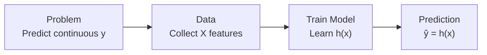

> [!example] Real-World Example: House Price Prediction
> Consider estimating the market value of a residential property:
> - **Input Features ($\mathbf{X}$)**:
>   - House Size: $1,200\text{ sq ft}$
>   - Number of Rooms: $4$
>   - Location Rating: $8 / 10$
>   - Building Age: $10\text{ years}$
> - **Regression Model**: Learns the underlying relationship between $\mathbf{X}$ and $y$.
> - **Output ($\hat{y}$)**: $\text{RM } 420,000$ (a continuous numeric value).

> [!note] Key Point
> Because the output variable is a continuous real number ($\text{RM } 420,000$) rather than a discrete class, this task is framed strictly as a regression problem.

---

## 1.2 The Machine Learning Pipeline for Regression

Building an effective machine learning regression system involves seven systematic stages:

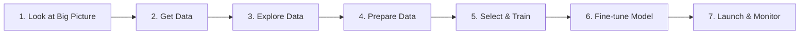

> [!note] Scope of Part I
> Part I concentrates on stages 1 through 4 (the essential data-centric phases prior to model training):
> 1. Looking at the big picture (problem formulation)
> 2. Obtaining the dataset
> 3. Exploratory Data Analysis (EDA)
> 4. Data Preparation & Preprocessing

---

## 1.3 Stage 1: Look at the Big Picture

Before writing code or training algorithms, the problem must be formally framed within the business or operational context:

1. **Understand the Problem**:
   - What specific business objective or task needs to be solved?
   - What decisions will downstream systems or human operators make based on the predicted $\hat{y}$?
2. **Current Solution & Reference Baseline**:
   - How is the problem currently handled (e.g., manual human heuristics, rule-based software)?
   - What is the existing baseline performance against which the ML model will be evaluated?
3. **Frame the Machine Learning Problem**:
   - **Supervision type**: Supervised, Unsupervised, Semi-supervised, or Reinforcement Learning? (Regression is Supervised).
   - **Task type**: Regression (predicting a continuous value) or Classification (predicting a discrete category)?
   - **Learning mode**: Batch learning or Online/incremental learning?

> [!example] Case Study: California Housing Price Prediction
> - **Objective**: Predict district median housing prices based on district-level metrics.
> - **Current Method**: Manual expert appraisal, which is costly, slow, and prone to subjective variance.
> - **Framing**: Supervised learning task; multivariate regression problem; batch offline learning.

---

## 1.4 Stage 2: Get Data

The objective is to acquire or construct a representative dataset that aligns with the target domain and feature requirements.

### Data Acquisition Strategies
- **Creating a Custom Dataset**:
  - *Web Scraping*: Using libraries such as `BeautifulSoup` or `Selenium` to extract unstructured web text.
  - *APIs*: Querying RESTful web services (e.g., weather feeds, financial exchanges).
  - *Manual Collection / IoT*: Field surveys, laboratory sensor measurements, camera feeds.
- **Online Benchmark Repositories**:
  - **Kaggle**: Real-world competitive datasets across domains.
  - **UCI Machine Learning Repository**: Standardized, peer-reviewed academic benchmark datasets.
  - **Google Dataset Search**: Search engine index spanning open government and research repositories.
  - **OpenML**: Collaborative platform hosting datasets, pipelines, and empirical evaluations.

### Code Implementation: Loading & Previewing Data
In the practical scenario (Food Delivery Times dataset), data is imported into a `pandas` DataFrame:

```python
import os
import pandas as pd
import numpy as np
import matplotlib.pyplot as plt

# Load dataset into pandas DataFrame
foodDeliveryTimesDF = pd.read_csv(DATASET_FILE)

# Preview first 5 rows to confirm integrity
foodDeliveryTimesDF.head()
```

| Order_ID | Distance_km | Weather | Traffic | Time | Vehicle | Prep_min | Experience | Delivery_min |
| :--- | :--- | :--- | :--- | :--- | :--- | :--- | :--- | :--- |
| 522 | 7.93 | Windy | Low | Afternoon | Scooter | 12 | 1 | 43 |
| 738 | 16.42 | Clear | Medium | Evening | Bike | 20 | 2 | 84 |
| 741 | 9.52 | Foggy | Low | Night | Scooter | 28 | 1 | 59 |
| 661 | 7.44 | Rainy | Medium | Afternoon | Scooter | 5 | 1 | 37 |
| 412 | 19.03 | Clear | Low | Morning | Bike | 16 | 5 | 68 |

---

## 1.5 Stage 3: Explore Data (EDA)

Exploratory Data Analysis (EDA) allows practitioners to gain deep intuition regarding data distributions, correlations, outliers, and defects before applying transformations.

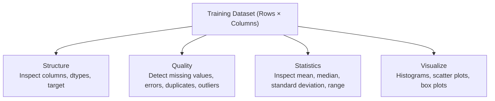

### 1.5.1 Inspection Code & Diagnostics
```python
# 1. Structural inspection
foodDeliveryTimesDF.head()
foodDeliveryTimesDF.info()

# 2. Numerical summary statistics
foodDeliveryTimesDF.describe()

# 3. Distribution visualization
foodDeliveryTimesDF.hist(bins=50, figsize=(20, 15))
plt.show()

# 4. Categorical inspection
cat_cols = foodDeliveryTimesDF.select_dtypes(include=['object']).columns
for col in cat_cols:
    print(f'{col} categories:')
    display(foodDeliveryTimesDF[col].value_counts(dropna=False))
```

### 1.5.2 Practical Dataset Findings
- **Dimensions**: $1,000$ entries, $9$ feature columns.
- **Feature Partitioning**:
  - *Numerical Features*: `Order_ID`, `Distance_km`, `Preparation_Time_min`, `Courier_Experience_yrs`, `Delivery_Time_min` (Target).
  - *Categorical Features*: `Weather`, `Traffic_Level`, `Time_of_Day`, `Vehicle_Type`.
- **Target Variable**: `Delivery_Time_min` (continuous numeric value, right-skewed tail extending past $120\text{ min}$).
- **Missing Value Audit**:
  - `Weather`: $20$ missing entries ($30$ unrecorded/null).
  - `Traffic_Level`: $24$ missing entries.
  - `Time_of_Day`: $24$ missing entries.
  - `Courier_Experience_yrs`: $22$ missing entries.
  - `Vehicle_Type`: $0$ missing entries.

---

## 1.6 Stage 4: Prepare Data

Data preparation converts raw, imperfect data into clean numerical arrays formatted specifically for mathematical optimization algorithms.

> [!important] Crucial Rule: Avoid Data Leakage
> All preprocessing transformations (imputation medians, standardizer means/standard deviations, and one-hot encoders) must be computed **strictly on the training partition** (`X_train`) and subsequently used to transform both `X_train` and `X_test`. Never fit scalers or imputers on the full dataset prior to splitting.

Data preparation follows six sequential operations:
1. Separate features ($\mathbf{X}$) and target vector ($y$).
2. Split dataset into training and test partitions.
3. Fix data errors and noise.
4. Handle missing observations.
5. Perform feature transformations (scaling, encoding, discretization).
6. Perform data reduction (feature selection, dimensionality reduction).

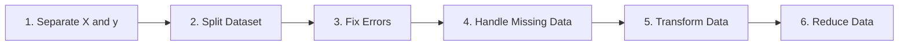

---

### 1.6.1 Step 4a: Separate Feature Matrix ($\mathbf{X}$) and Target Vector ($y$)

Before applying transformations, isolate the independent variables from the dependent prediction target:

```python
# Feature matrix X: all columns except target
X = foodDeliveryTimesDF.drop('Delivery_Time_min', axis=1)

# Target vector y: target column only
y = foodDeliveryTimesDF['Delivery_Time_min']

print('Shape of X:', X.shape)  # Output: (1000, 8)
print('Shape of y:', y.shape)  # Output: (1000,)
```

---

### 1.6.2 Step 4b: Split Dataset (Train/Test Partitioning)

Splitting guarantees an unbiased evaluation of model generalization on unseen observations.

- **Random Sampling**: Every sample in the population has an equal probability of selection. Suitable for large, balanced datasets.
- **Stratified Sampling**: The population is divided into homogeneous subgroups (strata), and samples are drawn proportionally to preserve subgroup ratios. Recommended when dealing with rare categorical classes or skewed key predictors.

```python
from sklearn.model_selection import train_test_split

X_train, X_test, y_train, y_test = train_test_split(
    X, y, test_size=0.2, random_state=30
)

# Shapes:
# X_train: (800, 8), X_test: (200, 8)
# y_train: (800,),    y_test: (200,)
```

#### Feature Type Partitioning
Because numerical and categorical variables require fundamentally distinct mathematical pipelines, `X_train` is partitioned by data type:

```python
# Identify numerical vs categorical columns
numerical_cols = X_train.select_dtypes(include=['int64', 'float64']).columns
categorical_cols = X_train.select_dtypes(include=['object']).columns

X_train_num = X_train[numerical_cols]  # Shape: (800, 4)
X_train_cat = X_train[categorical_cols]  # Shape: (800, 4)
```

---

### 1.6.3 Steps 4c & 4d: Fix Errors and Handle Missing Values

Missing values occur due to sensor drops, unrecorded surveys, or transmission errors.

#### Common Missing Value Handling Strategies
1. **Drop Records (Listwise Deletion)**: Discard rows containing nulls. Only acceptable if missingness is completely random and affects $< 2-3\%$ of total rows.
2. **Global Constant**: Impute with fixed sentinel (e.g., `-999` or `"Unknown"`).
3. **Measures of Central Tendency**:
   - **Median**: Preferred for numerical features due to robustness against extreme outliers and skewed distributions.
   - **Mean**: Suitable for symmetric, normally distributed numerical data without outliers.
   - **Mode (Most Frequent)**: The standard imputation technique for categorical features.
4. **Model-Based Imputation**: Impute using $k$-Nearest Neighbors ($k$-NN) or iterative regression from correlated features.

#### Imputation Implementation
```python
X_train_num_tr = X_train_num.copy()
X_train_cat_tr = X_train_cat.copy()

# Numerical: fill missing values using training median
numeric_medians = X_train_num_tr.median(numeric_only=True)
X_train_num_tr = X_train_num_tr.fillna(numeric_medians)

# Categorical: fill missing values using training mode
categorical_modes = {}
for col in X_train_cat_tr.columns:
    categorical_modes[col] = X_train_cat_tr[col].mode(dropna=True)[0]
    X_train_cat_tr[col] = X_train_cat_tr[col].fillna(categorical_modes[col])
```

> [!example] Imputation Walkthrough
> - **Numerical Example (`Distance_km`)**:
>   - Values: $[2.5, 4.0, \text{Missing}, 6.0, 8.5]$
>   - Sorted available: $[2.5, 4.0, 6.0, 8.5]$
>   - Median: $\frac{4.0 + 6.0}{2} = 5.0$
>   - Imputed value: $5.0$
> - **Categorical Example (`Weather`)**:
>   - Values: $[\text{Sunny}, \text{Rainy}, \text{Sunny}, \text{Missing}, \text{Cloudy}, \text{Sunny}]$
>   - Frequencies: $\text{Sunny} = 3$, $\text{Rainy} = 1$, $\text{Cloudy} = 1$
>   - Mode: $\text{Sunny}$
>   - Imputed value: $\text{Sunny}$

---

### 1.6.4 Step 4e: Perform Data Transformation

Transformation standardizes feature scales and formats categorical labels into numerical matrices.

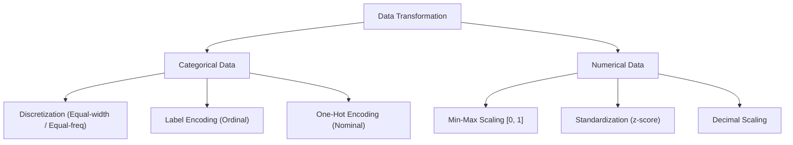

#### 1. Data Discretization (Binning)
Discretization maps continuous numerical variables into discrete intervals/categories (e.g., Low, Medium, High).
- **Motivations**: Converts regression targets into classification labels, smooths noisy continuous distributions, and simplifies business interpretability.
- **Methods**:
  1. **Equal-Distance (Equal-Width) Partitioning**: Divides the continuous range into intervals of identical length:
     $$\text{Bin Width} = \frac{X_{\max} - X_{\min}}{k}$$
     where $k$ is the number of target bins.
  2. **Equal-Frequency Partitioning**: Sorts values and divides them so each bin contains approximately the same count of samples:
     $$\text{Samples per Bin} = \frac{N}{k}$$

> [!example] Discretization Numerical Example
> Given values: $[18, 20, 25, 30, 38, 45, 60, 75, 90]$, $N = 9$, $k = 3$ bins:
> - **Equal-Distance**:
>   - $\text{Bin Width} = \frac{90 - 18}{3} = 24$
>   - Low: $[18, 42]$ $\to \{18, 20, 25, 30, 38\}$
>   - Medium: $[43, 66]$ $\to \{45, 60\}$
>   - High: $[67, 90]$ $\to \{75, 90\}$
> - **Equal-Frequency**:
>   - $\text{Samples per Bin} = \frac{9}{3} = 3\text{ items}$
>   - Low: $\{18, 20, 25\}$
>   - Medium: $\{30, 38, 45\}$
>   - High: $\{60, 75, 90\}$

#### 2. Categorical Encoding
Machine learning models compute dot products and cost functions over real numbers, requiring text categories to be encoded numerically.
- **Label Encoding**: Assigns an integer $0, 1, \dots, C-1$ to each unique category.
  - *Applicability*: **Ordinal data** where categories have a natural sequence or rank (e.g., $\text{Low} \to 0, \text{Medium} \to 1, \text{High} \to 2$).
  - *Caution*: Avoid using on nominal data (e.g., colors or cities), as the algorithm will misinterpret arbitrary integers as ranked magnitudes.
- **One-Hot Encoding**: Generates an independent binary indicator column ($0$ or $1$) for each unique category.
  - *Applicability*: **Nominal data** without intrinsic order (e.g., Weather: Clear, Rainy, Foggy, Snowy, Windy).
  - *Example*: For 5 categories: $\text{Clear} = [1, 0, 0, 0, 0]$, $\text{Rainy} = [0, 1, 0, 0, 0]$.

```python
from sklearn.preprocessing import OneHotEncoder

# Initialize OneHotEncoder
try:
    ohe = OneHotEncoder(handle_unknown='ignore', sparse_output=False)
except TypeError:
    ohe = OneHotEncoder(handle_unknown='ignore', sparse=False)

# Fit and transform training categorical data
X_train_cat_tr = ohe.fit_transform(X_train_cat_tr)

# Finalize training matrix: merge numerical and one-hot categorical features
X_train_tr = np.hstack([X_train_num_tr, X_train_cat_tr])
y_train = y_train.to_numpy() if hasattr(y_train, 'to_numpy') else np.asarray(y_train)

print('X_train_tr shape:', X_train_tr.shape)
print('y_train shape:', y_train.shape)
```

#### 3. Feature Scaling
When numerical attributes possess wildly differing magnitudes (e.g., House Size in thousands of sq ft vs. Number of Rooms between 1 and 5), features with large values dominate gradient updates and distance calculations.
- **Algorithms Requiring Feature Scaling**: $k$-Nearest Neighbors ($k$-NN), Support Vector Machines (SVM), Principal Component Analysis (PCA), Gradient Descent-based Linear/Logistic Regression, and Neural Networks.
- **Algorithms Invariant to Feature Scaling**: Decision Trees, Random Forests, and Gradient Boosted Trees (XGBoost/LightGBM).

| Scaling Technique | Formula | Output Range | Outlier Sensitivity |
| :--- | :--- | :--- | :--- |
| **Min-Max Scaling (Normalization)** | $X_i' = \frac{X_i - X_{\min}}{X_{\max} - X_{\min}}$ | $[0, 1]$ (or custom) | High (compressed by extreme outliers) |
| **Standardization ($Z$-Score)** | $z = \frac{x - \mu}{\sigma}$ | $\mu = 0, \sigma = 1$ (unbounded) | Moderate / Robust |
| **Decimal Scaling** | $x' = \frac{x}{10^j}$ where $\max(\|x'\|) < 1$ | $(-1, 1)$ | High |

##### Detailed Scaling Calculations:
1. **Min-Max Normalization**:
   $$X_i' = \frac{X_i - X_{\min}}{X_{\max} - X_{\min}}$$
   - *Example*: Data points $[2, 5, 8, 11, 14]$. $X_{\min} = 2, X_{\max} = 14$.
   - For $X = 8$:
     $$X' = \frac{8 - 2}{14 - 2} = \frac{6}{12} = 0.50$$
   - Scaled array: $[0.00, 0.25, 0.50, 0.75, 1.00]$.

2. **Standardization ($Z$-score Normalization)**:
   $$z = \frac{x - \mu}{\sigma}, \quad \text{where } \mu = \frac{1}{N}\sum_{i=1}^N x_i, \quad \sigma = \sqrt{\frac{1}{N}\sum_{i=1}^N (x_i - \mu)^2}$$
   - *Example*: Data points $[2, 5, 8, 11, 14]$.
   - Mean: $\mu = \frac{2 + 5 + 8 + 11 + 14}{5} = 8$
   - Standard Deviation: $\sigma = \sqrt{\frac{(-6)^2 + (-3)^2 + 0^2 + 3^2 + 6^2}{5}} = \sqrt{\frac{90}{5}} = \sqrt{18} \approx 4.2426$
   - For $x = 11$:
     $$z = \frac{11 - 8}{4.2426} = \frac{3}{4.2426} \approx 0.71$$
   - Standardized array: $[-1.41, -0.71, 0.00, 0.71, 1.41]$.

```python
from sklearn.preprocessing import StandardScaler

scaler = StandardScaler()
X_train_num_tr = scaler.fit_transform(X_train_num_tr)

print('Mean of columns:', X_train_num_tr.mean(axis=0))  # Near 0
print('Std of columns:', X_train_num_tr.std(axis=0))   # Exactly 1
```

3. **Decimal Scaling**:
   $$x' = \frac{x}{10^j}$$
   where $j$ is the smallest integer such that $\max(|x'|) < 1$.
   - *Example*: Data points $[2, 5, 8, 11, 14]$. $\max(|x|) = 14$.
   - If $j = 1 \implies \frac{14}{10} = 1.4 \not< 1$.
   - If $j = 2 \implies \frac{14}{100} = 0.14 < 1 \implies j = 2$.
   - Divide all values by $10^2 = 100$:
     $$[0.02, 0.05, 0.08, 0.11, 0.14]$$

---

### 1.6.5 Step 4f: Data Reduction Methods

Data reduction compresses the representation of the data while preserving its essential discriminatory information:

1. **Dimensionality Reduction**: Projects high-dimensional feature spaces into a smaller subspace (e.g., PCA reducing 50 correlated features into 5 principal components).
2. **Feature Selection**: Identifies and retains the most relevant features while removing uninformative, redundant, or noisy attributes (e.g., dropping unique record keys like `Order_ID`).
3. **Numerosity Reduction**: Replaces full data volumes with smaller alternative representations (e.g., random subsampling $1,000$ representative rows from $10,000$).
4. **Data Compression**: Lossless or lossy transformation storing data in compact binary representations.
5. **Discretization / Binning**: Reduces cardinality by replacing continuous spectra with small sets of interval tokens (e.g., Low, Medium, High).
6. **Aggregation**: Aggregates fine-grained transactional records into summarized higher-level metrics (e.g., hourly readings $\to$ daily average).

---

## 1.7 Practical Exercises & Solutions

### Exercise Q1: Missing Value Imputation
> [!example] Problem
> Fill the missing `Distance_km` using the **median** and the missing `Weather` using the **mode**:
> 
> | Order | Distance_km | Weather |
> | :--- | :--- | :--- |
> | 1 | 3 | Clear |
> | 2 | 5 | Rainy |
> | 3 | Missing | Clear |
> | 4 | 7 | Cloudy |
> | 5 | 9 | Missing |

> [!tip] Solution
> 1. **Numerical Imputation (`Distance_km`)**:
>    - Available sorted values: $[3, 5, 7, 9]$
>    - $\text{Median} = \frac{5 + 7}{2} = 6.0$
>    - Imputed `Distance_km`: **6.0**
> 2. **Categorical Imputation (`Weather`)**:
>    - Frequencies: $\text{Clear} = 2$, $\text{Rainy} = 1$, $\text{Cloudy} = 1$
>    - $\text{Mode} = \text{Clear}$
>    - Imputed `Weather`: **Clear**

---

### Exercise Q2: Equal-Distance Discretization
> [!example] Problem
> Given `Delivery_Time_min` values: $[18, 20, 25, 30, 38, 45, 60, 75, 90]$.
> Discretize into 3 equal-distance bins labeled **Low**, **Medium**, and **High**.

> [!tip] Solution
> - $X_{\min} = 18, X_{\max} = 90, k = 3$
> - $\text{Bin Width} = \frac{90 - 18}{3} = \frac{72}{3} = 24$
> - **Intervals**:
>   - **Low**: $[18, 18 + 24] = [18, 42] \implies \{18, 20, 25, 30, 38\}$
>   - **Medium**: $[43, 42 + 24] = [43, 66] \implies \{45, 60\}$
>   - **High**: $[67, 66 + 24] = [67, 90] \implies \{75, 90\}$

---

### Exercise Q3: Equal-Frequency Discretization
> [!example] Problem
> Using the same values: $[18, 20, 25, 30, 38, 45, 60, 75, 90]$ ($N = 9$), divide into 3 equal-frequency categories.

> [!tip] Solution
> - $\text{Samples per Bin} = \frac{9}{3} = 3\text{ samples}$
> - **Categories**:
>   - **Low**: $\{18, 20, 25\}$
>   - **Medium**: $\{30, 38, 45\}$
>   - **High**: $\{60, 75, 90\}$

---

### Exercise Q4: Min-Max Scaling
> [!example] Problem
> Given `Distance_km` values: $[2, 5, 8, 11, 14]$. Use Min-Max Scaling to transform the value $X = 8$.

> [!tip] Solution
> $$X' = \frac{X - X_{\min}}{X_{\max} - X_{\min}} = \frac{8 - 2}{14 - 2} = \frac{6}{12} = 0.50$$

---

### Exercise Q5: Standardization
> [!example] Problem
> Standardize all values in the set $[2, 5, 8, 11, 14]$.

> [!tip] Solution
> 1. $\mu = \frac{2 + 5 + 8 + 11 + 14}{5} = 8$
> 2. $\sigma = \sqrt{\frac{(2-8)^2 + (5-8)^2 + (8-8)^2 + (11-8)^2 + (14-8)^2}{5}} = \sqrt{\frac{36 + 9 + 0 + 9 + 36}{5}} = \sqrt{\frac{90}{5}} = \sqrt{18} \approx 4.24$
> 3. Compute $z = \frac{x - \mu}{\sigma}$:
>    - $x = 2: z = \frac{2 - 8}{4.24} = -1.41$
>    - $x = 5: z = \frac{5 - 8}{4.24} = -0.71$
>    - $x = 8: z = \frac{8 - 8}{4.24} = 0.00$
>    - $x = 11: z = \frac{11 - 8}{4.24} = +0.71$
>    - $x = 14: z = \frac{14 - 8}{4.24} = +1.41$
>    - **Result**: $[-1.41, -0.71, 0.00, 0.71, 1.41]$

---

### Exercise Q6: Decimal Scaling
> [!example] Problem
> Perform decimal scaling on the values $[2, 5, 8, 11, 14]$.

> [!tip] Solution
> - Maximum absolute value: $|14| = 14$
> - Find smallest integer $j$ such that $\frac{14}{10^j} < 1$:
>   - $j = 1 \implies 1.4 \not< 1$
>   - $j = 2 \implies 0.14 < 1 \implies j = 2$
> - Divide each value by $10^2 = 100$:
>   - **Scaled Values**: $[0.02, 0.05, 0.08, 0.11, 0.14]$


---

# Topic 2: The Regression Pipeline Part II

## 2.1 Stage 5: Select & Train Regression Models

Following data preparation, the next stage of the machine learning pipeline is selecting candidate learning algorithms and training them on the preprocessed training dataset.

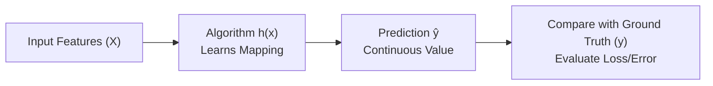

> [!info] Core Objective
> The goal of supervised regression training is to find a mathematical hypothesis function $h(x)$ that maps the input features $\mathbf{X}$ to continuous predictions $\hat{y}$ while minimizing the empirical discrepancy (loss/error) between predictions $\hat{y}$ and actual labels $y$.

### Candidate Regression Algorithms
Most supervised machine learning algorithms can be adapted for both regression (continuous output) and classification (discrete categories):
- **Linear Regression (LR)**: Parametric linear baseline finding optimal hyperplane weights.
- **Decision Trees (DT)**: Non-parametric partitioning of feature space into piecewise constant regions.
- **Random Forests (RF)**: Ensemble of decorrelated decision trees reducing prediction variance.
- **$k$-Nearest Neighbours ($k$-NN)**: Non-parametric, distance-weighted local interpolation.
- **Support Vector Regression (SVR)**: Boundary margin optimization with $\epsilon$-insensitive loss.
- **Artificial Neural Networks (ANN)**: Multi-layer perceptrons modeling complex non-linear manifolds.

---

## 2.2 Linear Regression (LR)

Linear Regression models the relationship between continuous input features $\mathbf{X}$ and a continuous target $y$ by fitting the optimal linear equation.

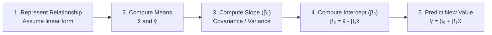

### 2.2.1 Mathematical Formulation (Simple Linear Regression)
$$\hat{y} = \beta_0 + \beta_1 X$$
where:
- $\hat{y}$ = Predicted continuous dependent target
- $X$ = Independent input predictor
- $\beta_0$ = $y$-intercept (predicted value of $y$ when $X = 0$)
- $\beta_1$ = Regression slope (expected rate of change in $y$ for a one-unit increase in $X$)

The optimal parameter vector $\boldsymbol{\beta}$ is derived by minimizing the **Sum of Squared Errors (SSE)** (Ordinary Least Squares - OLS):
$$\text{SSE} = \sum_{i=1}^n (y_i - \hat{y}_i)^2 = \sum_{i=1}^n \left(y_i - (\beta_0 + \beta_1 x_i)\right)^2$$

$$\beta_1 = \frac{\sum_{i=1}^n (x_i - \bar{x})(y_i - \bar{y})}{\sum_{i=1}^n (x_i - \bar{x})^2}, \quad \beta_0 = \bar{y} - \beta_1 \bar{x}$$

### 2.2.2 Step-by-Step Numerical Walkthrough
Given the Food Delivery trip records ($n = 5$):

| Observation | Distance $X$ (km) | Delivery Time $y$ (min) |
| :--- | :--- | :--- |
| A | 7.93 | 43 |
| B | 16.42 | 84 |
| C | 9.52 | 59 |
| D | 7.44 | 37 |
| E | 19.03 | 68 |

1. **Calculate Sample Means**:
   $$\bar{x} = \frac{7.93 + 16.42 + 9.52 + 7.44 + 19.03}{5} = \frac{60.34}{5} = 12.068\text{ km}$$
   $$\bar{y} = \frac{43 + 84 + 59 + 37 + 68}{5} = \frac{291}{5} = 58.20\text{ min}$$

2. **Compute Covariance and Variance Components**:

| $x_i$ | $y_i$ | $(x_i - \bar{x})$ | $(y_i - \bar{y})$ | $(x_i - \bar{x})(y_i - \bar{y})$ | $(x_i - \bar{x})^2$ |
| :--- | :--- | :--- | :--- | :--- | :--- |
| 7.93 | 43 | $-4.138$ | $-15.20$ | $62.898$ | $17.123$ |
| 16.42 | 84 | $+4.352$ | $+25.80$ | $112.282$ | $18.940$ |
| 9.52 | 59 | $-2.548$ | $+0.80$ | $-2.038$ | $6.492$ |
| 7.44 | 37 | $-4.628$ | $-21.20$ | $98.114$ | $21.418$ |
| 19.03 | 68 | $+6.962$ | $+9.80$ | $68.228$ | $48.470$ |
| **Sum ($\sum$)** | | | | **$339.482$** | **$112.443$** |

3. **Derive Slope ($\beta_1$) and Intercept ($\beta_0$)**:
   $$\beta_1 = \frac{339.482}{112.443} \approx 3.0191$$
   $$\beta_0 = 58.20 - (3.0191 \times 12.068) = 58.20 - 36.4345 = 21.7655 \approx 21.76$$

   $$\hat{y} = 21.76 + 3.0191 X$$

> [!note] Interpretation of Coefficients
> - **Slope ($\beta_1 = 3.02$)**: For every additional $1\text{ km}$ of delivery distance, predicted delivery duration increases by approximately $3.02\text{ minutes}$.
> - **Intercept ($\beta_0 = 21.76$)**: The baseline preparation and handover overhead (at $0\text{ km}$) is approximately $21.76\text{ minutes}$.

4. **Predict for New Input**:
   For a delivery of distance $X = 10\text{ km}$:
   $$\hat{y} = 21.76 + 3.0191(10) = 21.76 + 30.191 = 51.951 \approx 52.0\text{ minutes}$$

---

## 2.3 Decision Tree (DT) Regression

A Decision Tree for regression constructs a hierarchical sequence of binary decision thresholds, splitting the dataset into orthogonal hypercubes where predictions are piecewise constants.

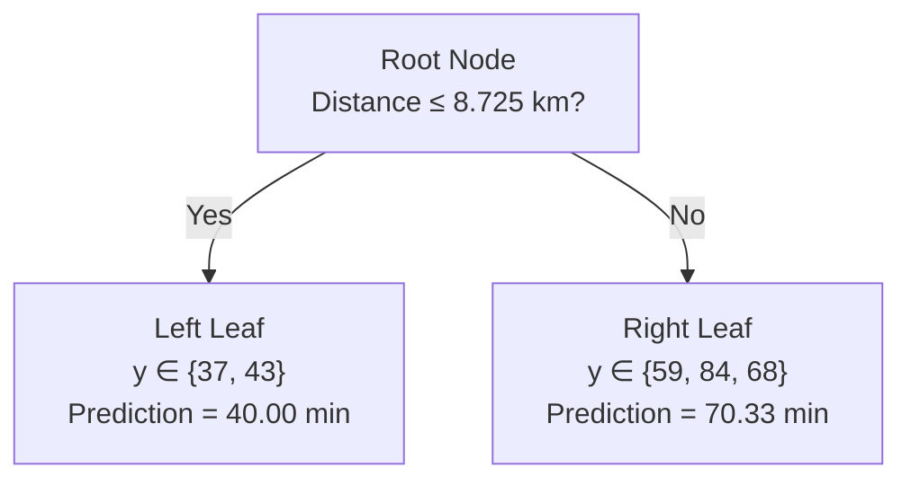

> [!info] Fundamental Mechanism
> Decision Tree Regression does **not** fit a continuous straight line. It partitions input space into discrete subsets and predicts the **sample mean** of the target values belonging to the terminal leaf node.

### 2.3.1 Splitting Criterion: Variance Reduction
At each node, the algorithm evaluates all candidate features and split thresholds to maximize **Variance Reduction (VR)**:
$$\text{Var}(\text{node}) = \frac{1}{N}\sum_{i=1}^N (y_i - \bar{y})^2$$
$$\text{Weighted Var}(\text{children}) = \left(\frac{n_L}{N}\right)\text{Var}(L) + \left(\frac{n_R}{N}\right)\text{Var}(R)$$
$$\text{Variance Reduction} = \text{Var}(\text{parent}) - \text{Weighted Var}(\text{children})$$

### 2.3.2 Step-by-Step Decision Tree Construction Example
Using the sorted delivery distance dataset:
- $X = [7.44, 7.93, 9.52, 16.42, 19.03]$
- $y = [37, 43, 59, 84, 68]$ ($N = 5$)

1. **Calculate Parent Node Variance**:
   $$\bar{y} = \frac{37 + 43 + 59 + 84 + 68}{5} = 58.20$$
   $$\text{SSE}_{\text{parent}} = (37-58.2)^2 + (43-58.2)^2 + (59-58.2)^2 + (84-58.2)^2 + (68-58.2)^2 = 1,442.80$$
   $$\text{Var}(\text{parent}) = \frac{1,442.80}{5} = 288.56$$

2. **Evaluate Candidate Midpoint Splits**:

| Candidate | Split Threshold Calculation | Rule | Left $y$ Partition | Right $y$ Partition | Weighted Child Variance | Variance Reduction |
| :--- | :--- | :--- | :--- | :--- | :--- | :--- |
| 1 | $(7.44 + 7.93)/2 = 7.685$ | $X \le 7.685$ | $[37]$ | $[43, 59, 84, 68]$ | $176.20$ | $112.36$ |
| **2 (Best)** | **$(7.93 + 9.52)/2 = 8.725$** | **$X \le 8.725$** | **$[37, 43]$** | **$[59, 84, 68]$** | **$67.73$** | **$220.83$** |
| 3 | $(9.52 + 16.42)/2 = 12.970$ | $X \le 12.970$ | $[37, 43, 59]$ | $[84, 68]$ | $77.33$ | $211.23$ |
| 4 | $(16.42 + 19.03)/2 = 17.725$ | $X \le 17.725$ | $[37, 43, 59, 84]$ | $[68]$ | $264.55$ | $24.01$ |

3. **Derive Terminal Leaf Predictions**:
   - **Left Leaf ($X \le 8.725$)**:
     $$\hat{y}_{\text{left}} = \frac{37 + 43}{2} = 40.00\text{ min}$$
   - **Right Leaf ($X > 8.725$)**:
     $$\hat{y}_{\text{right}} = \frac{59 + 84 + 68}{3} = 70.33\text{ min}$$

4. **Predict for New Input ($X = 10\text{ km}$)**:
   Since $10 > 8.725$, route sample to Right Leaf:
   $$\hat{y} = 70.33\text{ minutes}$$

---

## 2.4 Random Forest (RF) Regression

Random Forest is a bagging (bootstrap aggregating) ensemble method that constructs $T$ de-correlated decision trees in parallel and averages their predictions.

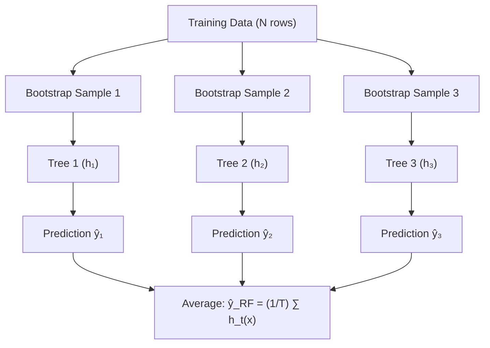

### 2.4.1 Five-Step Architecture of Random Forests
1. **Bootstrap Sampling**: Draw $T$ random subsets of size $N$ from the training set with replacement (some rows repeat, $\approx 36.8\%$ out-of-bag).
2. **Train Independent Trees**: Fit a separate decision tree on each bootstrap sample.
3. **Random Feature Subspace**: At every candidate split, consider only a random subset of features (typically $\sqrt{p}$ or $p/3$), ensuring trees remain de-correlated.
4. **Individual Tree Predictions**: Each tree generates an independent continuous estimate $h_t(x)$.
5. **Aggregation**: Compute the ensemble mean:
   $$\hat{y}_{\text{RF}} = \frac{1}{T}\sum_{t=1}^T h_t(x)$$

### 2.4.2 Numerical Calculation Walkthrough ($T = 3$ Trees)
Predict delivery time for $X = 10\text{ km}$:

| Tree ($t$) | Bootstrap Sample | Selected Optimal Split | Leaf Assignment for $X = 10$ | Leaf Prediction ($h_t(x)$) |
| :--- | :--- | :--- | :--- | :--- |
| $T_1$ | $\{A, B, C, D, E\}$ | $X \le 8.725$ | Right Leaf $\{C, D, E\} = [59, 84, 68]$ | $\hat{y}_1 = \frac{59 + 84 + 68}{3} = 70.33\text{ min}$ |
| $T_2$ | $\{A, B, C, C, E\}$ | $X \le 8.725$ | Right Leaf $\{C, C, E\} = [59, 59, 68]$ | $\hat{y}_2 = \frac{59 + 59 + 68}{3} = 62.00\text{ min}$ |
| $T_3$ | $\{B, C, D, E, E\}$ | $X \le 12.970$ | Left Leaf $\{B, C\} = [43, 59]$ | $\hat{y}_3 = \frac{43 + 59}{2} = 51.00\text{ min}$ |

Final Ensemble Prediction:
$$\hat{y}_{\text{RF}} = \frac{70.33 + 62.00 + 51.00}{3} = \frac{183.33}{3} = 61.11\text{ minutes}$$

---

## 2.5 The No Free Lunch Theorem

> [!info] The "No Free Lunch" (NFL) Principle
> Stated by David Wolpert: **No single machine learning model universally outperforms all other models across every possible problem.** 
> Every algorithm embodies inductive biases and structural assumptions that make it effective on certain data manifolds but inferior on others.

### Strategic Guidelines
- **Diversify Model Families**: Benchmark distinct mathematical architectures ($k$-NN, Regularized Linear Models, Decision Trees, Random Forests, Gradient Boosters, SVMs, Neural Networks).
- **Avoid Premature Deep Tuning**: Do not invest extensive compute in optimizing hyperparameters for a single model before identifying 2 to 5 top-performing baseline architectures.
- **Shortlist Promising Candidates**: Select the top 2-3 performing architectures for rigorous cross-validation and hyperparameter search.

---

## 2.6 Regression Performance Evaluation Metrics

Evaluation quantifies prediction discrepancies against known ground-truth targets on held-out data:

| Metric | Formula | Description & Characteristics | Ideal Value |
| :--- | :--- | :--- | :--- |
| **Mean Absolute Error (MAE)** | $\text{MAE} = \frac{1}{n}\sum_{i=1}^n \|y_i - \hat{y}_i\|$ | Linear average penalty; robust to extreme outliers; retains original target units. | $\downarrow 0$ |
| **Mean Squared Error (MSE)** | $\text{MSE} = \frac{1}{n}\sum_{i=1}^n (y_i - \hat{y}_i)^2$ | Quadratic penalty; heavily punishes large errors; differentiable for gradient descent. | $\downarrow 0$ |
| **Root Mean Squared Error (RMSE)** | $\text{RMSE} = \sqrt{\text{MSE}}$ | Square root of MSE; sensitive to large errors while preserving the original physical units. | $\downarrow 0$ |
| **Mean Absolute Percentage Error (MAPE)** | $\text{MAPE} = \frac{100}{n}\sum_{i=1}^n \left\|\frac{y_i - \hat{y}_i}{y_i}\right\|$ | Dimensionless relative percentage error; intuitive for executive reporting. | $\downarrow 0\%$ |
| **Coefficient of Determination ($R^2$)** | $R^2 = 1 - \frac{\sum (y_i - \hat{y}_i)^2}{\sum (y_i - \bar{y})^2} = 1 - \frac{SS_{\text{res}}}{SS_{\text{tot}}}$ | Proportion of total variance in the dependent variable explained by model predictors. | $\uparrow 1.0$ |
| **Adjusted $R^2$** | $\bar{R}^2 = 1 - (1 - R^2)\frac{n - 1}{n - p - 1}$ | Modifies $R^2$ to penalize the addition of uninformative independent predictors ($p$). | $\uparrow 1.0$ |

---

## 2.7 Underfitting, Overfitting, and Generalization

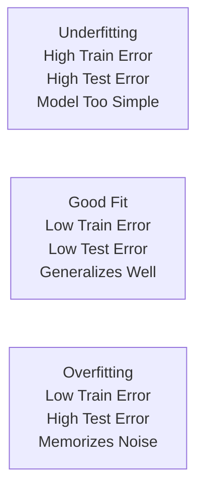

| State | Training Error | Test/Val Error | Root Cause | Remediation |
| :--- | :--- | :--- | :--- | :--- |
| **Underfitting (High Bias)** | High | High | Hypothesis class too constrained; insufficient feature complexity. | Add features/polynomial terms; increase model depth; reduce regularization penalty. |
| **Good Fit (Optimal Trade-off)** | Low | Low | Model captures underlying functional pattern without fitting noise. | Model ready for deployment and monitoring. |
| **Overfitting (High Variance)** | Low | High | Model excessively complex; memorizes sample noise and training quirks. | Prune trees; apply $L_1/L_2$ regularization; collect more data; perform feature selection. |

---

## 2.8 Cross-Validation (CV) Strategies

> [!warning] Test Set Contamination
> Never evaluate candidate models or tune hyperparameters using the test set. Doing so causes **data leakage**, resulting in overly optimistic generalization estimates that fail in production.

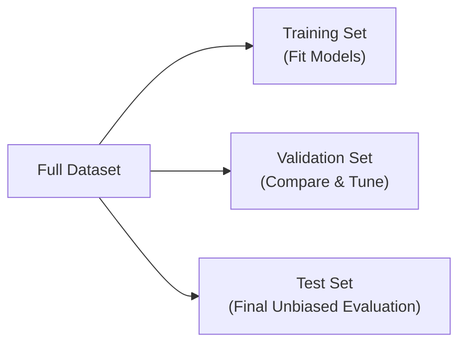

### Common Cross-Validation Taxonomies
1. **$k$-Fold Cross-Validation**: Divides the training set into $k$ equal folds. Iteratively trains on $k-1$ folds and validates on the remaining fold ($k$ cycles). The overall performance estimate is:
   $$\text{CV Score} = \frac{1}{K}\sum_{k=1}^K \text{Score}_k$$
2. **Stratified $k$-Fold**: Ensures each fold contains approximately the identical ratio of target classes (essential for imbalanced classification).
3. **Leave-One-Out CV (LOOCV)**: $k = N$. Trains on $N-1$ samples and validates on $1$ sample. Exhaustive but computationally prohibitive for large datasets.
4. **Time Series Split (Rolling Window)**: Enforces temporal ordering ($Train_{t < T} \to Validate_{t = T}$) to prevent future information leaking into the past.
5. **Group $k$-Fold**: Ensures samples originating from the same entity/subject are never split across both train and validation partitions simultaneously.

---

## 2.9 Stage 6: Fine-Tune the Model (Hyperparameter Optimization)

- **Model Parameters**: Weights learned internally during optimization (e.g., linear slopes $\beta$, neural network weights $W$).
- **Hyperparameters**: Structural configuration settings established prior to training (e.g., tree `max_depth`, `n_estimators`, learning rate $\alpha$).

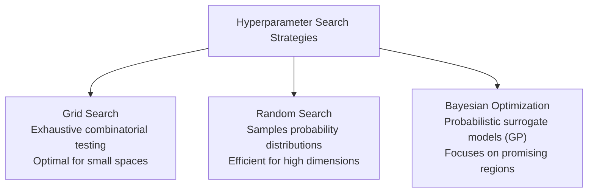

### Grid Search vs. Random Search Comparison

| Dimension | Grid Search | Random Search |
| :--- | :--- | :--- |
| **Mechanism** | Tests all Cartesian combinations $\theta \in \Theta$. | Randomly samples $S$ parameter tuples from $\Theta$. |
| **Search Space** | Discrete grid only. | Continuous distributions or large discrete sets. |
| **Dimensional Efficiency** | Suffers from the curse of dimensionality ($O(m^p)$). | Highly efficient when only a subset of hyperparameters matter. |
| **Guarantees** | Guaranteed to find the optimal grid point. | Probabilistically discovers near-optimal configurations in fewer trials. |

#### Mathematical Formulation
$$\theta^* = \arg\min_{\theta \in \Theta} \text{CV}(\theta) = \arg\min_{\theta \in \Theta} \frac{1}{K}\sum_{k=1}^K \text{Loss}_k(\theta)$$

---

## 2.10 Stage 7: Launch, Monitor, and Maintain

Deploying the regression model to production initiates an active operational lifecycle:

1. **Connect Input Source**: Package model artifacts (e.g., via ONNX, FastAPI, Docker) into production service pipelines.
2. **Automated Pipeline Testing**: Implement unit tests for data schemas and integration tests for latency and output boundaries.
3. **Continuous Performance Monitoring**: Track live inference metrics, residual errors, and prediction drift.
4. **Data Quality & Distribution Auditing**: Detect data drift (covariate shift) and concept drift (changing relationships between $\mathbf{X}$ and $y$).
5. **Human-in-the-Loop Review**: Route anomalous or high-impact predictions to human domain experts.
6. **Scheduled Retraining**: Re-fit pipelines on rolling windows of fresh data to mitigate model decay.
7. **Versioned Rollback Snapshots**: Maintain model registries to allow instant rollback to a previous version if errors occur.

---

## 2.11 Comprehensive Practical Exercise: Ice Cream Sales Analysis

### Problem Scenario
A vendor tracks daily promotional spending ($x$ in thousands) and actual sales ($y$ in units):

| Day | Promotion Spending $x$ | Actual Ice Cream Sales $y$ |
| :--- | :--- | :--- |
| 1 | 2 | 120 |
| 2 | 4 | 150 |
| 3 | 6 | 180 |
| 4 | 8 | 210 |
| 5 | 10 | 240 |

Target Query: Predict sales when promotion spending $x = 7$.

---

### Part A: Linear Regression Solution
1. **Calculate Means**:
   $$\bar{x} = \frac{2 + 4 + 6 + 8 + 10}{5} = \frac{30}{5} = 6.0$$
   $$\bar{y} = \frac{120 + 150 + 180 + 210 + 240}{5} = \frac{900}{5} = 180.0$$

2. **Calculate Slope ($b_1$)**:
   - $(x_i - \bar{x}) = [-4, -2, 0, 2, 4]$
   - $(y_i - \bar{y}) = [-60, -30, 0, 30, 60]$
   - $\sum (x_i - \bar{x})(y_i - \bar{y}) = (-4)(-60) + (-2)(-30) + 0 + (2)(30) + (4)(60) = 240 + 60 + 0 + 60 + 240 = 600$
   - $\sum (x_i - \bar{x})^2 = (-4)^2 + (-2)^2 + 0^2 + 2^2 + 4^2 = 16 + 4 + 0 + 4 + 16 = 40$
   $$b_1 = \frac{600}{40} = 15.0$$

3. **Calculate Intercept ($b_0$)**:
   $$b_0 = \bar{y} - b_1 \bar{x} = 180 - (15.0 \times 6.0) = 180 - 90 = 90.0$$

4. **Fitted Equation & Prediction**:
   $$\hat{y} = 90 + 15x$$
   For $x = 7$:
   $$\hat{y} = 90 + 15(7) = 90 + 105 = 195\text{ units}$$

---

### Part B: Decision Tree Regression Solution
Given split condition: $x \le 6$

1. **Leaf Partitions and Predictions**:
   - **Left Leaf ($x \le 6$)**: Contains days $\{1, 2, 3\}$ with $y = [120, 150, 180]$
     $$\hat{y}_{\text{left}} = \frac{120 + 150 + 180}{3} = \frac{450}{3} = 150\text{ units}$$
   - **Right Leaf ($x > 6$)**: Contains days $\{4, 5\}$ with $y = [210, 240]$
     $$\hat{y}_{\text{right}} = \frac{210 + 240}{2} = \frac{450}{2} = 225\text{ units}$$

2. **Sum of Squared Errors (SSE)**:
   - $\text{SSE}_{\text{left}} = (120 - 150)^2 + (150 - 150)^2 + (180 - 150)^2 = 900 + 0 + 900 = 1,800$
   - $\text{SSE}_{\text{right}} = (210 - 225)^2 + (240 - 225)^2 = 225 + 225 = 450$
   $$\text{SSE}_{\text{total}} = 1,800 + 450 = 2,250$$

3. **Prediction for $x = 7$**:
   Since $7 > 6$, sample is routed to Right Leaf:
   $$\hat{y} = 225\text{ units}$$

---

### Part C: Random Forest Regression Solution
Given individual tree predictions for $x = 7$:
- Tree 1: $\hat{y}_1 = 195$
- Tree 2: $\hat{y}_2 = 210$
- Tree 3: $\hat{y}_3 = 225$

1. **Ensemble Prediction**:
   $$\hat{y}_{\text{RF}} = \frac{\hat{y}_1 + \hat{y}_2 + \hat{y}_3}{3} = \frac{195 + 210 + 225}{3} = \frac{630}{3} = 210\text{ units}$$

2. **Methodological Comparison**:
   - **Linear Regression ($195$)**: Assumes a continuous global linear function across all feature space; outputs an exact interpolated line point.
   - **Decision Tree ($225$)**: Discretizes feature space into step functions; predicts the average of the closest localized cluster ($x > 6$).
   - **Random Forest ($210$)**: Smoothes step discontinuities by averaging multiple bootstrap tree estimates, balancing linear extrapolation and localized clustering.

---

### Part D: Performance Metrics Calculation

| Day | Actual Sales $y_i$ | Predicted Sales $\hat{y}_i$ | Error $(y_i - \hat{y}_i)$ | Absolute Error $\|y_i - \hat{y}_i\|$ | Squared Error $(y_i - \hat{y}_i)^2$ | Percentage Error $\left\|\frac{y_i - \hat{y}_i}{y_i}\right\| \times 100\%$ |
| :--- | :--- | :--- | :--- | :--- | :--- | :--- |
| 1 | 120 | 115 | $+5$ | 5 | 25 | $\frac{5}{120} \approx 4.17\%$ |
| 2 | 150 | 160 | $-10$ | 10 | 100 | $\frac{10}{150} \approx 6.67\%$ |
| 3 | 180 | 175 | $+5$ | 5 | 25 | $\frac{5}{180} \approx 2.78\%$ |
| 4 | 210 | 220 | $-10$ | 10 | 100 | $\frac{10}{210} \approx 4.76\%$ |
| 5 | 240 | 230 | $+10$ | 10 | 100 | $\frac{10}{240} \approx 4.17\%$ |
| **Sum** | | | | **40** | **350** | **$22.55\%$** |

1. **Mean Absolute Error (MAE)**:
   $$\text{MAE} = \frac{40}{5} = 8.0\text{ units}$$
2. **Mean Squared Error (MSE)**:
   $$\text{MSE} = \frac{350}{5} = 70.0$$
3. **Root Mean Squared Error (RMSE)**:
   $$\text{RMSE} = \sqrt{70.0} \approx 8.3666 \approx 8.37\text{ units}$$
4. **Mean Absolute Percentage Error (MAPE)**:
   $$\text{MAPE} = \frac{22.55\%}{5} = 4.51\%$$
5. **$R$-Squared ($R^2$)**:
   Given $SS_{\text{res}} = 350$, $SS_{\text{tot}} = 9,000$:
   $$R^2 = 1 - \frac{350}{9,000} = 1 - 0.03889 = 0.9611$$
6. **Adjusted $R$-Squared ($\bar{R}^2$)**:
   Given $R^2 = 0.9611, n = 20, p = 3$:
   $$\bar{R}^2 = 1 - (1 - 0.9611) \frac{20 - 1}{20 - 3 - 1} = 1 - (0.0389) \frac{19}{16} = 1 - (0.0389 \times 1.1875) = 1 - 0.04619 = 0.9538$$


---

# Topic 3: The Classification Pipeline

## 3.1 Overview of Classification

Classification is a primary pillar of supervised machine learning tasked with assigning input instances to predefined discrete categorical classes.

> [!info] Definition: Classification
> Classification learns a hypothesis mapping function $h(\mathbf{x})$ that predicts a discrete qualitative output label $y \in \{C_1, C_2, \dots, C_K\}$ from an input feature vector $\mathbf{X} = [x_1, x_2, \dots, x_n]$:
> $$\mathbf{X} \xrightarrow{h(\mathbf{x})} \hat{y} \in \mathcal{C}$$
> While regression answers *"How much?"* or *"How many?"*, classification answers *"Which category does this input belong to?"* (e.g., spam vs. ham, malignant vs. benign, fraud vs. legitimate).

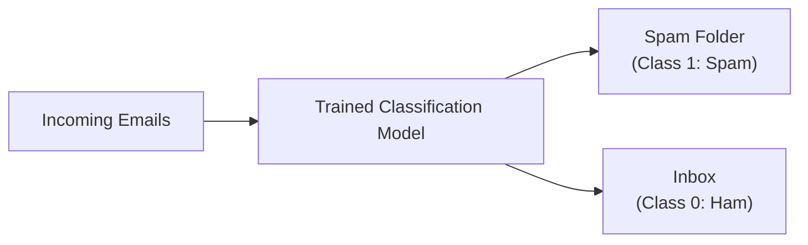

### The Seven-Stage Pipeline for Classification
The classification pipeline mirrors the standard machine learning life-cycle introduced in regression, differing primarily in algorithm taxonomy, cost function definitions, and evaluation metrics:
1. **Look at the Big Picture**: Problem formulation, business objectives, baseline definition.
2. **Get Data**: Data collection (APIs, scraping, databases).
3. **Explore Data**: Check class balance, distributions, feature correlations.
4. **Prepare Data**: Train/test split (stratified), imputation, one-hot encoding, scaling.
5. **Select & Train Models**: Train eager and lazy classification algorithms.
6. **Fine-tune Models**: Cross-validation, hyperparameter tuning, threshold optimization.
7. **Launch & Monitor**: Real-time deployment, drift detection, metric tracking.

---

## 3.2 Classification Algorithm Taxonomy

Different classifiers establish decision boundaries using distinct geometric, probabilistic, or structural assumptions:

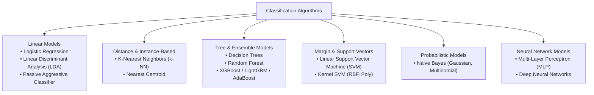

---

## 3.3 Types of Learners: Lazy vs. Eager Learning

Supervised classifiers are classified into two computational paradigms based on when generalization occurs:

| Architectural Aspect | Lazy Learning (Instance-Based) | Eager Learning (Model-Based) |
| :--- | :--- | :--- |
| **Generalization Timing** | **Delayed / At Query Time**: Does not generalize from training data during the fitting phase. | **Immediate / At Training Time**: Generalizes data into an explicit abstract model during training. |
| **Model Construction** | **No explicit model**: Training merely stores raw training instances in memory. | **Explicit model constructed**: Optimizes weights $\mathbf{w}$, intercepts $b$, or hierarchical split trees. |
| **Training Time** | **$O(1)$ / Minimal**: Merely indexing or storing data records. | **High**: Iterative numerical optimization, gradient descent, or combinatorial tree splitting. |
| **Prediction / Inference Time** | **$O(N \cdot d)$ / High**: Must compute distances against all stored training points for every new query. | **$O(d)$ / Very Low**: Simple mathematical function evaluation (e.g., dot product $\mathbf{w}^T\mathbf{x} + b$). |
| **Memory Footprint** | **High**: The complete training corpus must permanently reside in memory. | **Low**: Raw training instances can be discarded; only parameters/weights are preserved. |
| **Representative Algorithms** | $k$-Nearest Neighbors ($k$-NN), Case-Based Reasoning. | Logistic Regression, Decision Trees, Support Vector Machines, Naive Bayes, Neural Networks. |

---

## 3.4 Types of Classification Tasks

Classification tasks are organized into three primary operational structures:

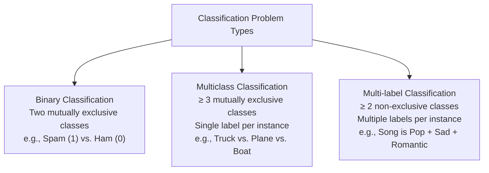

---

## 3.5 Binary Classification & Decision Tree Splitting

Binary classification predicts one of two mutually exclusive categories: $y \in \{0, 1\}$.

### 3.5.1 Impurity Metrics for Tree Splitting

A decision tree splits a parent node into left ($L$) and right ($R$) children to maximize node purity (minimizing impurity).

#### 1. Gini Impurity
Measures the probability of misclassifying a randomly chosen element from the set if it were randomly labeled according to the class distribution:
$$\text{Gini} = 1 - \sum_{i=1}^C p_i^2$$
where $p_i$ is the relative proportion of class $i$ within the node.
- Purity limits: $\text{Gini} = 0$ (perfect purity; all samples belong to one class). For binary tasks, $\max \text{Gini} = 0.50$ (worst case; exactly $50/50$ distribution).

#### 2. Weighted Gini After Split
$$\text{Gini}_{\text{split}} = \left(\frac{n_L}{n}\right)\text{Gini}_L + \left(\frac{n_R}{n}\right)\text{Gini}_R$$

#### 3. Gini Impurity Gain
$$\text{Gain} = \text{Gini}_{\text{parent}} - \text{Gini}_{\text{split}}$$
The algorithm evaluates all features and candidate thresholds, selecting the split that yields the **highest Gini Gain**.

#### 4. Entropy and Information Gain (Alternative Criterion)
$$\text{Entropy} = -\sum_{i=1}^C p_i \log_2(p_i)$$
$$\text{Information Gain} = \text{Entropy}_{\text{parent}} - \left[\frac{n_L}{n}\text{Entropy}_L + \frac{n_R}{n}\text{Entropy}_R\right]$$

---

### 3.5.2 Student Placement Case Study (Gini Calculation Walkthrough)

**Dataset Context**: $9,000$ university students evaluated for campus placement:
- Target Classes: `Placed` ($1$) vs. `Not Placed` ($0$).
- Total Parent Distribution:
  - $\text{Placed} = 7,702 \implies p_1 = \frac{7,702}{9,000} \approx 0.8558$
  - $\text{Not Placed} = 1,298 \implies p_0 = \frac{1,298}{9,000} \approx 0.1442$

1. **Calculate Parent Node Gini**:
   $$\text{Gini}_{\text{parent}} = 1 - (0.8558)^2 - (0.1442)^2 = 1 - 0.73239 - 0.02079 = 0.2468$$

2. **Evaluate Candidate Root Split: $\text{Backlogs} = 0$**:
   - **Left Node ($\text{Backlogs} = 0$, $n_L = 6,349$)**:
     - $\text{Placed} = 5,799 \implies p_1 = \frac{5,799}{6,349} \approx 0.9134$
     - $\text{Not Placed} = 550 \implies p_0 = \frac{550}{6,349} \approx 0.0866$
     $$\text{Gini}_L = 1 - (0.9134)^2 - (0.0866)^2 = 1 - 0.83430 - 0.00750 = 0.1582$$
   - **Right Node ($\text{Backlogs} > 0$, $n_R = 2,651$)**:
     - $\text{Placed} = 1,903 \implies p_1 = \frac{1,903}{2,651} \approx 0.7178$
     - $\text{Not Placed} = 748 \implies p_0 = \frac{748}{2,651} \approx 0.2822$
     $$\text{Gini}_R = 1 - (0.7178)^2 - (0.2822)^2 = 1 - 0.51524 - 0.07964 = 0.4051$$

3. **Compute Weighted Child Gini & Gain**:
   $$\text{Gini}_{\text{split}} = \left(\frac{6,349}{9,000} \times 0.1582\right) + \left(\frac{2,651}{9,000} \times 0.4051\right) = 0.1116 + 0.1193 = 0.2310$$
   $$\text{Gain} = \text{Gini}_{\text{parent}} - \text{Gini}_{\text{split}} = 0.2468 - 0.2310 = 0.0159$$

4. **Candidate Split Comparison Table**:

| Candidate Split | $n_L$ | $n_R$ | Weighted Gini | Gini Gain | Decision |
| :--- | :--- | :--- | :--- | :--- | :--- |
| **`backlogs = 0`** | **6,349** | **2,651** | **0.2310** | **0.0159** | **Selected Best Root Split** |
| `college_tier <= 2` | 5,934 | 3,066 | 0.2374 | 0.0094 | Rejected |
| `skill_score >= 3` | 2,353 | 6,647 | 0.2384 | 0.0085 | Rejected |
| `internships >= 1` | 5,793 | 3,207 | 0.2387 | 0.0081 | Rejected |
| `coding_score >= 50` | 4,469 | 4,531 | 0.2390 | 0.0079 | Rejected |
| `dsa_skill = 1` | 5,000 | 4,000 | 0.2415 | 0.0054 | Rejected |
| `projects >= 3` | 6,001 | 2,999 | 0.2416 | 0.0053 | Rejected |

---

## 3.6 Multiclass Classification Strategies

Multiclass classification assigns an instance to exactly one category among $C \ge 3$ candidate classes. Strictly binary classifiers (e.g., standard Perceptrons, classic SVMs, Logistic Regression) are adapted for multiclass tasks using decomposition strategies:

### 3.6.1 One-versus-One (OvO)
Trains a distinct binary classifier for every unique pair of classes:
$$N_{\text{OvO}} = \frac{C(C - 1)}{2}$$
- **Prediction Rule**: Each binary classifier casts a vote for its predicted winner. The sample is assigned to the class with the most aggregate votes:
  $$\hat{y} = \arg\max_k \text{Votes}(k)$$
- **Example ($C = 3$: Plane, Truck, Boat)**:
  - Classifiers: $N_{\text{OvO}} = \frac{3(2)}{2} = 3$ models:
    1. *Classifier 1 (Plane vs. Truck)*: Plane wins (1 vote Plane).
    2. *Classifier 2 (Plane vs. Boat)*: Plane wins (1 vote Plane).
    3. *Classifier 3 (Truck vs. Boat)*: Boat wins (1 vote Boat).
  - Voting Tally: Plane $= 2$, Boat $= 1$, Truck $= 0 \implies$ **Final Prediction: Plane**.

### 3.6.2 One-versus-Rest (OvR / One-vs-All)
Trains $C$ binary classifiers, where classifier $k$ treats class $k$ as the positive class ($1$) and all other $C-1$ classes combined as the negative class ($0$):
$$N_{\text{OvR}} = C$$
- **Prediction Rule**: Each classifier produces a continuous decision confidence score or probability $f_k(\mathbf{x})$. The class with the highest confidence is selected:
  $$\hat{y} = \arg\max_k f_k(\mathbf{x})$$
- **Example ($C = 3$: Plane, Truck, Boat)**:
  - Classifier 1 (*Plane vs. Not-Plane*): Score $= 0.82$
  - Classifier 2 (*Truck vs. Not-Truck*): Score $= 0.35$
  - Classifier 3 (*Boat vs. Not-Boat*): Score $= 0.58$
  - Highest Score $= 0.82 \implies$ **Final Prediction: Plane**.

---

## 3.7 Distance-Based Classification: $k$-Nearest Neighbors ($k$-NN)

$k$-NN is a non-parametric lazy learning algorithm that determines class membership based on local neighborhood geometry.

### 3.7.1 Mathematical Formulation
1. **Distance Metric (Euclidean Distance)**:
   $$d(\mathbf{X}, \mathbf{X}_i) = \sqrt{\sum_{j=1}^d (x_j - x_{ij})^2}$$
2. **Neighborhood Selection**: Sort distances and select the $K$ smallest entries: $\mathcal{N}_K(\mathbf{X})$.
3. **Voting Rule**:
   $$\hat{y} = \text{mode}\left(\{y_i \mid \mathbf{X}_i \in \mathcal{N}_K(\mathbf{X})\}\right)$$

> [!warning] Hyperparameter $K$ Trade-Offs
> - **Small $K$ (e.g., $K = 1$)**: High model complexity, low bias, but very high variance; highly vulnerable to noise and mislabeled outliers.
> - **Large $K$**: High bias, low variance, smoother decision boundaries; risks diluting minority classes with dominant majority background classes.

### 3.7.2 Multiclass $k$-NN Job Role Prediction & Tie-Breaking
Given training records of placed students:
- Target Classes: `Software Engineer` (SE), `Data Scientist` (DS), `Analyst` (A), `Web Developer` (WD).
- Query Sample: New Student $X = (\text{CGPA} = 5.20, \text{Coding Score} = 18.00)$.

| Student | CGPA | Coding Score | Job Role | Distance Calculation $d(X, X_i) = \sqrt{(\Delta\text{CGPA})^2 + (\Delta\text{Code})^2}$ | Euclidean Distance | Rank |
| :--- | :--- | :--- | :--- | :--- | :--- | :--- |
| **S21** | 5.21 | 18.40 | Software Engineer | $\sqrt{(5.20-5.21)^2 + (18.00-18.40)^2} = \sqrt{0.0001 + 0.1600}$ | **0.40** | **1st** |
| **S20** | 5.19 | 27.20 | Data Scientist | $\sqrt{(5.20-5.19)^2 + (18.00-27.20)^2} = \sqrt{0.0001 + 84.6400}$ | **9.20** | **2nd** |
| **S22** | 6.40 | 42.00 | Analyst | $\sqrt{(5.20-6.40)^2 + (18.00-42.00)^2} = \sqrt{1.4400 + 576.0000}$ | **24.03** | **3rd** |
| S24 | 5.35 | 57.50 | Web Developer | $\sqrt{(5.20-5.35)^2 + (18.00-57.50)^2} = \sqrt{0.0225 + 1560.2500}$ | 39.50 | 4th |

#### Voting with $K = 3$:
- The three nearest neighbors are: $\text{1st: S21 (SE)}$, $\text{2nd: S20 (DS)}$, $\text{3rd: S22 (A)}$.
- Vote distribution: 1 vote SE, 1 vote DS, 1 vote Analyst $\implies$ **3-way tie**.
- **Tie-Breaking Rule**: When a voting stalemate occurs, select the class corresponding to the single closest neighbor among the candidates.
- Closest neighbor is **S21** ($d = 0.40$) $\implies$ **Final Prediction: Software Engineer**.

---

## 3.8 Multi-label Classification & Support Vector Machines (SVM)

In multi-label classification, output labels are non-mutually exclusive; an input instance may be labeled with zero, one, or several classes simultaneously.

### 3.8.1 Binary Relevance Decomposition
Binary Relevance fits $L$ separate binary classifiers (one per label). Each classifier independently determines whether the input possesses that specific label:
$$\hat{y}_l = \mathbb{I}\left(f_l(\mathbf{x}) \ge 0\right), \quad \text{for } l = 1, \dots, L$$

### 3.8.2 Linear SVM Decision Function
$$f(\mathbf{x}) = \mathbf{w}^T\mathbf{x} + b = \sum_{j=1}^d w_j x_j + b$$
- If $f(\mathbf{x}) \ge 0 \implies \text{Class } 1$ (Label Present)
- If $f(\mathbf{x}) < 0 \implies \text{Class } 0$ (Label Absent)

### 3.8.3 Music Auto-Tagging Case Study
Given a generated song with extracted audio features:
- $\mathbf{x} = [\text{Tempo} = 0.45, \text{Energy} = 0.35, \text{Romance Score} = 0.80]$

| Label Classifier | Bias $b$ | $w_1$ (Tempo) | $w_2$ (Energy) | $w_3$ (Romance) | Decision Score Calculation $f(\mathbf{x}) = \mathbf{w}^T\mathbf{x} + b$ | Score | Binary Output |
| :--- | :--- | :--- | :--- | :--- | :--- | :--- | :--- |
| **Pop** | $-0.10$ | $+0.60$ | $+0.80$ | $+0.20$ | $-0.10 + (0.60 \times 0.45) + (0.80 \times 0.35) + (0.20 \times 0.80)$ | **$+0.610$** | **1 (Present)** |
| **Sad** | $+0.05$ | $-0.40$ | $-0.90$ | $+0.70$ | $+0.05 - (0.40 \times 0.45) - (0.90 \times 0.35) + (0.70 \times 0.80)$ | **$+0.115$** | **1 (Present)** |
| **Romantic** | $-0.20$ | $+0.10$ | $-0.20$ | $+1.30$ | $-0.20 + (0.10 \times 0.45) - (0.20 \times 0.35) + (1.30 \times 0.80)$ | **$+0.815$** | **1 (Present)** |
| **Dance** | $-0.20$ | $+0.70$ | $+1.20$ | $-0.80$ | $-0.20 + (0.70 \times 0.45) + (1.20 \times 0.35) - (0.80 \times 0.80)$ | **$-0.105$** | **0 (Absent)** |

- **Output Binary Vector**: $[1, 1, 1, 0]$
- **Predicted Tags**: **Pop + Sad + Romantic**

---

## 3.9 Comprehensive Classification Evaluation Metrics

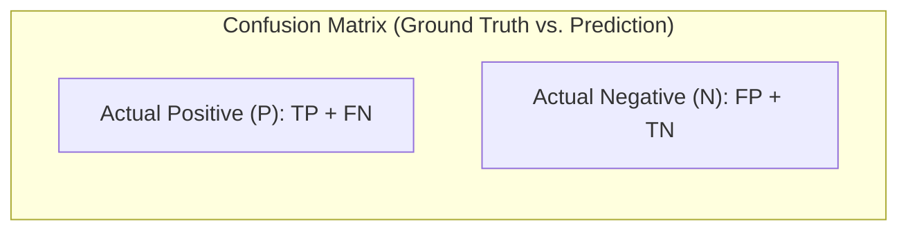

| Metric                        | Mathematical Formula                                                                                                  | Definition & Practical Importance                                                                                                             | Ideal Value              |
| :---------------------------- | :-------------------------------------------------------------------------------------------------------------------- | :-------------------------------------------------------------------------------------------------------------------------------------------- | :----------------------- |
| **Accuracy**                  | $\frac{TP + TN}{TP + TN + FP + FN}$                                                                                   | Overall percentage of correct predictions. Highly misleading on imbalanced data.                                                              | $\uparrow 1.0$ ($100\%$) |
| **Precision**                 | $\frac{TP}{TP + FP}$                                                                                                  | Fraction of predicted positives that are true positives. Critical when **False Positives are costly** (e.g., spam detection, fraud flagging). | $\uparrow 1.0$           |
| **Recall (Sensitivity, TPR)** | $\frac{TP}{TP + FN}$                                                                                                  | Fraction of actual positives correctly recovered. Critical when **False Negatives are dangerous** (e.g., disease diagnosis, missile alert).   | $\uparrow 1.0$           |
| **Specificity (TNR)**         | $\frac{TN}{TN + FP}$                                                                                                  | Fraction of actual negatives correctly rejected.                                                                                              | $\uparrow 1.0$           |
| **False Positive Rate (FPR)** | $\frac{FP}{FP + TN} = 1 - \text{Specificity}$                                                                         | Probability of a false alarm among actual negative events.                                                                                    | $\downarrow 0.0$         |
| **False Negative Rate (FNR)** | $\frac{FN}{FN + TP} = 1 - \text{Recall}$                                                                              | Miss rate of positive events.                                                                                                                 | $\downarrow 0.0$         |
| **$F_1$-Score**               | $2 \times \frac{\text{Precision} \times \text{Recall}}{\text{Precision} + \text{Recall}} = \frac{2TP}{2TP + FP + FN}$ | Harmonic mean balancing Precision and Recall; robust metric for imbalanced classes.                                                           | $\uparrow 1.0$           |
| **Log Loss (Cross-Entropy)**  | $-\frac{1}{n}\sum [y\log(p) + (1-y)\log(1-p)]$                                                                        | Penalizes confident incorrect probabilistic estimates.                                                                                        | $\downarrow 0.0$         |

---

## 3.10 Advanced Threshold Analysis & Curves

Most modern classifiers output an internal continuous probability or decision score $p = P(y = 1 \mid \mathbf{x})$, converting it to a discrete class via a decision threshold $\tau$:
$$\hat{y} = \begin{cases} 1 & \text{if } p \ge \tau \\ 0 & \text{if } p < \tau \end{cases}$$

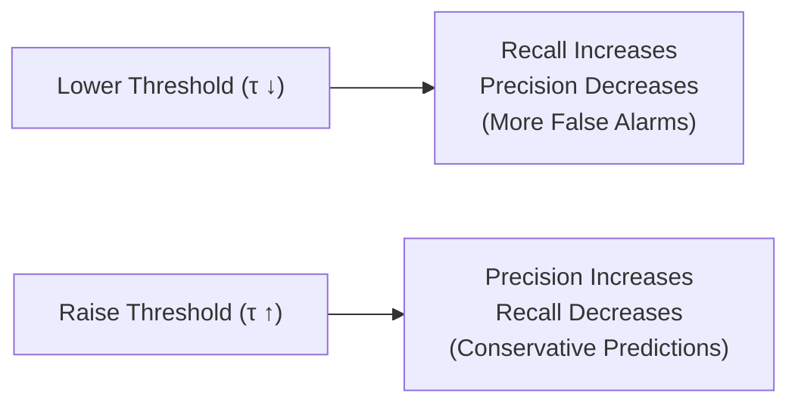

### 3.10.1 The Receiver Operating Characteristic (ROC) Curve
- Plots **True Positive Rate (TPR / Recall)** on the $y$-axis versus **False Positive Rate (FPR)** on the $x$-axis across all possible thresholds $\tau \in [0, 1]$.
- A random guess classifier produces a $45^\circ$ diagonal line ($AUC = 0.50$). A superior classifier arcs sharply toward the top-left coordinate $(0, 1)$.
- **Area Under the ROC Curve (ROC-AUC)**:
  - $0.50$: No discriminative capacity (random guessing).
  - $0.70 - 0.80$: Acceptable discrimination.
  - $0.80 - 0.90$: Excellent discrimination.
  - $> 0.90$: Outstanding performance.

### 3.10.2 The Precision-Recall (PR) Curve
- Plots **Precision** ($y$-axis) against **Recall** ($x$-axis).
- The ideal curve arcs toward the top-right coordinate $(1, 1)$.
- **Crucial Rule**: Use the **PR Curve and PR-AUC** instead of ROC-AUC when evaluating datasets with severe class imbalance, as ROC curves can paint an overly optimistic picture due to large true negative counts.

---

## 3.11 Multiclass Metric Aggregation: Macro vs. Weighted

Given a $4 \times 4$ Multiclass Confusion Matrix ($N = 80$ samples):

| Actual \ Predicted | Predicted A | Predicted B | Predicted C | Predicted D | Total Actual ($TP_i + FN_i$) |
| :--- | :--- | :--- | :--- | :--- | :--- |
| **Actual A** | **9** | 1 | 0 | 0 | **10** |
| **Actual B** | 1 | **15** | 3 | 1 | **20** |
| **Actual C** | 5 | 0 | **24** | 1 | **30** |
| **Actual D** | 0 | 4 | 1 | **15** | **20** |
| **Total Predicted ($TP_i + FP_i$)** | **15** | **20** | **28** | **17** | **$N = 80$** |

### 3.11.1 Overall Accuracy
$$\text{Accuracy} = \frac{\text{Trace}(\mathbf{M})}{N} = \frac{9 + 15 + 24 + 15}{80} = \frac{63}{80} = 0.7875\text{ (78.75\%)}$$

### 3.11.2 One-vs-Rest Decomposition per Class
- **Class A**:
  - $TP_A = 9$
  - $FP_A = 1 + 5 + 0 = 6$
  - $FN_A = 1 + 0 + 0 = 1$
  - $TN_A = 15 + 3 + 1 + 0 + 24 + 1 + 4 + 1 + 15 = 64$
  - $\text{Precision}_A = \frac{9}{9 + 6} = \frac{9}{15} = 0.6000$
  - $\text{Recall}_A = \frac{9}{9 + 1} = \frac{9}{10} = 0.9000$
- **Class B**:
  - $TP_B = 15, \quad FP_B = 1 + 0 + 4 = 5, \quad FN_B = 1 + 3 + 1 = 5, \quad TN_B = 55$
  - $\text{Precision}_B = \frac{15}{20} = 0.7500, \quad \text{Recall}_B = \frac{15}{20} = 0.7500$
- **Class C**:
  - $TP_C = 24, \quad FP_C = 0 + 3 + 1 = 4, \quad FN_C = 5 + 0 + 1 = 6, \quad TN_C = 46$
  - $\text{Precision}_C = \frac{24}{28} \approx 0.8571, \quad \text{Recall}_C = \frac{24}{30} = 0.8000$
- **Class D**:
  - $TP_D = 15, \quad FP_D = 0 + 1 + 1 = 2, \quad FN_D = 0 + 4 + 1 = 5, \quad TN_D = 58$
  - $\text{Precision}_D = \frac{15}{17} \approx 0.8824, \quad \text{Recall}_D = \frac{15}{20} = 0.7500$

### 3.11.3 Macro Averages
$$\text{Macro Precision} = \frac{\frac{9}{15} + \frac{15}{20} + \frac{24}{28} + \frac{15}{17}}{4} = \frac{0.6000 + 0.7500 + 0.8571 + 0.8824}{4} = \frac{3.0895}{4} = 0.7724$$
$$\text{Macro Recall} = \frac{\frac{9}{10} + \frac{15}{20} + \frac{24}{30} + \frac{15}{20}}{4} = \frac{0.9000 + 0.7500 + 0.8000 + 0.7500}{4} = \frac{3.2000}{4} = 0.8000$$

---

## 3.12 Practical Exercises & Solutions

### Exercise Q5: Binary Spam Confusion Matrix
> [!example] Problem
> Given the spam classification results:
> 
> | Actual \ Predicted | Predicted Spam | Predicted Not Spam |
> | :--- | :--- | :--- |
> | **Actual Spam** | 30 | 10 |
> | **Actual Not Spam** | 5 | 55 |
> 
> Calculate Accuracy, Precision, Recall, and $F_1$-score.

> [!tip] Solution
> - $TP = 30$, $FN = 10$, $FP = 5$, $TN = 55$. Total $N = 100$.
> 1. $\text{Accuracy} = \frac{TP + TN}{N} = \frac{30 + 55}{100} = \frac{85}{100} = 0.85\text{ (85\%)}$
> 2. $\text{Precision} = \frac{TP}{TP + FP} = \frac{30}{30 + 5} = \frac{30}{35} \approx 0.8571\text{ (85.71\%)}$
> 3. $\text{Recall} = \frac{TP}{TP + FN} = \frac{30}{30 + 10} = \frac{30}{40} = 0.75\text{ (75.00\%)}$
> 4. $F_1\text{-score} = 2 \times \frac{0.8571 \times 0.75}{0.8571 + 0.75} = \frac{1.28565}{1.6071} \approx 0.8000\text{ (80.00\%)}$

---

### Exercise Q10: Decision Threshold Tuning
> [!example] Problem
> Five instances evaluated with decision rule: $\text{Class} = 1$ if $\text{Score} \ge 1.0$, else $0$:
> 
> | Sample | Model Score | Actual Class |
> | :--- | :--- | :--- |
> | S1 | 0.30 | 0 |
> | S2 | 0.40 | 0 |
> | S3 | 1.50 | 1 |
> | S4 | 0.90 | 1 |
> | S5 | 1.20 | 1 |
> 
> a) Determine predictions. b) Build confusion matrix. c) Compute Precision and Recall. d) Explain trade-off.

> [!tip] Solution
> a) **Predictions**:
> - S1: $0.30 < 1.0 \implies 0$ (Correct, TN)
> - S2: $0.40 < 1.0 \implies 0$ (Correct, TN)
> - S3: $1.50 \ge 1.0 \implies 1$ (Correct, TP)
> - S4: $0.90 < 1.0 \implies 0$ (Missed, FN)
> - S5: $1.20 \ge 1.0 \implies 1$ (Correct, TP)
> 
> b) **Confusion Matrix**:
> - $TP = 2$ (S3, S5)
> - $FP = 0$
> - $FN = 1$ (S4)
> - $TN = 2$ (S1, S2)
> 
> c) **Metrics**:
> - $\text{Precision} = \frac{TP}{TP + FP} = \frac{2}{2 + 0} = 1.00\text{ (100\%)}$
> - $\text{Recall} = \frac{TP}{TP + FN} = \frac{2}{2 + 1} = \frac{2}{3} \approx 0.6667\text{ (66.67\%)}$
> 
> d) **Trade-off Interpretation**:
> Setting a high threshold ($\tau = 1.0$) enforces conservative predictions. The model achieves **perfect precision** ($0$ false alarms), but suffers a lower recall because borderline positive instances (S4 with score $0.90$) are missed.


---

# Topic 4: Logistic Regression & Probabilistic Classification

## 4.1 Foundations of Logistic Regression

Logistic Regression is an eager, parametric classification algorithm that estimates the posterior probability that a given observation belongs to a particular class.

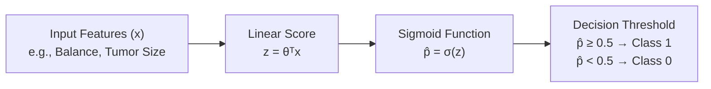

> [!info] Core Identity
> Despite containing the word *"Regression"*, **Logistic Regression is strictly a classification algorithm**. It models the probability of categorical outcomes by mapping an unbounded continuous linear combination of features through the non-linear **logistic (sigmoid) function**.

### Why Linear Regression Fails for Classification
Applying Ordinary Least Squares (OLS) Linear Regression directly to classification exhibits critical structural flaws:
1. **Unbounded Predictions**: Linear regression outputs real values on $(-\infty, +\infty)$, producing probabilities outside the legitimate range $[0, 1]$ (e.g., $\hat{y} = -0.4$ or $\hat{y} = 1.3$).
2. **Sensitivity to Distant Outliers**: Adding valid training points with extreme feature values far from the decision boundary tilts the OLS regression line significantly, shifting the decision threshold and generating erroneous misclassifications.
3. **Violation of Constant Variance (Heteroscedasticity)**: In binary data, the variance $\text{Var}(y \mid x) = p(x)(1 - p(x))$ depends on $x$, violating the standard OLS homoscedasticity assumption.

---

## 4.2 The Hypothesis Function & The Sigmoid Curve

To constrain the model predictions strictly within the valid probabilistic interval $[0, 1]$, the linear score $z = \boldsymbol{\theta}^T\mathbf{x}$ is mapped through the **Sigmoid Function** $\sigma(z)$:

$$\sigma(z) = \frac{1}{1 + e^{-z}} = \frac{e^z}{1 + e^z}$$

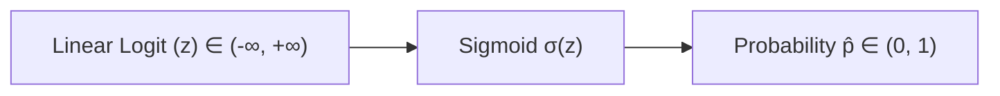

### Mathematical Properties of the Sigmoid Function
- **Range Boundaries**: $0 < \sigma(z) < 1$ for all real $z$.
- **Symmetry Point**: $\sigma(0) = 0.5$.
- **Asymptotic Limits**: $\lim_{z \to +\infty} \sigma(z) = 1$ and $\lim_{z \to -\infty} \sigma(z) = 0$.
- **Derivative Property**: $\frac{d\sigma(z)}{dz} = \sigma(z)(1 - \sigma(z))$.

### Hypothesis Representation
$$h_{\boldsymbol{\theta}}(\mathbf{x}) = \hat{p} = \sigma(\boldsymbol{\theta}^T\mathbf{x}) = \frac{1}{1 + e^{-\boldsymbol{\theta}^T\mathbf{x}}}$$
- **Positive Class Probability**: $h_{\boldsymbol{\theta}}(\mathbf{x}) = P(y = 1 \mid \mathbf{x}; \boldsymbol{\theta})$
- **Negative Class Probability**: $1 - h_{\boldsymbol{\theta}}(\mathbf{x}) = P(y = 0 \mid \mathbf{x}; \boldsymbol{\theta})$

---

## 4.3 Decision Boundary Formulation

The classifier predicts the positive class ($y = 1$) whenever the estimated probability exceeds or equals the standard decision threshold $\tau = 0.5$:
$$\hat{y} = \begin{cases} 1 & \text{if } \hat{p} \ge 0.5 \\ 0 & \text{if } \hat{p} < 0.5 \end{cases}$$

Since $\sigma(z) \ge 0.5$ if and only if $z \ge 0$, the decision rule simplifies to evaluating the sign of the linear score:
$$\boldsymbol{\theta}^T\mathbf{x} \ge 0 \implies \hat{y} = 1$$
$$\boldsymbol{\theta}^T\mathbf{x} < 0 \implies \hat{y} = 0$$

> [!important] The Decision Boundary Equation
> The geometric decision boundary is the hyperplane separating the feature space where the model is completely uncertain ($\hat{p} = 0.5$):
> $$\boldsymbol{\theta}^T\mathbf{x} = 0$$

### 4.3.1 One-Dimensional Decision Boundary Example
Given parameter vector $\boldsymbol{\theta} = [\theta_0 = 3, \theta_1 = -2]^T$ and input $x$:
$$z = \theta_0 + \theta_1 x = 3 - 2x = 0 \implies 2x = 3 \implies x = 1.5$$
- For $x = 0$: $z = 3 - 2(0) = +3 > 0 \implies \hat{p} = \sigma(3) \approx 0.9526 > 0.5 \implies \hat{y} = 1$ (Positive).
- For $x = 1.5$: $z = 3 - 2(1.5) = 0 \implies \hat{p} = \sigma(0) = 0.50$ (On Boundary).
- For $x = 3.0$: $z = 3 - 2(3) = -3 < 0 \implies \hat{p} = \sigma(-3) \approx 0.0474 < 0.5 \implies \hat{y} = 0$ (Negative).

---

### 4.3.2 Two-Dimensional Decision Boundary Example
Given parameter vector $\boldsymbol{\theta} = [\theta_0 = -3, \theta_1 = 1, \theta_2 = 1]^T$ with feature vector $\mathbf{x} = [1, x_1, x_2]^T$:
$$\boldsymbol{\theta}^T\mathbf{x} = -3 + x_1 + x_2 = 0 \implies x_1 + x_2 = 3 \iff x_2 = 3 - x_1$$
- **On Boundary Point $(2, 1)$**: $-3 + 2 + 1 = 0 \implies \hat{p} = 0.5$.
- **Positive Region Point $(3, 3)$**: $-3 + 3 + 3 = +3 > 0 \implies \hat{p} > 0.5 \implies \hat{y} = 1$.
- **Negative Region Point $(1, 1)$**: $-3 + 1 + 1 = -1 < 0 \implies \hat{p} < 0.5 \implies \hat{y} = 0$.

---

## 4.4 Training Logistic Regression: Cross-Entropy Loss

Using Mean Squared Error (MSE) on logistic regression yields a non-convex cost function with numerous local minima due to the non-linear sigmoid transformation. Instead, logistic regression employs **Cross-Entropy Loss (Log Loss)** derived from maximum likelihood estimation:

### 4.4.1 Cost Function Definition
$$c(\boldsymbol{\theta}) = \begin{cases} -\log(\hat{p}) & \text{if } y = 1 \\ -\log(1 - \hat{p}) & \text{if } y = 0 \end{cases}$$

> [!note] Intuitive Mechanics
> - If $y = 1$ and $\hat{p} \to 1$: $\text{Cost} = -\log(1) = 0$ (correct prediction receives zero penalty).
> - If $y = 1$ and $\hat{p} \to 0$: $\text{Cost} \to \infty$ (confident incorrect prediction is penalized infinitely).
> - If $y = 0$ and $\hat{p} \to 0$: $\text{Cost} = -\log(1) = 0$.
> - If $y = 0$ and $\hat{p} \to 1$: $\text{Cost} \to \infty$.

### 4.4.2 Unified Cross-Entropy Cost Function
Over $m$ training samples, the average cost is formulated as:
$$J(\boldsymbol{\theta}) = -\frac{1}{m}\sum_{i=1}^m \left[ y^{(i)}\log\left(\hat{p}^{(i)}\right) + (1 - y^{(i)})\log\left(1 - \hat{p}^{(i)}\right) \right]$$

#### Vectorized Representation:
$$J(\boldsymbol{\theta}) = \frac{1}{m}\left[ -\mathbf{y}^T\log(\mathbf{h}) - (\mathbf{1} - \mathbf{y})^T\log(\mathbf{1} - \mathbf{h}) \right]$$
where $\mathbf{h} = \sigma(\mathbf{X}\boldsymbol{\theta})$ is the $m \times 1$ probability vector.

---

## 4.5 Minimizing $J(\boldsymbol{\theta})$ via Gradient Descent

There is **no closed-form analytic solution** (normal equation) for logistic regression parameters. However, the cross-entropy cost function $J(\boldsymbol{\theta})$ is mathematically proven to be **strictly convex**, guaranteeing that Gradient Descent converges to the global minimum given an appropriate learning rate $\eta$.

### 4.5.1 Gradient Derivation
$$\nabla_{\boldsymbol{\theta}} J(\boldsymbol{\theta}) = \frac{1}{m} \mathbf{X}^T \left( \sigma(\mathbf{X}\boldsymbol{\theta}) - \mathbf{y} \right) = \frac{1}{m} \mathbf{X}^T (\hat{\mathbf{p}} - \mathbf{y})$$

### 4.5.2 Parameter Update Equation
$$\boldsymbol{\theta} := \boldsymbol{\theta} - \eta \nabla_{\boldsymbol{\theta}} J(\boldsymbol{\theta}) = \boldsymbol{\theta} - \frac{\eta}{m} \mathbf{X}^T (\hat{\mathbf{p}} - \mathbf{y})$$

---

## 4.6 Comprehensive Numerical Walkthrough: Model Evaluation & Gradient Step

### Scenario Context
Given four training samples ($m = 4$):

| Sample | Feature $x$ | Ground Truth $y$ | Binary Label |
| :--- | :--- | :--- | :--- |
| 1 | 3 | No | 0 |
| 2 | 5 | No | 0 |
| 3 | 7 | Yes | 1 |
| 4 | 9 | Yes | 1 |

---

### Step 1: Evaluate Model A ($\theta_0 = -3, \theta_1 = 0.5$)
$$z = -3 + 0.5x, \quad \hat{p} = \frac{1}{1 + e^{-z}}$$

| $x$ | $z = -3 + 0.5x$ | $\hat{p} = \sigma(z)$ | Predicted $\hat{y}$ ($\hat{p} \ge 0.5$) | Actual $y$ | Correct? |
| :--- | :--- | :--- | :--- | :--- | :--- |
| 3 | $-3 + 0.5(3) = -1.5$ | $\frac{1}{1 + e^{1.5}} \approx 0.1824$ | 0 | 0 | Yes |
| 5 | $-3 + 0.5(5) = -0.5$ | $\frac{1}{1 + e^{0.5}} \approx 0.3775$ | 0 | 0 | Yes |
| 7 | $-3 + 0.5(7) = +0.5$ | $\frac{1}{1 + e^{-0.5}} \approx 0.6225$ | 1 | 1 | Yes |
| 9 | $-3 + 0.5(9) = +1.5$ | $\frac{1}{1 + e^{-1.5}} \approx 0.8176$ | 1 | 1 | Yes |

$$\text{Accuracy}_{\text{Model A}} = \frac{4}{4} = 1.00\text{ (100\%)}$$

---

### Step 2: Evaluate Model B ($\theta_0 = -1, \theta_1 = 0.3$)
$$z = -1 + 0.3x, \quad \hat{p} = \frac{1}{1 + e^{-z}}$$

| $x$ | $z = -1 + 0.3x$ | $\hat{p} = \sigma(z)$ | Predicted $\hat{y}$ ($\hat{p} \ge 0.5$) | Actual $y$ | Correct? |
| :--- | :--- | :--- | :--- | :--- | :--- |
| 3 | $-1 + 0.3(3) = -0.1$ | $\frac{1}{1 + e^{0.1}} \approx 0.4750$ | 0 | 0 | Yes |
| 5 | $-1 + 0.3(5) = +0.5$ | $\frac{1}{1 + e^{-0.5}} \approx 0.6225$ | 1 | 0 | **No (FP)** |
| 7 | $-1 + 0.3(7) = +1.1$ | $\frac{1}{1 + e^{-1.1}} \approx 0.7503$ | 1 | 1 | Yes |
| 9 | $-1 + 0.3(9) = +1.7$ | $\frac{1}{1 + e^{-1.7}} \approx 0.8455$ | 1 | 1 | Yes |

$$\text{Accuracy}_{\text{Model B}} = \frac{3}{4} = 0.75\text{ (75\%)}$$

> [!note] Decision
> Model A achieves higher initial accuracy ($100\%$ vs. $75\%$) because its decision boundary correctly separates all samples.

---

### Step 3: Compute One Step of Gradient Descent on Model B
Initialize parameters: $\boldsymbol{\theta} = [-1.0, 0.3]^T$ with learning rate $\eta = 0.01$.

1. **Construct Matrices**:
   $$\mathbf{X} = \begin{bmatrix} 1 & 3 \\ 1 & 5 \\ 1 & 7 \\ 1 & 9 \end{bmatrix}, \quad \mathbf{y} = \begin{bmatrix} 0 \\ 0 \\ 1 \\ 1 \end{bmatrix}$$
   $$\hat{\mathbf{p}} = \begin{bmatrix} 0.4750 \\ 0.6225 \\ 0.7503 \\ 0.8455 \end{bmatrix}$$

2. **Compute Error Vector $\mathbf{d} = \hat{\mathbf{p}} - \mathbf{y}$**:
   $$\mathbf{d} = \begin{bmatrix} 0.4750 - 0 \\ 0.6225 - 0 \\ 0.7503 - 1 \\ 0.8455 - 1 \end{bmatrix} = \begin{bmatrix} +0.4750 \\ +0.6225 \\ -0.2497 \\ -0.1545 \end{bmatrix}$$

3. **Compute Matrix Product $\mathbf{X}^T \mathbf{d}$**:
   $$\mathbf{X}^T\mathbf{d} = \begin{bmatrix} 1 & 1 & 1 & 1 \\ 3 & 5 & 7 & 9 \end{bmatrix} \begin{bmatrix} 0.4750 \\ 0.6225 \\ -0.2497 \\ -0.1545 \end{bmatrix}$$
   - **First Component ($\theta_0$)**:
     $$1(0.4750) + 1(0.6225) + 1(-0.2497) + 1(-0.1545) = 0.6933$$
   - **Second Component ($\theta_1$)**:
     $$3(0.4750) + 5(0.6225) + 7(-0.2497) + 9(-0.1545) = 1.4250 + 3.1125 - 1.7479 - 1.3905 = 1.3991 \approx 1.3990$$

4. **Compute Gradient $\nabla_{\boldsymbol{\theta}} J(\boldsymbol{\theta}) = \frac{1}{m} \mathbf{X}^T \mathbf{d}$**:
   $$\nabla_{\theta_0} J = \frac{0.6933}{4} = 0.173325 \approx 0.1733$$
   $$\nabla_{\theta_1} J = \frac{1.3990}{4} = 0.349750 \approx 0.3497$$

5. **Perform Parameter Update ($\boldsymbol{\theta} := \boldsymbol{\theta} - \eta \nabla J$)**:
   $$\theta_0 := -1 - 0.01(0.1733) = -1 - 0.001733 = -1.0017$$
   $$\theta_1 := 0.3 - 0.01(0.3497) = 0.3 - 0.003497 = 0.2965$$

$$\boldsymbol{\theta}_{\text{updated}} = \begin{bmatrix} -1.0017 \\ 0.2965 \end{bmatrix}$$


---

# Topic 5: Unsupervised Learning & Clustering Architectures

## 5.1 Foundations of Unsupervised Learning

Unsupervised learning analyzes unlabelled datasets to automatically discover underlying structure, groupings, density patterns, and feature relationships without human supervision.


> [!info] Core Distinction
> While supervised learning fits parameters to predict an explicit ground-truth target $y$, unsupervised learning operates exclusively on the feature matrix $\mathbf{X}$. The algorithm identifies natural geometry, cluster boundaries, or low-dimensional manifolds inherent in the data.

### Four Major Tasks of Unsupervised Learning
1. **Clustering**: Partitioning unlabelled data points into cohesive groups based on geometric proximity or density.
2. **Association Rule Mining**: Discovering co-occurrence patterns among features (e.g., market basket analysis: $\text{Diapers} \implies \text{Beer}$).
3. **Dimensionality Reduction**: Projecting high-dimensional feature spaces into compact representations while preserving information variance (e.g., PCA, t-SNE).
4. **Anomaly / Outlier Detection**: Identifying rare observations that deviate substantially from baseline data distributions.

---

## 5.2 Taxonomy of Clustering Families

Clustering methods differ fundamentally in how cluster membership and boundary geometries are defined:

```mermaid
flowchart TD
    Families["Clustering Paradigms"]
    Families --> Excl["1. Exclusive (Hard) Clustering<br>• One point → exactly one cluster<br>• Centroid-based<br>• e.g., K-Means"]
    Families --> Over["2. Overlapping (Soft) Clustering<br>• Continuous membership degree u_ij ∈ [0, 1]<br>• Probabilistic / Fuzzy<br>• e.g., Fuzzy C-Means, GMM"]
    Families --> Hier["3. Hierarchical Clustering<br>• Nested clusters across multiple scales<br>• Dendrogram representation<br>• e.g., Agglomerative, Divisive"]
    Families --> Dens["4. Density-Based Clustering<br>• Arbitrary non-spherical shapes<br>• Isolates noise points<br>• e.g., DBSCAN, OPTICS"]
```

| Family | Geometric Mechanism | Cluster Membership | Representative Algorithms | Key Strengths |
| :--- | :--- | :--- | :--- | :--- |
| **Exclusive (Hard)** | Nearest centroid optimization | Hard: $x_i \in C_k$ exclusively | $K$-Means, $K$-Medoids | Computationally efficient ($O(N)$); scales to large datasets. |
| **Overlapping (Soft)** | Membership-weighted centroids | Soft: $\sum_j u_{ij} = 1, u_{ij} \in [0, 1]$ | Fuzzy $C$-Means (FCM), GMM | Handles ambiguous boundary points naturally. |
| **Hierarchical** | Greedy pairwise merge/split | Multi-level tree (Dendrogram) | Agglomerative, Divisive | Does not require pre-specifying $K$; reveals nested taxonomic hierarchy. |
| **Density-Based** | Density reachability & connectivity | Core, Border, Noise | DBSCAN, OPTICS, HDBSCAN | Discovers arbitrary non-convex geometries; immune to noise. |

---

## 5.3 Exclusive Clustering: The $K$-Means Algorithm

$K$-Means partitions $N$ observations into $k$ non-overlapping clusters by iteratively assigning points to the closest centroid and recomputing centroids.

```mermaid
flowchart LR
    S1["1. Choose k<br>Elbow / Silhouette"] --> S2["2. Initialize Centroids<br>k random points"]
    S2 --> S3["3. Assign Points<br>argmin d(x_i, μ_j)"]
    S3 --> S4["4. Update Centroids<br>μ_j = Mean of Cluster j"]
    S4 --> S5{"Centroids<br>Stabilized?"}
    S5 -- No --> S3
    S5 -- Yes --> Done["Converged: Final Clusters"]
```

### 5.3.1 Mathematical Objective: Minimizing WCSS / Inertia
$$J = \text{WCSS} = \sum_{j=1}^k \sum_{\mathbf{x}_i \in C_j} \|\mathbf{x}_i - \boldsymbol{\mu}_j\|^2$$
- **Assignment Step**:
  $$C_i = \arg\min_j \|\mathbf{x}_i - \boldsymbol{\mu}_j\|^2$$
- **Centroid Update Step**:
  $$\boldsymbol{\mu}_j = \frac{1}{|C_j|}\sum_{\mathbf{x}_i \in C_j} \mathbf{x}_i$$
- **Convergence Condition**:
  $$\|\boldsymbol{\mu}_j^{(t)} - \boldsymbol{\mu}_j^{(t-1)}\| < \epsilon$$

### 5.3.2 Complete Numerical Walkthrough: 2D Patient Clustering
**Dataset**: Four patient records evaluated on two clinical indices $(x, y)$:
- $P_1 = (2, 10)$
- $P_2 = (2, 5)$
- $P_3 = (8, 4)$
- $P_4 = (5, 8)$
- Initial Seed Centroids: $C_1 = (2, 10)$ and $C_2 = (8, 4)$

#### Iteration 1: Distance Calculation & Assignment
Euclidean Distance: $d(P, C) = \sqrt{(x_P - x_C)^2 + (y_P - y_C)^2}$

| Point     | Coordinates | Distance to $C_1(2, 10)$                                      | Distance to $C_2(8, 4)$                              | Assigned Cluster |
| :-------- | :---------- | :------------------------------------------------------------ | :--------------------------------------------------- | :--------------- |
| **$P_1$** | $(2, 10)$   | $\sqrt{(2-2)^2 + (10-10)^2} = \mathbf{0.00}$                  | $\sqrt{(2-8)^2 + (10-4)^2} = \sqrt{72} \approx 8.49$ | **$C_1$**        |
| **$P_2$** | $(2, 5)$    | $\sqrt{(2-2)^2 + (5-10)^2} = \sqrt{25} = \mathbf{5.00}$       | $\sqrt{(2-8)^2 + (5-4)^2} = \sqrt{37} \approx 6.08$  | **$C_1$**        |
| **$P_3$** | $(8, 4)$    | $\sqrt{(8-2)^2 + (4-10)^2} = \sqrt{72} \approx 8.49$          | $\sqrt{(8-8)^2 + (4-4)^2} = \mathbf{0.00}$           | **$C_2$**        |
| **$P_4$** | $(5, 8)$    | $\sqrt{(5-2)^2 + (8-10)^2} = \sqrt{13} \approx \mathbf{3.61}$ | $\sqrt{(5-8)^2 + (8-4)^2} = \sqrt{25} = 5.00$        | **$C_1$**        |

- **Cluster Allocations**: $C_1 = \{P_1, P_2, P_4\}$, $C_2 = \{P_3\}$.

#### Iteration 1: Centroid Update
$$\boldsymbol{\mu}_1 = \left( \frac{2 + 2 + 5}{3}, \frac{10 + 5 + 8}{3} \right) = \left( \frac{9}{3}, \frac{23}{3} \right) = (3.00, 7.67)$$
$$\boldsymbol{\mu}_2 = (8.00, 4.00) \quad \text{(only $P_3$)}$$

#### Iteration 2: Re-evaluation against Updated Centroids
- $d(P_1, \boldsymbol{\mu}_1) = \sqrt{(2-3)^2 + (10-7.67)^2} = \sqrt{1 + 5.4289} = \mathbf{2.54} < d(P_1, \boldsymbol{\mu}_2) = 8.49 \implies C_1$
- $d(P_2, \boldsymbol{\mu}_1) = \sqrt{(2-3)^2 + (5-7.67)^2} = \sqrt{1 + 7.1289} = \mathbf{2.85} < d(P_2, \boldsymbol{\mu}_2) = 6.08 \implies C_1$
- $d(P_3, \boldsymbol{\mu}_1) = \sqrt{(8-3)^2 + (4-7.67)^2} = \sqrt{25 + 13.4689} = 6.20 > d(P_3, \boldsymbol{\mu}_2) = \mathbf{0.00} \implies C_2$
- $d(P_4, \boldsymbol{\mu}_1) = \sqrt{(5-3)^2 + (8-7.67)^2} = \sqrt{4 + 0.1089} = \mathbf{2.03} < d(P_4, \boldsymbol{\mu}_2) = 5.00 \implies C_1$

> [!note] Convergence
> Cluster memberships remain identical ($C_1 = \{P_1, P_2, P_4\}$, $C_2 = \{P_3\}$). The algorithm converges and terminates.

---

## 5.4 Overlapping Clustering: Fuzzy $C$-Means (FCM)

In Fuzzy $C$-Means, instances are not forced into a single exclusive cluster; each observation carries a continuous membership grade $u_{ij} \in [0, 1]$ across all $C$ clusters:
$$\sum_{j=1}^C u_{ij} = 1, \quad \forall i$$

### 5.4.1 Mathematical Objective
$$J_m = \sum_{i=1}^N \sum_{j=1}^C u_{ij}^m \|\mathbf{x}_i - \mathbf{c}_j\|^2$$
where $m > 1$ is the **fuzziness exponent** (conventionally $m = 2$).

- **Centroid Update Formula**:
  $$\mathbf{c}_j = \frac{\sum_{i=1}^N u_{ij}^m \mathbf{x}_i}{\sum_{i=1}^N u_{ij}^m}$$
- **Membership Update Formula**:
  $$u_{ij} = \frac{1}{\sum_{k=1}^C \left(\frac{\|\mathbf{x}_i - \mathbf{c}_j\|}{\|\mathbf{x}_i - \mathbf{c}_k\|}\right)^{\frac{2}{m-1}}}$$
  For $C = 2$ clusters and $m = 2$:
  $$u_{i1} = \frac{1}{1 + \left(\frac{d_{i1}}{d_{i2}}\right)^2}, \quad u_{i2} = 1 - u_{i1}$$

### 5.4.2 Numerical Calculation Walkthrough ($m = 2$)
Using the same initial centroids $C_1(2, 10)$ and $C_2(8, 4)$ on the 4 patients:

#### Initial Membership Matrix:
- $P_1(2, 10)$: Exact coincidence with $C_1 \implies u_{11} = 1.000, u_{12} = 0.000$.
- $P_2(2, 5)$: $d_1 = 5.00, d_2 = 6.08 \implies u_{21} = \frac{1}{1 + (5.00/6.08)^2} = \frac{1}{1 + 0.6766} \approx \mathbf{0.597}, u_{22} = \mathbf{0.403}$.
- $P_3(8, 4)$: Exact coincidence with $C_2 \implies u_{31} = 0.000, u_{32} = 1.000$.
- $P_4(5, 8)$: $d_1 = 3.61, d_2 = 5.00 \implies u_{41} = \frac{1}{1 + (3.61/5.00)^2} = \frac{1}{1 + 0.5213} \approx \mathbf{0.657}, u_{42} = \mathbf{0.343}$.

#### Recomputing Fuzzy Centroid $C_1$ ($w_{i1} = u_{i1}^2$):
- Weights: $[1^2, 0.597^2, 0^2, 0.657^2] = [1.000, 0.356, 0.000, 0.432] \implies \sum w = 1.788$
- $c_{1x} = \frac{1(2) + 0.356(2) + 0(8) + 0.432(5)}{1.788} = \frac{4.872}{1.788} \approx 2.72$
- $c_{1y} = \frac{1(10) + 0.356(5) + 0(4) + 0.432(8)}{1.788} = \frac{15.236}{1.788} \approx 8.52$
$$\mathbf{c}_1 = (2.72, 8.52)$$

#### Recomputing Fuzzy Centroid $C_2$ ($w_{i2} = u_{i2}^2$):
- Weights: $[0^2, 0.403^2, 1^2, 0.343^2] = [0.000, 0.162, 1.000, 0.118] \implies \sum w = 1.280$
- $c_{2x} = \frac{0(2) + 0.162(2) + 1(8) + 0.118(5)}{1.280} = \frac{8.914}{1.280} \approx 6.96$
- $c_{2y} = \frac{0(10) + 0.162(5) + 1(4) + 0.118(8)}{1.280} = \frac{5.754}{1.280} \approx 4.49$
$$\mathbf{c}_2 = (6.96, 4.49)$$

---

## 5.5 Hierarchical Clustering

Hierarchical clustering constructs a multi-level nesting tree known as a **Dendrogram**.

```mermaid
flowchart TD
    Dendro["Root Cluster (All Data)"]
    Dendro --> Sub1["Cluster AB"]
    Dendro --> Sub2["Cluster CD"]
    Sub1 --> L1["A"]
    Sub1 --> L2["B"]
    Sub2 --> L3["C"]
    Sub2 --> L4["D"]
```

### 5.5.1 Directions of Hierarchy Construction
- **Agglomerative (Bottom-Up)**: Begins with $N$ individual singleton clusters. At each iteration, the two most similar clusters are greedily merged until a single global cluster remains.
- **Divisive (Top-Down)**: Begins with the entire dataset in one parent cluster. Iteratively bisects the most heterogeneous cluster into sub-clusters until all points are singletons.

### 5.5.2 Inter-Cluster Linkage Criteria

| Linkage Method | Mathematical Definition | Characteristic Geometry |
| :--- | :--- | :--- |
| **Single Linkage** | $D(A, B) = \min_{\mathbf{x} \in A, \mathbf{y} \in B} d(\mathbf{x}, \mathbf{y})$ | Chains together elongated, non-spherical clusters; sensitive to noise/outlier bridges. |
| **Complete Linkage** | $D(A, B) = \max_{\mathbf{x} \in A, \mathbf{y} \in B} d(\mathbf{x}, \mathbf{y})$ | Enforces compact, spherical, equal-diameter clusters; sensitive to outliers. |
| **Average Linkage** | $D(A, B) = \frac{1}{\|A\|\|B\|}\sum_{\mathbf{x} \in A}\sum_{\mathbf{y} \in B} d(\mathbf{x}, \mathbf{y})$ | Robust compromise balancing local proximity and global dispersion. |
| **Ward's Method** | $\Delta\text{SSE} = \text{SSE}(A \cup B) - [\text{SSE}(A) + \text{SSE}(B)]$ | Merges clusters that yield the minimal increase in within-cluster variance. |

### 5.5.3 Worked Linkage Example: Patient LDL Cholesterol
- Cluster A (Normal): $P_1 = 105, P_2 = 115$
- Cluster B (High): $P_3 = 185, P_4 = 195$
- New Query Patient: $P_5 = 130$

#### 1. Average Linkage Assignment:
- $D(P_5, A) = \frac{|130 - 105| + |130 - 115|}{2} = \frac{25 + 15}{2} = \mathbf{20.00}$
- $D(P_5, B) = \frac{|130 - 185| + |130 - 195|}{2} = \frac{55 + 65}{2} = \mathbf{60.00}$
$$\text{Since } 20.00 < 60.00 \implies P_5 \text{ merges with Cluster A}$$

#### 2. Ward's Minimum Variance Assignment:
- Baseline SSE: $\mu_A = 110, \text{SSE}(A) = 25 + 25 = 50$; $\mu_B = 190, \text{SSE}(B) = 25 + 25 = 50 \implies \text{Total Baseline} = 100$.
- **Hypothetical Merge $P_5 \to A$**:
  - $A^* = \{105, 115, 130\} \implies \mu = \frac{350}{3} \approx 116.67$
  - $\text{SSE}(A^*) = (105-116.67)^2 + (115-116.67)^2 + (130-116.67)^2 = 136.19 + 2.79 + 177.69 = 316.67$
  - $\Delta\text{SSE}_A = (316.67 + 50) - 100 = \mathbf{266.67}$
- **Hypothetical Merge $P_5 \to B$**:
  - $B^* = \{185, 195, 130\} \implies \mu = \frac{510}{3} = 170.00$
  - $\text{SSE}(B^*) = (185-170)^2 + (195-170)^2 + (130-170)^2 = 225 + 625 + 1600 = 2,450.00$
  - $\Delta\text{SSE}_B = (2,450 + 50) - 100 = \mathbf{2,400.00}$
$$\Delta\text{SSE}_A (266.67) \ll \Delta\text{SSE}_B (2,400.00) \implies P_5 \text{ merges with Cluster A}$$

---

## 5.6 Density-Based Clustering: DBSCAN

DBSCAN (Density-Based Spatial Clustering of Applications with Noise) groups points that are densely packed together and marks points that lie alone in low-density regions as noise.

```mermaid
flowchart TD
    Core["Core Point<br>|N_ε(p)| ≥ MinPts"] --> DirReach["Directly Density-Reachable<br>q ∈ N_ε(p)"]
    DirReach --> Connected["Density-Connected Cluster<br>Chain of reachable cores"]
    Noise["Isolated Point<br>|N_ε(p)| < MinPts & not reachable<br>Label = -1 (Noise)"]
```

### 5.6.1 Fundamental Concepts & Parameters
1. **$\epsilon$ (Epsilon)**: Maximum radius defining the neighborhood around a sample:
   $$N_\epsilon(\mathbf{p}) = \{\mathbf{q} \in D \mid \text{dist}(\mathbf{p}, \mathbf{q}) \le \epsilon\}$$
2. **$\text{MinPts}$**: Minimum number of points within $N_\epsilon(\mathbf{p})$ required to classify $\mathbf{p}$ as a **Core Point**:
   $$|N_\epsilon(\mathbf{p})| \ge \text{MinPts}$$
3. **Point Categorization**:
   - **Core Point**: Contains at least $\text{MinPts}$ within distance $\epsilon$.
   - **Border Point**: Not a core point, but falls within the $\epsilon$-neighborhood of a core point.
   - **Noise Point**: Neither core nor border point (assigned cluster label $-1$).
4. **Density Reachability vs. Connectivity**:
   - $\mathbf{q}$ is *directly density-reachable* from $\mathbf{p}$ if $\mathbf{q} \in N_\epsilon(\mathbf{p})$ and $\mathbf{p}$ is a core point.
   - $\mathbf{p}$ and $\mathbf{q}$ are *density-connected* if there exists an intermediate point $\mathbf{o}$ such that both $\mathbf{p}$ and $\mathbf{q}$ are density-reachable from $\mathbf{o}$.

---

## 5.7 Unsupervised Model Validation Metrics

Evaluating clustering requires distinct metrics depending on whether external ground-truth labels exist:

### 5.7.1 Group 1: Internal Validation Metrics (No Labels Available)
Given clusters $C_1 = \{1, 2, 3\}$ ($\mu_1 = 2$) and $C_2 = \{5, 6, 7\}$ ($\mu_2 = 6$) ($N = 6, k = 2$):

#### 1. Silhouette Coefficient
Compares intra-cluster cohesion $a(i)$ with nearest-cluster separation $b(i)$:
$$s(i) = \frac{b(i) - a(i)}{\max(a(i), b(i))}, \quad S = \frac{1}{n}\sum_{i=1}^n s(i) \in [-1, 1]$$
- For $x = 1$: $a(1) = \frac{1 + 2}{2} = 1.50$; $b(1) = \frac{4 + 5 + 6}{3} = 5.00 \implies s(1) = \frac{5.00 - 1.50}{5.00} = 0.70$
- Point scores: $[0.70, 0.75, 0.50, 0.50, 0.75, 0.70] \implies \bar{S} = \frac{3.90}{6} = \mathbf{0.65}$ (strong cluster structure).

#### 2. Davies-Bouldin (DB) Index
Measures worst-case cluster similarity by comparing cluster dispersion $S_i$ against centroid separation $M_{ij}$:
$$R_{ij} = \frac{S_i + S_j}{M_{ij}}, \quad \text{DB} = \frac{1}{k}\sum_{i=1}^k \max_{j \neq i} R_{ij} \quad (\downarrow \text{Lower is better})$$
- $S_1 = \frac{|1-2| + |2-2| + |3-2|}{3} = \frac{2}{3} \approx 0.6667, \quad S_2 = 0.6667$
- $M_{12} = |2 - 6| = 4.0 \implies R_{12} = \frac{0.6667 + 0.6667}{4} = 0.3333$
$$\text{DB} = \frac{0.3333 + 0.3333}{2} = \mathbf{0.3333}$$

#### 3. Calinski-Harabasz (CH) Index (Variance Ratio Criterion)
$$\text{CH} = \frac{B_k / (k - 1)}{W_k / (n - k)} \quad (\uparrow \text{Higher is better})$$
- Overall mean $\mu = 4.0$. $W_k = \text{SSE}(C_1) + \text{SSE}(C_2) = 2 + 2 = 4.0$.
- $B_k = 3(2 - 4)^2 + 3(6 - 4)^2 = 3(4) + 3(4) = 24.0$.
$$\text{CH} = \frac{24 / (2 - 1)}{4 / (6 - 2)} = \frac{24 / 1}{4 / 4} = \frac{24}{1} = \mathbf{24.0}$$

---

### 5.7.2 Group 2: External Validation Metrics (Ground Truth Available)
Given 6 samples with ground truth $T = [A, A, A, B, B, B]$ and clustering $C = [1, 1, 2, 2, 2, 2]$:

| Contingency Table | Cluster 1 | Cluster 2 | Row Total |
| :--- | :--- | :--- | :--- |
| **Class A** | 2 | 1 | 3 |
| **Class B** | 0 | 3 | 3 |
| **Column Total** | **2** | **4** | **$N = 6$** |

1. **Adjusted Rand Index (ARI)**:
   $$\text{ARI} = \frac{\text{Index} - \text{Expected}}{\text{Max} - \text{Expected}} = \frac{4 - 2.8}{6.5 - 2.8} = \frac{1.2}{3.7} \approx \mathbf{0.3243}$$
2. **Purity**:
   $$\text{Purity} = \frac{1}{n}\sum_k \max_j |C_k \cap T_j| = \frac{\max(2, 0) + \max(1, 3)}{6} = \frac{2 + 3}{6} = \frac{5}{6} \approx \mathbf{0.8333}$$
3. **Normalized Mutual Information (NMI)**:
   $$\text{NMI} = \frac{2 I(T; C)}{H(T) + H(C)} = \frac{2(0.3183)}{0.6931 + 0.6365} = \frac{0.6366}{1.3296} \approx \mathbf{0.4787}$$
4. **$V$-Measure**:
   Harmonic mean of Homogeneity ($h = 0.4591$) and Completeness ($c = 0.5000$):
   $$V = \frac{2 \times 0.4591 \times 0.5000}{0.4591 + 0.5000} \approx \mathbf{0.4787}$$

---

### 5.7.3 Group 3: Method-Specific Metrics
- **Fuzzy Clustering Metrics**:
  - **Fuzzy Partition Coefficient (FPC)**: $\frac{1}{n}\sum_{i=1}^n \sum_{j=1}^c u_{ij}^2 \in [1/c, 1]$ (higher indicates crisper boundaries).
  - **Partition Entropy (PE)**: $-\frac{1}{n}\sum_{i=1}^n \sum_{j=1}^c u_{ij} \ln(u_{ij}) \in [0, \ln(c)]$ (lower indicates less fuzziness/uncertainty).
- **Hierarchical Metrics**:
  - **Cophenetic Correlation ($r$)**: Linear Pearson correlation between original pairwise distances and tree cophenetic distances ($r \to 1$ confirms dendrogram fidelity).
- **DBSCAN Metrics**:
  - **DBCV (Density-Based Cluster Validity)**: Weights cluster density separation by cluster size while penalizing noise points ($\in [-1, 1]$).
  - **Noise Ratio**: $\frac{n_{\text{noise}}}{n_{\text{total}}}$.


---

# Topic 6: Optimization for Linear Models: Normal Equation & Gradient Descent

## 6.1 Linear Regression Foundations & Vectorization

Linear regression models the relationship between an input feature vector $\mathbf{x} \in \mathbb{R}^n$ and a scalar continuous target $y \in \mathbb{R}$ through a linear hypothesis function:

$$\hat{y} = h_{\boldsymbol{\theta}}(\mathbf{x}) = \theta_0 + \theta_1 x_1 + \theta_2 x_2 + \dots + \theta_n x_n$$

```mermaid
flowchart LR
    Features["Input Features x = [x₁, ..., xₙ]"] --> Hypo["Linear Model<br>h_θ(x) = θ₀ + ∑ θⱼxⱼ"]
    Hypo --> Pred["Prediction ŷ"]
```

### 6.1.1 Geometric Representation
- $n = 1$ feature: Represents a **straight line** in 2D space ($\hat{y} = \theta_0 + \theta_1 x$).
- $n = 2$ features: Represents a **flat plane** in 3D space ($\hat{y} = \theta_0 + \theta_1 x_1 + \theta_2 x_2$).
- $n > 2$ features: Represents an $(n)$-dimensional **hyperplane** in an $(n+1)$-dimensional space.

### 6.1.2 Single-Sample Vectorized Hypothesis
By defining a dummy intercept feature $x_0 = 1$, the hypothesis can be represented compactly as a vector dot product:

$$\mathbf{x} = \begin{bmatrix} x_0 \\ x_1 \\ \vdots \\ x_n \end{bmatrix} = \begin{bmatrix} 1 \\ x_1 \\ \vdots \\ x_n \end{bmatrix}, \quad \boldsymbol{\theta} = \begin{bmatrix} \theta_0 \\ \theta_1 \\ \vdots \\ \theta_n \end{bmatrix}$$

$$h_{\boldsymbol{\theta}}(\mathbf{x}) = \boldsymbol{\theta}^T \mathbf{x} = \begin{bmatrix} \theta_0 & \theta_1 & \dots & \theta_n \end{bmatrix} \begin{bmatrix} 1 \\ x_1 \\ \vdots \\ x_n \end{bmatrix} = \theta_0 + \sum_{j=1}^n \theta_j x_j$$

> [!example] Single-Sample Calculation
> Given $\mathbf{x} = [1, 2, 4]^T$ and $\boldsymbol{\theta} = [1.5, 2, 3]^T$:
> $$h_{\boldsymbol{\theta}}(\mathbf{x}) = \boldsymbol{\theta}^T \mathbf{x} = 1.5(1) + 2(2) + 3(4) = 1.5 + 4 + 12 = 17.5$$

### 6.1.3 Multiple-Sample Vectorized Hypothesis (Design Matrix)
For a dataset containing $m$ training instances and $n$ features, the input is organized into a **Design Matrix** $\mathbf{X}$ of dimension $m \times (n+1)$:

$$\mathbf{X} = \begin{bmatrix} x_0^{(1)} & x_1^{(1)} & \dots & x_n^{(1)} \\ x_0^{(2)} & x_1^{(2)} & \dots & x_n^{(2)} \\ \vdots & \vdots & \ddots & \vdots \\ x_0^{(m)} & x_1^{(m)} & \dots & x_n^{(m)} \end{bmatrix} = \begin{bmatrix} (\mathbf{x}^{(1)})^T \\ (\mathbf{x}^{(2)})^T \\ \vdots \\ (\mathbf{x}^{(m)})^T \end{bmatrix}, \quad \mathbf{h}_{\boldsymbol{\theta}}(\mathbf{X}) = \mathbf{X}\boldsymbol{\theta}$$

$$\begin{bmatrix} \hat{y}^{(1)} \\ \hat{y}^{(2)} \\ \vdots \\ \hat{y}^{(m)} \end{bmatrix} = \mathbf{X}\boldsymbol{\theta}$$

---

## 6.2 The Cost Function: Mean Squared Error (MSE)

To determine optimal weights $\boldsymbol{\theta}$, we define the Mean Squared Error (MSE) cost function:

$$\text{MSE}(\mathbf{X}, h_{\boldsymbol{\theta}}) = J(\boldsymbol{\theta}) = \frac{1}{m}\sum_{i=1}^m \left(h_{\boldsymbol{\theta}}(\mathbf{x}^{(i)}) - y^{(i)}\right)^2 = \frac{1}{m}\sum_{i=1}^m \left(\boldsymbol{\theta}^T\mathbf{x}^{(i)} - y^{(i)}\right)^2$$

### Vectorized MSE Formulation:
$$J(\boldsymbol{\theta}) = \frac{1}{m} (\mathbf{X}\boldsymbol{\theta} - \mathbf{y})^T (\mathbf{X}\boldsymbol{\theta} - \mathbf{y})$$

> [!note] Why Square the Residuals?
> 1. Prevents positive and negative residual deviations from canceling each other out.
> 2. Imposes a progressive quadratic penalty on large errors.
> 3. Creates a continuous, globally convex, everywhere-differentiable parabolic optimization bowl.

---

## 6.3 Closed-Form Solution: The Normal Equation

The Normal Equation provides an exact analytical solution for $\boldsymbol{\theta}$ that minimizes the MSE without requiring iterative gradient loops:

$$\hat{\boldsymbol{\theta}} = \arg\min_{\boldsymbol{\theta}} J(\boldsymbol{\theta})$$

Setting the partial derivatives $\nabla_{\boldsymbol{\theta}} J(\boldsymbol{\theta}) = \mathbf{0}$ yields the closed-form **Normal Equation**:

$$\hat{\boldsymbol{\theta}} = (\mathbf{X}^T \mathbf{X})^{-1} \mathbf{X}^T \mathbf{y}$$

```mermaid
flowchart LR
    X["Design Matrix X & Labels y"] --> XT["Compute XᵀX and Xᵀy"]
    XT --> Inv["Invert Matrix: (XᵀX)⁻¹"]
    Inv --> Sol["Multiply: θ̂ = (XᵀX)⁻¹ Xᵀy"]
```

### 6.3.1 Step-by-Step Manual Calculation of the Normal Equation
Find the optimal line fitting 3 points: $(1, 0), (2, 1), (3, 2)$:

1. **Construct $\mathbf{X}$ and $\mathbf{y}$**:
   $$\mathbf{X} = \begin{bmatrix} 1 & 1 \\ 1 & 2 \\ 1 & 3 \end{bmatrix}, \quad \mathbf{y} = \begin{bmatrix} 0 \\ 1 \\ 2 \end{bmatrix}$$

2. **Compute $\mathbf{X}^T \mathbf{X}$**:
   $$\mathbf{X}^T \mathbf{X} = \begin{bmatrix} 1 & 1 & 1 \\ 1 & 2 & 3 \end{bmatrix} \begin{bmatrix} 1 & 1 \\ 1 & 2 \\ 1 & 3 \end{bmatrix} = \begin{bmatrix} 1+1+1 & 1+2+3 \\ 1+2+3 & 1^2+2^2+3^2 \end{bmatrix} = \begin{bmatrix} 3 & 6 \\ 6 & 14 \end{bmatrix}$$

3. **Compute $\mathbf{X}^T \mathbf{y}$**:
   $$\mathbf{X}^T \mathbf{y} = \begin{bmatrix} 1 & 1 & 1 \\ 1 & 2 & 3 \end{bmatrix} \begin{bmatrix} 0 \\ 1 \\ 2 \end{bmatrix} = \begin{bmatrix} 0 + 1 + 2 \\ 0 + 2 + 6 \end{bmatrix} = \begin{bmatrix} 3 \\ 8 \end{bmatrix}$$

4. **Invert Matrix $(\mathbf{X}^T \mathbf{X})$**:
   $$\det(\mathbf{X}^T \mathbf{X}) = (3)(14) - (6)(6) = 42 - 36 = 6$$
   $$(\mathbf{X}^T \mathbf{X})^{-1} = \frac{1}{6} \begin{bmatrix} 14 & -6 \\ -6 & 3 \end{bmatrix}$$

5. **Compute $\hat{\boldsymbol{\theta}}$**:
   $$\hat{\boldsymbol{\theta}} = \frac{1}{6} \begin{bmatrix} 14 & -6 \\ -6 & 3 \end{bmatrix} \begin{bmatrix} 3 \\ 8 \end{bmatrix} = \frac{1}{6} \begin{bmatrix} 14(3) + (-6)(8) \\ -6(3) + 3(8) \end{bmatrix} = \frac{1}{6} \begin{bmatrix} 42 - 48 \\ -18 + 24 \end{bmatrix} = \frac{1}{6} \begin{bmatrix} -6 \\ 6 \end{bmatrix} = \begin{bmatrix} -1 \\ 1 \end{bmatrix}$$

$$\hat{y} = h_{\boldsymbol{\theta}}(x) = -1 + 1x = x - 1$$
- Intercept $\theta_0 = -1$, Slope $\theta_1 = 1$.

### 6.3.2 Normal Equation: Strengths vs. Weaknesses
- **Strengths**:
  - One-shot closed-form solution: no hyperparameter tuning (no learning rate $\eta$ or iteration count).
  - Scalability with samples: $O(m)$ linear with respect to the number of instances $m$.
- **Weaknesses**:
  - **Inversion Computational Complexity**: Matrix inversion of $(\mathbf{X}^T\mathbf{X})$ scales at $O(n^{2.4})$ to $O(n^3)$ with respect to feature count $n$. If $n$ doubles, compute time increases approximately $8\times$. Prohibitive when $n > 10,000$.
  - **Non-Invertibility (Singular Matrix)**: $(\mathbf{X}^T\mathbf{X})$ cannot be inverted if:
    1. Features are collinear / linearly dependent (e.g., floor area in sq ft and sq meters).
    2. Number of features exceeds samples ($n > m$).
    3. Redundant or duplicate observations exist.

---

## 6.4 Iterative Optimization: Gradient Descent

When feature dimensionality $n$ is very large or memory cannot accommodate full matrix products, **Gradient Descent (GD)** provides a scalable alternative.

```mermaid
flowchart TD
    Init["Initialize θ randomly"] --> Grad["Compute Gradient: ∇ J(θ)"]
    Grad --> Update["Update Weights: θ := θ - η ∇ J(θ)"]
    Update --> Check{"Convergence<br>Criteria Met?"}
    Check -- No --> Grad
    Check -- Yes --> Stop["Optimal Parameter Vector θ*"]
```

### 6.4.1 Fundamental Update Equation
$$\boldsymbol{\theta} := \boldsymbol{\theta} - \eta \nabla_{\boldsymbol{\theta}} J(\boldsymbol{\theta})$$
where:
- $\eta$ (eta) = Learning rate (step size hyperparameter).
- $\nabla_{\boldsymbol{\theta}} J(\boldsymbol{\theta})$ = Gradient vector of partial derivatives pointing in the direction of steepest ascent. Subtracting the gradient forces parameters downward along the steepest descent path.

### 6.4.2 Learning Rate Dynamics
- **$\eta$ Too Small**: Parameter steps are tiny. Optimization requires thousands of iterations, creating unacceptably slow convergence.
- **$\eta$ Just Right**: Loss function decreases smoothly and monotonically, settling cleanly at the global minimum.
- **$\eta$ Too Large**: Updates overshoot the minimum, bouncing back and forth across the valley walls (the **Ping-Pong Effect**) or diverging entirely ($\text{Loss} \to \infty$).

---

## 6.5 Stopping Criteria for Iterative Optimization

Iterative descent loops terminate when one of three standard conditions is triggered:
1. **Maximum Iterations**: Terminates when a preset upper bound is reached (e.g., `epochs = 1,000`).
2. **Loss Improvement Absolute Tolerance**: Terminates when change in loss drops below threshold $\epsilon$:
   $$\left|J^{(t-1)} - J^{(t)}\right| < \epsilon$$
3. **Gradient Vector $L_2$ Norm**: Terminates when the Euclidean norm of the gradient vector is near zero:
   $$\|\nabla_{\boldsymbol{\theta}} J(\boldsymbol{\theta})\|_2 = \sqrt{\sum_{j=0}^n \left(\frac{\partial J}{\partial \theta_j}\right)^2} < \tau$$

---

## 6.6 The Three Variants of Gradient Descent

```mermaid
flowchart TD
    GD["Gradient Descent Taxonomy"]
    GD --> BGD["1. Batch Gradient Descent (BGD)<br>• Uses ALL m samples per step<br>• Monotonic & exact gradient<br>• Slow on massive data"]
    GD --> SGD["2. Stochastic Gradient Descent (SGD)<br>• Uses ONE random sample per step<br>• Ultra-fast & low memory<br>• Erratic path; escapes local minima"]
    GD --> MBGD["3. Mini-Batch Gradient Descent (MGD)<br>• Uses small batch (e.g., 32–256)<br>• GPU vectorization enabled<br>• Standard industry practice"]
```

### 6.6.1 Batch Gradient Descent (BGD)
Computes the true gradient across all $m$ training instances for every single weight update:
$$\nabla_{\boldsymbol{\theta}} \text{MSE}(\boldsymbol{\theta}) = \frac{2}{m} \mathbf{X}^T (\mathbf{X}\boldsymbol{\theta} - \mathbf{y})$$
$$\boldsymbol{\theta} := \boldsymbol{\theta} - \eta \frac{2}{m} \mathbf{X}^T (\mathbf{X}\boldsymbol{\theta} - \mathbf{y})$$

#### Worked Step-by-Step BGD Update
Given $\mathbf{X} = \begin{bmatrix} 1 & 1 \\ 1 & 2 \\ 1 & 3 \end{bmatrix}, \mathbf{y} = \begin{bmatrix} 0 \\ 1 \\ 2 \end{bmatrix}$, initial $\boldsymbol{\theta} = \begin{bmatrix} 1.0 \\ 0.5 \end{bmatrix}$, $\eta = 0.03$, $m = 3$:
1. **Predictions**:
   $$\mathbf{X}\boldsymbol{\theta} = \begin{bmatrix} 1(1) + 1(0.5) \\ 1(1) + 2(0.5) \\ 1(1) + 3(0.5) \end{bmatrix} = \begin{bmatrix} 1.5 \\ 2.0 \\ 2.5 \end{bmatrix}$$
2. **Residual Vector $\mathbf{e} = \mathbf{X}\boldsymbol{\theta} - \mathbf{y}$**:
   $$\mathbf{e} = \begin{bmatrix} 1.5 - 0 \\ 2.0 - 1 \\ 2.5 - 2 \end{bmatrix} = \begin{bmatrix} 1.5 \\ 1.0 \\ 0.5 \end{bmatrix}$$
3. **Gradient Vector**:
   $$\mathbf{X}^T\mathbf{e} = \begin{bmatrix} 1 & 1 & 1 \\ 1 & 2 & 3 \end{bmatrix} \begin{bmatrix} 1.5 \\ 1.0 \\ 0.5 \end{bmatrix} = \begin{bmatrix} 1.5 + 1.0 + 0.5 \\ 1.5(1) + 1.0(2) + 0.5(3) \end{bmatrix} = \begin{bmatrix} 3.0 \\ 5.0 \end{bmatrix}$$
   $$\nabla_{\boldsymbol{\theta}} \text{MSE} = \frac{2}{3} \begin{bmatrix} 3.0 \\ 5.0 \end{bmatrix} = \begin{bmatrix} 2.000 \\ 3.333 \end{bmatrix}$$
4. **Update Parameters**:
   $$\boldsymbol{\theta}_{\text{new}} = \begin{bmatrix} 1.0 \\ 0.5 \end{bmatrix} - 0.03 \begin{bmatrix} 2.000 \\ 3.333 \end{bmatrix} = \begin{bmatrix} 1.0 - 0.060 \\ 0.5 - 0.09999 \end{bmatrix} = \begin{bmatrix} 0.940 \\ 0.400 \end{bmatrix}$$

---

### 6.6.2 Stochastic Gradient Descent (SGD)
Selects a single observation $(\mathbf{x}_i, y_i)$ at random per step and updates parameters immediately:
$$\boldsymbol{\theta} := \boldsymbol{\theta} - \eta \nabla_{\boldsymbol{\theta}} J(\boldsymbol{\theta}; \mathbf{x}_i, y_i)$$

> [!important] Simulated Annealing & Learning Rate Schedules
> Because individual samples introduce stochastic noise, SGD never settles perfectly at the minimum with a fixed $\eta$. Practitioners employ a **learning schedule** (gradually decreasing $\eta$ over time) to allow initial aggressive space exploration followed by fine-grained convergence.

---

### 6.6.3 Mini-Batch Gradient Descent (MBGD)
Evaluates a small random subset (mini-batch) of $B$ samples ($16 \le B \le 512$):
$$\boldsymbol{\theta} := \boldsymbol{\theta} - \frac{\eta}{B}\sum_{i=1}^B \nabla_{\boldsymbol{\theta}} J(\boldsymbol{\theta}; \mathbf{x}_i, y_i)$$

#### Worked Step-by-Step Mini-Batch Example ($B = 2$)
Given mini-batch samples: $(x_1, y_1) = (1, 5)$ and $(x_2, y_2) = (2, 7)$ with starting $\boldsymbol{\theta} = [2, 1]^T$ and $\eta = 0.1$:
- $h(x_1) = 2 + 1(1) = 3 \implies e_1 = 3 - 5 = -2 \implies \mathbf{g}_1 = \begin{bmatrix} e_1 \\ e_1 x_1 \end{bmatrix} = \begin{bmatrix} -2 \\ -2 \end{bmatrix}$
- $h(x_2) = 2 + 1(2) = 4 \implies e_2 = 4 - 7 = -3 \implies \mathbf{g}_2 = \begin{bmatrix} e_2 \\ e_2 x_2 \end{bmatrix} = \begin{bmatrix} -3 \\ -6 \end{bmatrix}$
- **Average Gradient**:
  $$\bar{\mathbf{g}} = \frac{1}{2} \left( \begin{bmatrix} -2 \\ -2 \end{bmatrix} + \begin{bmatrix} -3 \\ -6 \end{bmatrix} \right) = \frac{1}{2} \begin{bmatrix} -5 \\ -8 \end{bmatrix} = \begin{bmatrix} -2.5 \\ -4.0 \end{bmatrix}$$
- **Update Parameters**:
  $$\theta_0 := 2 - 0.1(-2.5) = 2 + 0.25 = 2.25$$
  $$\theta_1 := 1 - 0.1(-4.0) = 1 + 0.40 = 1.40$$
  $$\boldsymbol{\theta}_{\text{updated}} = \begin{bmatrix} 2.25 \\ 1.40 \end{bmatrix}$$
- **Loss Improvement**: Batch MSE drops from $3.25 \to 1.406$.

---

## 6.7 Comparison of Optimization Algorithms

| Dimension | Normal Equation | Batch Gradient Descent | Stochastic GD (SGD) | Mini-Batch GD (MBGD) |
| :--- | :--- | :--- | :--- | :--- |
| **Step Mechanism** | Closed-form analytic matrix inversion | Full dataset per update | 1 sample per update | Small batch ($B \approx 32-128$) |
| **Complexity per Step** | $O(n^3)$ (one solve) | $O(m \cdot n)$ | $O(n)$ | $O(B \cdot n)$ |
| **Scalability to Large $m$** | Good ($O(m)$) | Poor (slow per epoch) | Excellent (online/streaming) | Excellent |
| **Scalability to Large $n$** | Poor (fails when $n > 10^4$) | Excellent ($O(n)$) | Excellent ($O(n)$) | Excellent ($O(n)$) |
| **Hyperparameter Tuning** | None ($\eta$ not needed) | Requires tuning $\eta$ | Requires tuning $\eta$ schedule | Requires tuning $\eta$ and $B$ |
| **Convergence Path** | Direct exact minimum | Smooth, monotonic descent | Noisy, erratic walk | Balanced, semi-smooth path |
| **Hardware Acceleration** | CPU matrix libraries | Moderate | Poor (scalar overhead) | Ideal for GPU/SIMD vectorization |


---

# Topic 7: Polynomial Regression & Regularization Techniques

## 7.1 Polynomial Regression: Modeling Non-Linear Relationships

Standard linear regression assumes a strictly monotonic planar relationship between inputs and targets. When underlying data manifolds exhibit curvature, a simple linear model suffers from severe underfitting (high bias).

```mermaid
flowchart LR
    Underfit["Underfitting Line<br>h_θ(x) = θ₀ + θ₁x<br>(High Bias)"] --> Expand["Feature Expansion<br>φ(x) = [1, x, x², ..., xᵖ]"]
    Expand --> Poly["Fitted Polynomial<br>h_θ(x) = θ₀ + ∑ θⱼxʲ<br>(Captures Curvature)"]
```

> [!info] The Core Insight of Polynomial Regression
> Polynomial regression creates non-linear combinations of features while keeping the mathematical hypothesis **strictly linear in the parameter weights $\boldsymbol{\theta}$**:
> $$h_{\boldsymbol{\theta}}(x) = \theta_0 + \theta_1 x + \theta_2 x^2 + \theta_3 x^3 + \dots + \theta_p x^p = \boldsymbol{\theta}^T \phi(x)$$
> Because the equation remains linear in $\boldsymbol{\theta}$, all closed-form solutions (Normal Equation) and gradient optimization algorithms developed for standard linear regression apply directly without modification.

### 7.1.1 Degree $p$ and Representation Trade-offs
- **$p = 1$**: Standard straight line (fails to capture non-linear bends).
- **$p = 2$**: Quadratic parabola (single extremum/turning point).
- **$p = 3$**: Cubic curve (inflection point, S-curves).
- **$p \gg 3$**: High-degree polynomials introduce extreme flexibility, oscillating wildly between data points (Runge's phenomenon) and memorizing sample noise.

| Attribute | Strengths | Vulnerabilities |
| :--- | :--- | :--- |
| **Polynomial Modeling** | • Models non-linear patterns within standard linear regression framework.<br>• Directly tunable degree $p$. | • Highly vulnerable to extreme outliers in higher-order terms.<br>• Severe risk of overfitting as degree $p$ increases.<br>• Unscaled features cause numerical explosion (e.g., $x = 100 \implies x^4 = 10^8$). |

---

## 7.2 Diagnosing Underfitting and Overfitting

Diagnosing model complexity requires analyzing the simultaneous behavior of **Training Error** and **Validation Error**:

```mermaid
flowchart TD
    Diag["Model Complexity Diagnostics"]
    Diag --> Under["High Bias (Underfitting)<br>• High Train Error<br>• High Val Error<br>• Small Gap between curves"]
    Diag --> Opt["Optimal Capacity (Good Fit)<br>• Low Train Error<br>• Minimum Validation Error"]
    Diag --> Over["High Variance (Overfitting)<br>• Low Train Error<br>• High Val Error<br>• Massive Generalization Gap"]
```

| Diagnostic Metric | High Bias (Underfitting) | Optimal Fit | High Variance (Overfitting) |
| :--- | :--- | :--- | :--- |
| **Training Error** | High | Low | Extremely Low / Near Zero |
| **Validation Error** | High | Low (Global Minimum) | High |
| **Train-Validation Gap** | Small | Small | Large |
| **Effect of Adding Data** | **Does not help** (model lacks capacity) | Marginally improves | **Significantly helps** (closes the gap) |
| **Remediation Strategy** | • Add polynomial terms ($x^2, x^3$).<br>• Add new informative domain features.<br>• Increase model capacity / tree depth. | Ready for production validation. | • Reduce polynomial degree $p$.<br>• Collect more training samples.<br>• Apply feature selection.<br>• **Apply Regularization (Ridge / Lasso)**. |

---

## 7.3 Regularization Foundations

> [!info] The Principle of Regularization
> Regularization deliberately introduces a controlled amount of bias to constrain model complexity, achieving a substantial reduction in generalization variance:
> $$J(\boldsymbol{\theta}) = \text{MSE}(\boldsymbol{\theta}) + \text{Penalty}(\boldsymbol{\theta})$$
> By penalizing excessively large parameter weights $\theta_j$, regularization flattens steep polynomial oscillations and yields smoother hypothesis functions.

### The Regularization Strength Hyperparameter $\alpha$
- **$\alpha = 0$**: No regularization penalty (pure Ordinary Least Squares; high risk of overfitting).
- **$\alpha$ Optimal**: Balances empirical data fit and model simplicity; minimizes validation error.
- **$\alpha \to \infty$**: Penalty dominates; shrinks all non-bias weights to zero ($\hat{y} \approx \theta_0 = \bar{y}$), causing severe underfitting.
- **Intercept Invariance Rule**: The bias term $\theta_0$ is **never regularized**, ensuring the baseline mean level of the target remains unconstrained.

---

## 7.4 Ridge Regression ($L_2$ Regularization)

Ridge regression adds an $L_2$-norm penalty proportional to the sum of squared coefficients:

$$J_{\text{Ridge}}(\boldsymbol{\theta}) = \text{MSE}(\boldsymbol{\theta}) + \frac{\alpha}{2}\sum_{j=1}^n \theta_j^2 = \frac{1}{m}(\mathbf{X}\boldsymbol{\theta} - \mathbf{y})^T(\mathbf{X}\boldsymbol{\theta} - \mathbf{y}) + \frac{\alpha}{2}\boldsymbol{\theta}_{1:n}^T \boldsymbol{\theta}_{1:n}$$

### 7.4.1 Regularized Closed-Form Solution
$$\hat{\boldsymbol{\theta}}_{\text{Ridge}} = (\mathbf{X}^T \mathbf{X} + \alpha \mathbf{A})^{-1} \mathbf{X}^T \mathbf{y}$$
where $\mathbf{A}$ is an $(n+1) \times (n+1)$ diagonal matrix with a zero at index $(0, 0)$ to protect the intercept $\theta_0$:
$$\mathbf{A} = \begin{bmatrix} 0 & 0 & \dots & 0 \\ 0 & 1 & \dots & 0 \\ \vdots & \vdots & \ddots & \vdots \\ 0 & 0 & \dots & 1 \end{bmatrix}$$

> [!tip] Mathematical Advantage: Invertibility Guarantee
> In standard linear regression, $(\mathbf{X}^T\mathbf{X})$ is non-invertible whenever features are collinear or $n > m$. Adding the positive diagonal matrix $\alpha \mathbf{A}$ guarantees that $(\mathbf{X}^T\mathbf{X} + \alpha\mathbf{A})$ is **strictly positive definite and always invertible**.

### 7.4.2 Step-by-Step Ridge Normal Equation Calculation
Given $m = 3$ samples: $\mathbf{X} = \begin{bmatrix} 1 & 0 \\ 1 & 1 \\ 1 & 2 \end{bmatrix}$, $\mathbf{y} = \begin{bmatrix} 0.5 \\ 2.0 \\ 2.5 \end{bmatrix}$, $\alpha = 0.1$, $\mathbf{A} = \begin{bmatrix} 0 & 0 \\ 0 & 1 \end{bmatrix}$:

1. **Compute $\mathbf{X}^T \mathbf{X}$ and $\mathbf{X}^T \mathbf{y}$**:
   $$\mathbf{X}^T\mathbf{X} = \begin{bmatrix} 1 & 1 & 1 \\ 0 & 1 & 2 \end{bmatrix} \begin{bmatrix} 1 & 0 \\ 1 & 1 \\ 1 & 2 \end{bmatrix} = \begin{bmatrix} 3 & 3 \\ 3 & 5 \end{bmatrix}$$
   $$\mathbf{X}^T\mathbf{y} = \begin{bmatrix} 1 & 1 & 1 \\ 0 & 1 & 2 \end{bmatrix} \begin{bmatrix} 0.5 \\ 2.0 \\ 2.5 \end{bmatrix} = \begin{bmatrix} 0.5 + 2.0 + 2.5 \\ 0(0.5) + 1(2.0) + 2(2.5) \end{bmatrix} = \begin{bmatrix} 5.0 \\ 7.0 \end{bmatrix}$$

2. **Form Matrix $\mathbf{B} = \mathbf{X}^T\mathbf{X} + \alpha\mathbf{A}$**:
   $$\mathbf{B} = \begin{bmatrix} 3 & 3 \\ 3 & 5 \end{bmatrix} + 0.1 \begin{bmatrix} 0 & 0 \\ 0 & 1 \end{bmatrix} = \begin{bmatrix} 3 & 3 \\ 3 & 5.1 \end{bmatrix}$$

3. **Invert Matrix $\mathbf{B}$**:
   $$\det(\mathbf{B}) = (3)(5.1) - (3)(3) = 15.3 - 9.0 = 6.3$$
   $$\mathbf{B}^{-1} = \frac{1}{6.3} \begin{bmatrix} 5.1 & -3.0 \\ -3.0 & 3.0 \end{bmatrix}$$

4. **Solve for Regularized Parameter Vector $\hat{\boldsymbol{\theta}}$**:
   $$\hat{\boldsymbol{\theta}} = \frac{1}{6.3} \begin{bmatrix} 5.1 & -3.0 \\ -3.0 & 3.0 \end{bmatrix} \begin{bmatrix} 5.0 \\ 7.0 \end{bmatrix} = \frac{1}{6.3} \begin{bmatrix} 5.1(5) - 3(7) \\ -3(5) + 3(7) \end{bmatrix} = \frac{1}{6.3} \begin{bmatrix} 25.5 - 21.0 \\ -15.0 + 21.0 \end{bmatrix} = \frac{1}{6.3} \begin{bmatrix} 4.5 \\ 6.0 \end{bmatrix} = \begin{bmatrix} 0.714 \\ 0.952 \end{bmatrix}$$

$$\hat{y} = 0.714 + 0.952x$$

---

## 7.5 Lasso Regression ($L_1$ Regularization)

Lasso (Least Absolute Shrinkage and Selection Operator) imposes an $L_1$-norm penalty proportional to the sum of absolute coefficients:

$$J_{\text{Lasso}}(\boldsymbol{\theta}) = \text{MSE}(\boldsymbol{\theta}) + \alpha \sum_{j=1}^n |\theta_j|$$

```mermaid
flowchart LR
    Lasso["Lasso Regularization (L1)"] --> Sharp["Diamond-shaped L1 Constraint"]
    Sharp --> Sparse["Forces non-informative θ_j strictly to 0"]
    Sparse --> Select["Performs Embedded Feature Selection"]
```

### 7.5.1 Distinctive Properties of Lasso
1. **Sparsity & Automatic Feature Selection**: Due to the sharp corners of the $L_1$ diamond constraint, the optimal cost contour frequently touches vertices on the axes, forcing less informative features to have weights of **exactly zero**.
2. **Interpretability**: Produces compact sparse models containing only the most influential subset of predictors.
3. **Limitation with Correlated Features**: When multiple predictors are strongly correlated, Lasso arbitrarily retains one and drives the others to zero, which can lead to unstable model interpretation across resampled folds.

---

## 7.6 Elastic Net (Combined $L_1 + L_2$ Regularization)

Elastic Net blends the properties of Ridge and Lasso through a convex combination of $L_1$ and $L_2$ penalties:

$$J_{\text{ElasticNet}}(\boldsymbol{\theta}) = \text{MSE}(\boldsymbol{\theta}) + r \alpha \sum_{j=1}^n |\theta_j| + (1 - r)\frac{\alpha}{2}\sum_{j=1}^n \theta_j^2$$

where:
- $\alpha \ge 0$: Overall regularization intensity.
- $r \in [0, 1]$: Mixing ratio ($L_1$ ratio).
  - $r = 1$: Equivalent to pure **Lasso Regression**.
  - $r = 0$: Equivalent to pure **Ridge Regression**.
  - $0 < r < 1$: Enforces feature sparsity while maintaining grouping stability among correlated predictor clusters.

### 7.6.1 Step-by-Step Elastic Net Cost Calculation
Given: $\mathbf{X} = \begin{bmatrix} 1 & 1 \\ 1 & 2 \\ 1 & 3 \end{bmatrix}, \mathbf{y} = \begin{bmatrix} 1 \\ 2 \\ 2 \end{bmatrix}$, parameters $\boldsymbol{\theta} = [0.5, -1.2]^T$, $\alpha = 0.3$, $r = 0.6$:

1. **Compute Predictions & Residuals**:
   $$\mathbf{X}\boldsymbol{\theta} = \begin{bmatrix} 0.5 - 1.2(1) \\ 0.5 - 1.2(2) \\ 0.5 - 1.2(3) \end{bmatrix} = \begin{bmatrix} -0.7 \\ -1.9 \\ -3.1 \end{bmatrix}$$
   $$\mathbf{e} = \begin{bmatrix} -0.7 - 1 \\ -1.9 - 2 \\ -3.1 - 2 \end{bmatrix} = \begin{bmatrix} -1.7 \\ -3.9 \\ -5.1 \end{bmatrix}$$

2. **Compute Base MSE**:
   $$\mathbf{e}^T\mathbf{e} = (-1.7)^2 + (-3.9)^2 + (-5.1)^2 = 2.89 + 15.21 + 26.01 = 44.11$$
   $$\text{MSE} = \frac{44.11}{3} = 14.7033$$

3. **Compute $L_1$ Penalty Component**:
   $$\sum |\theta_j| = |0.5| + |-1.2| = 1.70$$
   $$\text{Penalty}_{L_1} = r \alpha \sum |\theta_j| = (0.6)(0.3)(1.70) = 0.3060$$

4. **Compute $L_2$ Penalty Component**:
   $$\sum \theta_j^2 = (0.5)^2 + (-1.2)^2 = 0.25 + 1.44 = 1.69$$
   $$\text{Penalty}_{L_2} = (1 - r)\frac{\alpha}{2}\sum \theta_j^2 = (0.4)\left(\frac{0.3}{2}\right)(1.69) = (0.4)(0.15)(1.69) = 0.1014$$

5. **Total Elastic Net Objective Cost**:
   $$J(\boldsymbol{\theta}) = 14.7033 + 0.3060 + 0.1014 = 15.1107$$

---

## 7.7 Comprehensive Regularization Comparison

| Feature | Ordinary Least Squares (OLS) | Ridge ($L_2$) | Lasso ($L_1$) | Elastic Net ($L_1 + L_2$) |
| :--- | :--- | :--- | :--- | :--- |
| **Penalty Term** | None | $\frac{\alpha}{2}\sum \theta_j^2$ | $\alpha \sum \|\theta_j\|$ | $r\alpha \sum \|\theta_j\| + (1-r)\frac{\alpha}{2}\sum \theta_j^2$ |
| **Coefficient Behavior** | Unconstrained weights | Shrinks asymptotically toward zero | Shrinks uninformative weights strictly to zero | Shrinks weights; selects groups of correlated features |
| **Output Model** | Dense (all features) | Dense (all features) | **Sparse** (automatic feature selection) | **Sparse** (controlled sparsity) |
| **Analytical Solution** | Yes: $(\mathbf{X}^T\mathbf{X})^{-1}\mathbf{X}^T\mathbf{y}$ | Yes: $(\mathbf{X}^T\mathbf{X} + \alpha\mathbf{A})^{-1}\mathbf{X}^T\mathbf{y}$ | No (requires sub-gradient or coordinate descent) | No (coordinate descent) |
| **Handling Collinearity** | Unstable (singular $\mathbf{X}^T\mathbf{X}$) | Stable (regularization guarantees invertibility) | Arbitrarily picks one feature | Highly robust (groups correlated features together) |
| **Recommended Use Case** | Small $n$, linear relationships, no collinearity | Many predictors with small distributed effects | When only a small fraction of features are true signals | Default choice when feature correlations are suspected |


---

# Topic 8: Classical & Heuristic Search Algorithms

## 8.1 Formulation of Search Problems

In artificial intelligence, problem solving by search is the process of navigating through a combinatorial configuration space to find an optimal sequence of actions that achieves a defined goal.

```mermaid
flowchart LR
    Start["Start State (s₀)"] --> Act["Sequence of Actions<br>a₁, a₂, ..., aₖ"]
    Act --> Trans["Transition Model<br>Result(s, a)"]
    Trans --> Goal{"Goal Test<br>Satisfied?"}
    Goal -- Yes --> Sol["Solution Path<br>Total Path Cost: ∑ c(s, a, s')"]
```

### 8.1.1 Five Formal Components of a Search Problem
1. **State Space ($S$)**: The set of all possible configurations or world states.
2. **Initial / Start State ($s_0$)**: The specific state where the agent begins exploration.
3. **Actions & Successor Function ($T(s, a) \to s'$)**: The set of legal moves available in state $s$, the resulting successor states $s'$, and step costs $c(s, a, s')$.
4. **Goal Test ($G(s) \to \{\text{True}, \text{False}\}$)**: A boolean predicate identifying whether a given state satisfies the termination conditions.
5. **Path Cost ($g(n)$)**: A numerical function summing the individual step costs along a trajectory:
   $$g(n) = \sum_{t=1}^k c(s_{t-1}, a_t, s_t)$$

---

### 8.1.2 Canonical Case Study: The River Crossing Problem

**Challenge**: A farmer must transport a Wolf ($W$), a Goat ($G$), and a Cabbage ($C$) across a river using a boat that can carry only the Man ($M$) and at most one item. The goat will eat the cabbage, and the wolf will eat the goat if left unattended without the man.

- **State Notation**: `{Left Bank Occupants} || {Right Bank Occupants}`
- **Start State**: `MCGW ||`
- **Goal State**: `|| MCGW`
- **Safety Constraint**: If $M$ is absent from a bank, $(G, C)$ and $(W, G)$ cannot be present together.
  - *Valid states*: `CW || MG`, `MCW || G`, `C || MGW`, `MGW || C`.
  - *Invalid states*: `CGW || M` (goat eats cabbage), `GW || MC` (wolf eats goat).

#### Optimal 7-Step Solution Trajectory:
1. `MCGW ||` $\xrightarrow{MG>}$ `CW || MG` (Man takes Goat across)
2. `CW || MG` $\xrightarrow{M<}$ `MCW || G` (Man returns alone)
3. `MCW || G` $\xrightarrow{MW>}$ `C || MGW` (Man takes Wolf across)
4. `C || MGW` $\xrightarrow{MG<}$ `MCG || W` (Man brings Goat back to prevent conflict)
5. `MCG || W` $\xrightarrow{MC>}$ `G || MCW` (Man takes Cabbage across)
6. `G || MCW` $\xrightarrow{M<}$ `MG || CW` (Man returns alone)
7. `MG || CW` $\xrightarrow{MG>}$ `|| MCGW` (Man takes Goat across; **Goal Achieved in 7 trips**)

---

## 8.2 General Search Architecture & Frontier Management

A search algorithm superimposes a dynamic **Search Tree** over the underlying **State-Space Graph**.

```mermaid
flowchart TD
    Init["Initialize Frontier with Start State s₀"] --> Empty{"Frontier<br>Empty?"}
    Empty -- Yes --> Fail["Return Failure"]
    Empty -- No --> Select["Select & Remove Node n from Frontier<br>(Strategy-Specific Priority)"]
    Select --> Goal{"Is n a<br>Goal State?"}
    Goal -- Yes --> Success["Return Solution Path & Cost"]
    Goal -- No --> Expand["Expand Node n<br>Generate Legal Children"]
    Expand --> Add["Insert Successors into Frontier"]
    Add --> Empty
```

- **Frontier (Open List)**: A collection maintaining all candidate leaf nodes that have been generated but not yet expanded.
- **Explored Set (Closed List)**: A collection tracking all states that have already been evaluated and expanded to prevent infinite loops in cyclic graphs.
- **Core Distinction**: Algorithms differ almost exclusively by **how they prioritize and select the next node from the frontier**.

### Four Dimensions of Search Algorithm Evaluation
1. **Completeness**: Is the algorithm guaranteed to find a valid solution if one exists?
2. **Optimality**: Does the algorithm guarantee finding the lowest-cost solution path?
3. **Time Complexity**: How many nodes are generated/evaluated before reaching the goal?
4. **Space Complexity**: What is the maximum number of nodes stored concurrently in memory?

---

## 8.3 Uninformed (Blind) Search Strategies

Uninformed search algorithms possess no problem-specific domain knowledge regarding how close a given state is to the destination. They evaluate nodes strictly based on graph topology or accumulated path cost.

```mermaid
flowchart TD
    Uninformed["Uninformed Search Strategies"]
    Uninformed --> BFS["Breadth-First Search (BFS)<br>• Frontier: Queue (FIFO)<br>• Level-by-level exploration<br>• Complete; Optimal for uniform costs"]
    Uninformed --> DFS["Depth-First Search (DFS)<br>• Frontier: Stack (LIFO)<br>• Deep-branch exploration<br>• Linear memory; Incomplete for infinite trees"]
    Uninformed --> UCS["Uniform-Cost Search (UCS)<br>• Frontier: Priority Queue (min-heap)<br>• Expands lowest g(n)<br>• Complete & Optimal for positive costs"]
```

---

### 8.3.1 Benchmark Graph for Search Tracing
To illustrate BFS, DFS, and UCS, consider the directed graph from Start $S$ to Goal $G$:
- Directed Edges & Step Costs:
  - $S \to A$ (cost 1), $S \to B$ (cost 2), $S \to C$ (cost 5)
  - $A \to B$ (cost 2), $A \to C$ (cost 3)
  - $B \to C$ (cost 1)
  - $C \to G$ (cost 1)
- True Optimal Path: $S \to B \to C \to G$ with total path cost $2 + 1 + 1 = \mathbf{4}$.

---

### 8.3.2 Breadth-First Search (BFS)
- **Frontier Implementation**: First-In-First-Out (FIFO) **Queue**.
- **Expansion Logic**: Explores all depth-$d$ nodes before considering any depth-$(d+1)$ nodes.
- **Goal Test Timing**: Applied when nodes are selected from the queue (or generated).

#### Step-by-Step BFS Trace on Benchmark Graph (Alphabetical tie-breaking):
1. **Initialize**: $\text{Queue} = [S]$. Select $S$.
2. **Expand $S$**: Enqueue children $A_1, B_1, C_1$. $\text{Queue} = [A_1, B_1, C_1]$. Select $A_1$.
3. **Expand $A_1$**: Enqueue $B_2, C_2$. $\text{Queue} = [B_1, C_1, B_2, C_2]$. Select $B_1$.
4. **Expand $B_1$**: Enqueue $C_3$. $\text{Queue} = [C_1, B_2, C_2, C_3]$. Select $C_1$.
5. **Expand $C_1$**: Enqueue $G_1$. $\text{Queue} = [B_2, C_2, C_3, G_1]$. Select $B_2$.
6. **Expand $B_2$**: Enqueue $C_4$. $\text{Queue} = [C_2, C_3, G_1, C_4]$. Select $C_2$.
7. **Expand $C_2$**: Enqueue $G_2$. $\text{Queue} = [C_3, G_1, C_4, G_2]$. Select $C_3$.
8. **Expand $C_3$**: Enqueue $G_3$. $\text{Queue} = [G_1, C_4, G_2, G_3]$. Select $G_1$ (Goal!).

- **Returned Path**: $S \to C \to G$
- **Returned Cost**: $5 + 1 = \mathbf{6}$ (**Suboptimal!** BFS minimizes step count / depth, not general weighted cost).
- **Nodes Expanded**: $8$, **Max Frontier Size**: $4$.

---

### 8.3.3 Depth-First Search (DFS)
- **Frontier Implementation**: Last-In-First-Out (LIFO) **Stack**.
- **Expansion Logic**: Immediately pursues the deepest unexpanded child before backtracking.

#### Step-by-Step DFS Trace on Benchmark Graph:
1. **Initialize**: $\text{Stack} = [S]$. Pop $S$.
2. **Expand $S$**: Push $C_1, B_1, A_1$ (top of stack is $A_1$). $\text{Stack} = [A_1, B_1, C_1]$. Pop $A_1$.
3. **Expand $A_1$**: Push $C_2, B_2$ ($B_2$ on top). $\text{Stack} = [B_2, C_2, B_1, C_1]$. Pop $B_2$.
4. **Expand $B_2$**: Push $C_3$. $\text{Stack} = [C_3, C_2, B_1, C_1]$. Pop $C_3$.
5. **Expand $C_3$**: Push $G_1$. $\text{Stack} = [G_1, C_2, B_1, C_1]$. Pop $G_1$ (Goal!).

- **Returned Path**: $S \to A \to B \to C \to G$
- **Returned Cost**: $1 + 2 + 1 + 1 = \mathbf{5}$ (**Suboptimal**).
- **Nodes Expanded**: $5$, **Max Frontier Size**: $4$.
- **Key Advantage**: Minimal linear memory consumption $O(b \cdot m)$.

---

### 8.3.4 Uniform-Cost Search (UCS / Dijkstra's Algorithm)
- **Frontier Implementation**: **Priority Queue** ordered strictly by cumulative path cost $g(n)$.
- **Expansion Logic**: Always expands the cheapest unexplored path in the frontier.
- **Optimality Guarantee**: Guarantees finding the global minimum-cost solution when step costs are strictly positive ($c \ge \epsilon > 0$). Goal test must be evaluated **upon node selection, not upon generation**.

#### Step-by-Step UCS Trace on Benchmark Graph:
1. **Initialize**: $\text{PQ} = [S(0)]$. Select $S(0)$.
2. **Expand $S$**: Add $A_1(1), B_1(2), C_1(5)$. $\text{PQ} = [A_1(1), B_1(2), C_1(5)]$. Select $A_1(1)$.
3. **Expand $A_1(1)$**: Children $B_2(1+2=3), C_2(1+3=4)$. $\text{PQ} = [B_1(2), B_2(3), C_2(4), C_1(5)]$. Select $B_1(2)$.
4. **Expand $B_1(2)$**: Child $C_3(2+1=3)$. $\text{PQ} = [B_2(3), C_3(3), C_2(4), C_1(5)]$. Select $B_2(3)$ (alphabetical tie-break).
5. **Expand $B_2(3)$**: Child $C_4(3+1=4)$. $\text{PQ} = [C_3(3), C_2(4), C_4(4), C_1(5)]$. Select $C_3(3)$.
6. **Expand $C_3(3)$**: Child $G_1(3+1=4)$. $\text{PQ} = [C_2(4), C_4(4), G_1(4), C_1(5)]$. Select $C_2(4)$.
7. **Expand $C_2(4)$**: Child $G_2(4+1=5)$. $\text{PQ} = [C_4(4), G_1(4), C_1(5), G_2(5)]$. Select $C_4(4)$.
8. **Expand $C_4(4)$**: Child $G_3(4+1=5)$. $\text{PQ} = [G_1(4), C_1(5), G_2(5), G_3(5)]$. Select $G_1(4)$ (Goal!).

- **Returned Path**: $S \to B \to C \to G$
- **Returned Cost**: $2 + 1 + 1 = \mathbf{4}$ (**Globally Optimal!**).
- **Limitation**: UCS is strictly backward-looking ($f(n) = g(n)$); it explores circular cost contours blindly without heading toward the target goal.

---

## 8.4 Informed (Heuristic) Search & $A^*$ Search

Informed search leverages a domain-specific **Heuristic Function $h(n)$** providing an estimate of the cheapest remaining distance from node $n$ to the goal.

```mermaid
flowchart LR
    UCS["UCS: f(n) = g(n)<br>Backward-looking only"] 
    Greedy["Greedy Best-First: f(n) = h(n)<br>Forward-looking only (non-optimal)"]
    AStar["A* Search: f(n) = g(n) + h(n)<br>Optimal balance of past cost & future estimate"]
```

### 8.4.1 The $A^*$ Evaluation Function
$$f(n) = g(n) + h(n)$$
where:
- $g(n)$ = Exact cumulative cost from the start state to node $n$.
- $h(n)$ = Estimated cost from node $n$ to the goal state.
- $f(n)$ = Estimated total cost of the cheapest path constrained to pass through node $n$.

### 8.4.2 Admissibility: The Guarantee of Optimality

> [!important] Definition: Admissible Heuristic
> A heuristic $h(n)$ is **admissible** if it **never overestimates** the true minimal cost $h^*(n)$ required to reach the goal:
> $$0 \le h(n) \le h^*(n), \quad \forall n$$
> An admissible heuristic is mathematically optimistic. For physical path-finding, **Straight-Line Distance (Euclidean)** is inherently admissible because the straight-line distance represents the absolute shortest geometric path between two coordinates.

---

### 8.4.3 Romania Route-Finding Case Study: Arad to Bucharest

**Objective**: Find the optimal driving route from Arad to Bucharest.
- Straight-Line Distance Heuristic to Bucharest ($h_{\text{SLD}}$):
  - Arad: $366$, Sibiu: $253$, Rimnicu Vilcea: $193$, Fagaras: $176$, Pitesti: $100$, Bucharest: $0$.
  - Timisoara: $329$, Zerind: $374$, Oradea: $380$, Craiova: $160$.

```mermaid
flowchart TD
    Arad["Arad: f = 0 + 366 = 366"]
    Arad --> Sibiu["Sibiu: f = 140 + 253 = 393"]
    Arad --> Tim["Timisoara: f = 118 + 329 = 447"]
    Arad --> Zer["Zerind: f = 75 + 374 = 449"]
    
    Sibiu --> Rim["Rimnicu Vilcea: f = 220 + 193 = 413"]
    Sibiu --> Fag["Fagaras: f = 239 + 176 = 415"]
    
    Rim --> Pit["Pitesti: f = 317 + 100 = 417"]
    Rim --> Cra["Craiova: f = 366 + 160 = 526"]
    
    Fag --> Buc1["Bucharest: f = 450 + 0 = 450"]
    Pit --> Buc2["Bucharest: f = 418 + 0 = 418 (OPTIMAL)"]
```

#### Step-by-Step $A^*$ Search Execution:
1. **Initialize**: $\text{Frontier} = [\text{Arad}(0 + 366 = 366)]$. Select Arad.
2. **Expand Arad**:
   - Sibiu: $g = 140, h = 253 \implies f = 393$
   - Timisoara: $g = 118, h = 329 \implies f = 447$
   - Zerind: $g = 75, h = 374 \implies f = 449$
   - $\text{Frontier} = [\text{Sibiu}(393), \text{Timisoara}(447), \text{Zerind}(449)]$. Select **Sibiu ($393$)**.
3. **Expand Sibiu**:
   - Rimnicu Vilcea: $g = 140 + 80 = 220, h = 193 \implies f = 413$
   - Fagaras: $g = 140 + 99 = 239, h = 176 \implies f = 415$
   - $\text{Frontier} = [\text{Rimnicu}(413), \text{Fagaras}(415), \text{Timisoara}(447), \text{Zerind}(449), \dots]$. Select **Rimnicu ($413$)**.
4. **Expand Rimnicu Vilcea**:
   - Pitesti: $g = 220 + 97 = 317, h = 100 \implies f = 417$
   - Craiova: $g = 220 + 146 = 366, h = 160 \implies f = 526$
   - $\text{Frontier} = [\text{Fagaras}(415), \text{Pitesti}(417), \text{Timisoara}(447), \dots]$. Select **Fagaras ($415$)**.
5. **Expand Fagaras**:
   - Bucharest: $g = 239 + 211 = 450, h = 0 \implies f = 450$.
   - $\text{Frontier} = [\text{Pitesti}(417), \text{Timisoara}(447), \text{Zerind}(449), \text{Bucharest}_1(450), \dots]$.
   - Notice: Even though a path to Bucharest was generated ($f = 450$), $A^*$ **does not stop** because Pitesti ($f = 417$) has a lower estimated cost. Select **Pitesti ($417$)**.
6. **Expand Pitesti**:
   - Bucharest: $g = 317 + 101 = 418, h = 0 \implies f = 418$.
   - $\text{Frontier} = [\text{Bucharest}_2(418), \text{Timisoara}(447), \text{Zerind}(449), \text{Bucharest}_1(450), \dots]$. Select **$\text{Bucharest}_2 (418)$**.

- **Optimal Solution**: $\text{Arad} \to \text{Sibiu} \to \text{Rimnicu Vilcea} \to \text{Pitesti} \to \text{Bucharest}$
- **Total Path Cost**: $\mathbf{418}$
- **Nodes Expanded**: Only $6$ nodes (compared to dozens in blind search).

---

## 8.5 Genetic Algorithms: Evolutionary Search

Genetic Algorithms (GAs) are randomized, population-based heuristic optimization techniques modeled after Darwinian natural selection and biological genetics.

```mermaid
flowchart TD
    P["1. Initialize Random Population of Chromosomes"] --> Fit["2. Fitness Evaluation (Objective Function)"]
    Fit --> Sel["3. Selection (Roulette Wheel / Tournament / Elitism)"]
    Sel --> Cross["4. Crossover (Recombine Segments)"]
    Cross --> Mut["5. Mutation (Random Bit-Flips)"]
    Mut --> Next["Form Next Generation"]
    Next --> Check{"Termination Criteria<br>Met?"}
    Check -- No --> Fit
    Check -- Yes --> End["Return Optimal Chromosome Solution"]
```

### 8.5.1 Core Biological Analogies
- **Gene**: A single scalar variable, character, or binary bit.
- **Chromosome**: An encoded string representing a complete candidate solution (e.g., binary string `101011`).
- **Population**: A set of $P$ active candidate chromosomes evaluated concurrently.
- **Fitness Function**: An objective scoring metric quantifying how effectively a candidate satisfies problem objectives.

### 8.5.2 Selection Mechanisms
- **Roulette Wheel Selection (Fitness-Proportionate)**: The selection probability of chromosome $i$ is proportional to its fitness:
  $$P_i = \frac{\text{Fitness}_i}{\sum_{k=1}^P \text{Fitness}_k}$$
- **Tournament Selection**: Subsamples $k$ candidates at random and selects the individual with the highest fitness.
- **Elitism**: Directly copies the top $E$ elite performers into the next generation without modification, preventing loss of the best discovered traits.

### 8.5.3 Genetic Operators: Exploration vs. Exploitation
1. **Crossover (Recombination - Exploitation)**:
   - Exchanges sub-sequences between two fit parent chromosomes to assemble superior combinations of building blocks:
     $$\text{Parent 1: } 111 \mid 000, \quad \text{Parent 2: } 000 \mid 111 \implies \text{Offspring: } 111 \mid 111$$
2. **Mutation (Variation - Exploration)**:
   - Flips individual genes with low probability $p_m \approx 0.01$:
     $$\text{Before: } 111111 \implies \text{After: } 110111$$
   - Prevents permanent loss of genetic alleles and rescues the population from premature stagnation in sub-optimal local minima.

---

## 8.6 Comparison of Search Strategies

| Algorithm | Type | Frontier Mechanism | Complete? | Optimal? | Time Complexity | Space Complexity |
| :--- | :--- | :--- | :--- | :--- | :--- | :--- |
| **BFS** | Uninformed | Queue (FIFO) | Yes (finite $b$) | Yes (if step costs equal) | $O(b^d)$ | $O(b^d)$ (Exponential) |
| **DFS** | Uninformed | Stack (LIFO) | No (fails on cycles) | No | $O(b^m)$ | $O(b \cdot m)$ (Linear) |
| **UCS** | Uninformed | Priority Queue by $g(n)$ | Yes (if $c \ge \epsilon > 0$) | **Yes** | $O(b^{1 + \lfloor C^* / \epsilon \rfloor})$ | $O(b^{1 + \lfloor C^* / \epsilon \rfloor})$ |
| **Greedy Best-First** | Informed | Priority Queue by $h(n)$ | No (fails on cycles) | No | $O(b^m)$ (worst) | $O(b^m)$ |
| **$A^*$ Search** | Informed | Priority Queue by $g(n) + h(n)$ | Yes (if $c \ge \epsilon$) | **Yes** (if $h$ is admissible) | $O(b^d)$ (heavily pruned) | $O(b^d)$ |
| **Genetic Algorithm** | Stochastic / Evolutionary | Population Pool | Probabilistic | Near-optimal heuristic | $O(\text{Gens} \cdot P)$ | $O(P \cdot L)$ |

