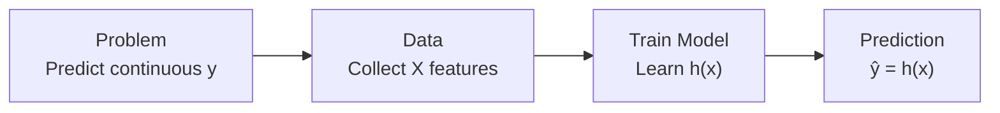
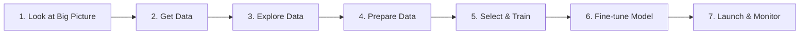
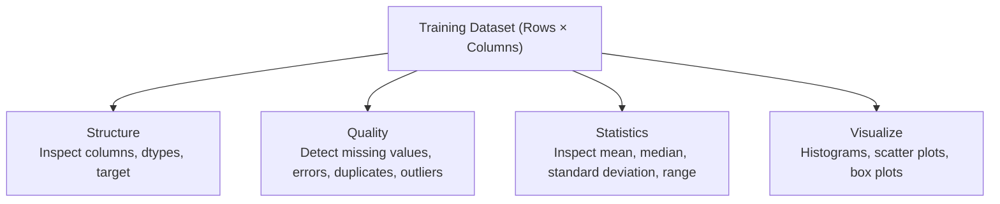
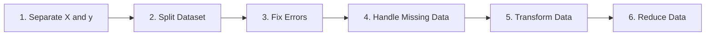
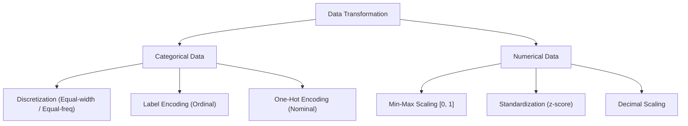

# Topic 1: The Regression Pipeline Part I

## 1.1 Introduction to Regression

Regression is a fundamental category of supervised machine learning where the algorithm learns a mapping function from input features to a continuous numerical target.

> [!info] Definition: Regression
> Regression learns a mathematical mapping function $h(x)$ that maps an input feature vector $\mathbf{X} = [x_1, x_2, \dots, x_n]$ to a continuous, numerical target value $y$:
> $$\mathbf{X} \xrightarrow{h(x)} \hat{y}$$
> Unlike **classification**, where the predicted target is a discrete categorical label (e.g., Spam vs. Not Spam), the output of a **regression** model is quantitative, continuous, and ordered (e.g., price, temperature, duration).



> [!example] Real-World Example: House Price Prediction
> Consider estimating the market value of a residential property:
> - **Input Features ($\mathbf{X}$)**:
>   - House Size: $1,200\text{ sq ft}$
>   - Number of Rooms: $4$
>   - Location Rating: $8 / 10$
>   - Building Age: $10\text{ years}$
> - **Regression Model**: Learns the underlying relationship between $\mathbf{X}$ and $y$.
> - **Output ($\hat{y}$)**: $\text{RM } 420,000$ (a continuous numeric value).

> [!note] Key Point
> Because the output variable is a continuous real number ($\text{RM } 420,000$) rather than a discrete class, this task is framed strictly as a regression problem.

---

## 1.2 The Machine Learning Pipeline for Regression

Building an effective machine learning regression system involves seven systematic stages:



> [!note] Scope of Part I
> Part I concentrates on stages 1 through 4 (the essential data-centric phases prior to model training):
> 1. Looking at the big picture (problem formulation)
> 2. Obtaining the dataset
> 3. Exploratory Data Analysis (EDA)
> 4. Data Preparation & Preprocessing

---

## 1.3 Stage 1: Look at the Big Picture

Before writing code or training algorithms, the problem must be formally framed within the business or operational context:

1. **Understand the Problem**:
   - What specific business objective or task needs to be solved?
   - What decisions will downstream systems or human operators make based on the predicted $\hat{y}$?
2. **Current Solution & Reference Baseline**:
   - How is the problem currently handled (e.g., manual human heuristics, rule-based software)?
   - What is the existing baseline performance against which the ML model will be evaluated?
3. **Frame the Machine Learning Problem**:
   - **Supervision type**: Supervised, Unsupervised, Semi-supervised, or Reinforcement Learning? (Regression is Supervised).
   - **Task type**: Regression (predicting a continuous value) or Classification (predicting a discrete category)?
   - **Learning mode**: Batch learning or Online/incremental learning?

> [!example] Case Study: California Housing Price Prediction
> - **Objective**: Predict district median housing prices based on district-level metrics.
> - **Current Method**: Manual expert appraisal, which is costly, slow, and prone to subjective variance.
> - **Framing**: Supervised learning task; multivariate regression problem; batch offline learning.

---

## 1.4 Stage 2: Get Data

The objective is to acquire or construct a representative dataset that aligns with the target domain and feature requirements.

### Data Acquisition Strategies
- **Creating a Custom Dataset**:
  - *Web Scraping*: Using libraries such as `BeautifulSoup` or `Selenium` to extract unstructured web text.
  - *APIs*: Querying RESTful web services (e.g., weather feeds, financial exchanges).
  - *Manual Collection / IoT*: Field surveys, laboratory sensor measurements, camera feeds.
- **Online Benchmark Repositories**:
  - **Kaggle**: Real-world competitive datasets across domains.
  - **UCI Machine Learning Repository**: Standardized, peer-reviewed academic benchmark datasets.
  - **Google Dataset Search**: Search engine index spanning open government and research repositories.
  - **OpenML**: Collaborative platform hosting datasets, pipelines, and empirical evaluations.

### Code Implementation: Loading & Previewing Data
In the practical scenario (Food Delivery Times dataset), data is imported into a `pandas` DataFrame:

```python
import os
import pandas as pd
import numpy as np
import matplotlib.pyplot as plt

# Load dataset into pandas DataFrame
foodDeliveryTimesDF = pd.read_csv(DATASET_FILE)

# Preview first 5 rows to confirm integrity
foodDeliveryTimesDF.head()
```

| Order_ID | Distance_km | Weather | Traffic | Time | Vehicle | Prep_min | Experience | Delivery_min |
| :--- | :--- | :--- | :--- | :--- | :--- | :--- | :--- | :--- |
| 522 | 7.93 | Windy | Low | Afternoon | Scooter | 12 | 1 | 43 |
| 738 | 16.42 | Clear | Medium | Evening | Bike | 20 | 2 | 84 |
| 741 | 9.52 | Foggy | Low | Night | Scooter | 28 | 1 | 59 |
| 661 | 7.44 | Rainy | Medium | Afternoon | Scooter | 5 | 1 | 37 |
| 412 | 19.03 | Clear | Low | Morning | Bike | 16 | 5 | 68 |

---

## 1.5 Stage 3: Explore Data (EDA)

Exploratory Data Analysis (EDA) allows practitioners to gain deep intuition regarding data distributions, correlations, outliers, and defects before applying transformations.



### 1.5.1 Inspection Code & Diagnostics
```python
# 1. Structural inspection
foodDeliveryTimesDF.head()
foodDeliveryTimesDF.info()

# 2. Numerical summary statistics
foodDeliveryTimesDF.describe()

# 3. Distribution visualization
foodDeliveryTimesDF.hist(bins=50, figsize=(20, 15))
plt.show()

# 4. Categorical inspection
cat_cols = foodDeliveryTimesDF.select_dtypes(include=['object']).columns
for col in cat_cols:
    print(f'{col} categories:')
    display(foodDeliveryTimesDF[col].value_counts(dropna=False))
```

### 1.5.2 Practical Dataset Findings
- **Dimensions**: $1,000$ entries, $9$ feature columns.
- **Feature Partitioning**:
  - *Numerical Features*: `Order_ID`, `Distance_km`, `Preparation_Time_min`, `Courier_Experience_yrs`, `Delivery_Time_min` (Target).
  - *Categorical Features*: `Weather`, `Traffic_Level`, `Time_of_Day`, `Vehicle_Type`.
- **Target Variable**: `Delivery_Time_min` (continuous numeric value, right-skewed tail extending past $120\text{ min}$).
- **Missing Value Audit**:
  - `Weather`: $20$ missing entries ($30$ unrecorded/null).
  - `Traffic_Level`: $24$ missing entries.
  - `Time_of_Day`: $24$ missing entries.
  - `Courier_Experience_yrs`: $22$ missing entries.
  - `Vehicle_Type`: $0$ missing entries.

---

## 1.6 Stage 4: Prepare Data

Data preparation converts raw, imperfect data into clean numerical arrays formatted specifically for mathematical optimization algorithms.

> [!important] Crucial Rule: Avoid Data Leakage
> All preprocessing transformations (imputation medians, standardizer means/standard deviations, and one-hot encoders) must be computed **strictly on the training partition** (`X_train`) and subsequently used to transform both `X_train` and `X_test`. Never fit scalers or imputers on the full dataset prior to splitting.

Data preparation follows six sequential operations:
1. Separate features ($\mathbf{X}$) and target vector ($y$).
2. Split dataset into training and test partitions.
3. Fix data errors and noise.
4. Handle missing observations.
5. Perform feature transformations (scaling, encoding, discretization).
6. Perform data reduction (feature selection, dimensionality reduction).



---

### 1.6.1 Step 4a: Separate Feature Matrix ($\mathbf{X}$) and Target Vector ($y$)

Before applying transformations, isolate the independent variables from the dependent prediction target:

```python
# Feature matrix X: all columns except target
X = foodDeliveryTimesDF.drop('Delivery_Time_min', axis=1)

# Target vector y: target column only
y = foodDeliveryTimesDF['Delivery_Time_min']

print('Shape of X:', X.shape)  # Output: (1000, 8)
print('Shape of y:', y.shape)  # Output: (1000,)
```

---

### 1.6.2 Step 4b: Split Dataset (Train/Test Partitioning)

Splitting guarantees an unbiased evaluation of model generalization on unseen observations.

- **Random Sampling**: Every sample in the population has an equal probability of selection. Suitable for large, balanced datasets.
- **Stratified Sampling**: The population is divided into homogeneous subgroups (strata), and samples are drawn proportionally to preserve subgroup ratios. Recommended when dealing with rare categorical classes or skewed key predictors.

```python
from sklearn.model_selection import train_test_split

X_train, X_test, y_train, y_test = train_test_split(
    X, y, test_size=0.2, random_state=30
)

# Shapes:
# X_train: (800, 8), X_test: (200, 8)
# y_train: (800,),    y_test: (200,)
```

#### Feature Type Partitioning
Because numerical and categorical variables require fundamentally distinct mathematical pipelines, `X_train` is partitioned by data type:

```python
# Identify numerical vs categorical columns
numerical_cols = X_train.select_dtypes(include=['int64', 'float64']).columns
categorical_cols = X_train.select_dtypes(include=['object']).columns

X_train_num = X_train[numerical_cols]  # Shape: (800, 4)
X_train_cat = X_train[categorical_cols]  # Shape: (800, 4)
```

---

### 1.6.3 Steps 4c & 4d: Fix Errors and Handle Missing Values

Missing values occur due to sensor drops, unrecorded surveys, or transmission errors.

#### Common Missing Value Handling Strategies
1. **Drop Records (Listwise Deletion)**: Discard rows containing nulls. Only acceptable if missingness is completely random and affects $< 2-3\%$ of total rows.
2. **Global Constant**: Impute with fixed sentinel (e.g., `-999` or `"Unknown"`).
3. **Measures of Central Tendency**:
   - **Median**: Preferred for numerical features due to robustness against extreme outliers and skewed distributions.
   - **Mean**: Suitable for symmetric, normally distributed numerical data without outliers.
   - **Mode (Most Frequent)**: The standard imputation technique for categorical features.
4. **Model-Based Imputation**: Impute using $k$-Nearest Neighbors ($k$-NN) or iterative regression from correlated features.

#### Imputation Implementation
```python
X_train_num_tr = X_train_num.copy()
X_train_cat_tr = X_train_cat.copy()

# Numerical: fill missing values using training median
numeric_medians = X_train_num_tr.median(numeric_only=True)
X_train_num_tr = X_train_num_tr.fillna(numeric_medians)

# Categorical: fill missing values using training mode
categorical_modes = {}
for col in X_train_cat_tr.columns:
    categorical_modes[col] = X_train_cat_tr[col].mode(dropna=True)[0]
    X_train_cat_tr[col] = X_train_cat_tr[col].fillna(categorical_modes[col])
```

> [!example] Imputation Walkthrough
> - **Numerical Example (`Distance_km`)**:
>   - Values: $[2.5, 4.0, \text{Missing}, 6.0, 8.5]$
>   - Sorted available: $[2.5, 4.0, 6.0, 8.5]$
>   - Median: $\frac{4.0 + 6.0}{2} = 5.0$
>   - Imputed value: $5.0$
> - **Categorical Example (`Weather`)**:
>   - Values: $[\text{Sunny}, \text{Rainy}, \text{Sunny}, \text{Missing}, \text{Cloudy}, \text{Sunny}]$
>   - Frequencies: $\text{Sunny} = 3$, $\text{Rainy} = 1$, $\text{Cloudy} = 1$
>   - Mode: $\text{Sunny}$
>   - Imputed value: $\text{Sunny}$

---

### 1.6.4 Step 4e: Perform Data Transformation

Transformation standardizes feature scales and formats categorical labels into numerical matrices.



#### 1. Data Discretization (Binning)
Discretization maps continuous numerical variables into discrete intervals/categories (e.g., Low, Medium, High).
- **Motivations**: Converts regression targets into classification labels, smooths noisy continuous distributions, and simplifies business interpretability.
- **Methods**:
  1. **Equal-Distance (Equal-Width) Partitioning**: Divides the continuous range into intervals of identical length:
     $$\text{Bin Width} = \frac{X_{\max} - X_{\min}}{k}$$
     where $k$ is the number of target bins.
  2. **Equal-Frequency Partitioning**: Sorts values and divides them so each bin contains approximately the same count of samples:
     $$\text{Samples per Bin} = \frac{N}{k}$$

> [!example] Discretization Numerical Example
> Given values: $[18, 20, 25, 30, 38, 45, 60, 75, 90]$, $N = 9$, $k = 3$ bins:
> - **Equal-Distance**:
>   - $\text{Bin Width} = \frac{90 - 18}{3} = 24$
>   - Low: $[18, 42]$ $\to \{18, 20, 25, 30, 38\}$
>   - Medium: $[43, 66]$ $\to \{45, 60\}$
>   - High: $[67, 90]$ $\to \{75, 90\}$
> - **Equal-Frequency**:
>   - $\text{Samples per Bin} = \frac{9}{3} = 3\text{ items}$
>   - Low: $\{18, 20, 25\}$
>   - Medium: $\{30, 38, 45\}$
>   - High: $\{60, 75, 90\}$

#### 2. Categorical Encoding
Machine learning models compute dot products and cost functions over real numbers, requiring text categories to be encoded numerically.
- **Label Encoding**: Assigns an integer $0, 1, \dots, C-1$ to each unique category.
  - *Applicability*: **Ordinal data** where categories have a natural sequence or rank (e.g., $\text{Low} \to 0, \text{Medium} \to 1, \text{High} \to 2$).
  - *Caution*: Avoid using on nominal data (e.g., colors or cities), as the algorithm will misinterpret arbitrary integers as ranked magnitudes.
- **One-Hot Encoding**: Generates an independent binary indicator column ($0$ or $1$) for each unique category.
  - *Applicability*: **Nominal data** without intrinsic order (e.g., Weather: Clear, Rainy, Foggy, Snowy, Windy).
  - *Example*: For 5 categories: $\text{Clear} = [1, 0, 0, 0, 0]$, $\text{Rainy} = [0, 1, 0, 0, 0]$.

```python
from sklearn.preprocessing import OneHotEncoder

# Initialize OneHotEncoder
try:
    ohe = OneHotEncoder(handle_unknown='ignore', sparse_output=False)
except TypeError:
    ohe = OneHotEncoder(handle_unknown='ignore', sparse=False)

# Fit and transform training categorical data
X_train_cat_tr = ohe.fit_transform(X_train_cat_tr)

# Finalize training matrix: merge numerical and one-hot categorical features
X_train_tr = np.hstack([X_train_num_tr, X_train_cat_tr])
y_train = y_train.to_numpy() if hasattr(y_train, 'to_numpy') else np.asarray(y_train)

print('X_train_tr shape:', X_train_tr.shape)
print('y_train shape:', y_train.shape)
```

#### 3. Feature Scaling
When numerical attributes possess wildly differing magnitudes (e.g., House Size in thousands of sq ft vs. Number of Rooms between 1 and 5), features with large values dominate gradient updates and distance calculations.
- **Algorithms Requiring Feature Scaling**: $k$-Nearest Neighbors ($k$-NN), Support Vector Machines (SVM), Principal Component Analysis (PCA), Gradient Descent-based Linear/Logistic Regression, and Neural Networks.
- **Algorithms Invariant to Feature Scaling**: Decision Trees, Random Forests, and Gradient Boosted Trees (XGBoost/LightGBM).

| Scaling Technique | Formula | Output Range | Outlier Sensitivity |
| :--- | :--- | :--- | :--- |
| **Min-Max Scaling (Normalization)** | $X_i' = \frac{X_i - X_{\min}}{X_{\max} - X_{\min}}$ | $[0, 1]$ (or custom) | High (compressed by extreme outliers) |
| **Standardization ($Z$-Score)** | $z = \frac{x - \mu}{\sigma}$ | $\mu = 0, \sigma = 1$ (unbounded) | Moderate / Robust |
| **Decimal Scaling** | $x' = \frac{x}{10^j}$ where $\max(\|x'\|) < 1$ | $(-1, 1)$ | High |

##### Detailed Scaling Calculations:
1. **Min-Max Normalization**:
   $$X_i' = \frac{X_i - X_{\min}}{X_{\max} - X_{\min}}$$
   - *Example*: Data points $[2, 5, 8, 11, 14]$. $X_{\min} = 2, X_{\max} = 14$.
   - For $X = 8$:
     $$X' = \frac{8 - 2}{14 - 2} = \frac{6}{12} = 0.50$$
   - Scaled array: $[0.00, 0.25, 0.50, 0.75, 1.00]$.

2. **Standardization ($Z$-score Normalization)**:
   $$z = \frac{x - \mu}{\sigma}, \quad \text{where } \mu = \frac{1}{N}\sum_{i=1}^N x_i, \quad \sigma = \sqrt{\frac{1}{N}\sum_{i=1}^N (x_i - \mu)^2}$$
   - *Example*: Data points $[2, 5, 8, 11, 14]$.
   - Mean: $\mu = \frac{2 + 5 + 8 + 11 + 14}{5} = 8$
   - Standard Deviation: $\sigma = \sqrt{\frac{(-6)^2 + (-3)^2 + 0^2 + 3^2 + 6^2}{5}} = \sqrt{\frac{90}{5}} = \sqrt{18} \approx 4.2426$
   - For $x = 11$:
     $$z = \frac{11 - 8}{4.2426} = \frac{3}{4.2426} \approx 0.71$$
   - Standardized array: $[-1.41, -0.71, 0.00, 0.71, 1.41]$.

```python
from sklearn.preprocessing import StandardScaler

scaler = StandardScaler()
X_train_num_tr = scaler.fit_transform(X_train_num_tr)

print('Mean of columns:', X_train_num_tr.mean(axis=0))  # Near 0
print('Std of columns:', X_train_num_tr.std(axis=0))   # Exactly 1
```

3. **Decimal Scaling**:
   $$x' = \frac{x}{10^j}$$
   where $j$ is the smallest integer such that $\max(|x'|) < 1$.
   - *Example*: Data points $[2, 5, 8, 11, 14]$. $\max(|x|) = 14$.
   - If $j = 1 \implies \frac{14}{10} = 1.4 \not< 1$.
   - If $j = 2 \implies \frac{14}{100} = 0.14 < 1 \implies j = 2$.
   - Divide all values by $10^2 = 100$:
     $$[0.02, 0.05, 0.08, 0.11, 0.14]$$

---

### 1.6.5 Step 4f: Data Reduction Methods

Data reduction compresses the representation of the data while preserving its essential discriminatory information:

1. **Dimensionality Reduction**: Projects high-dimensional feature spaces into a smaller subspace (e.g., PCA reducing 50 correlated features into 5 principal components).
2. **Feature Selection**: Identifies and retains the most relevant features while removing uninformative, redundant, or noisy attributes (e.g., dropping unique record keys like `Order_ID`).
3. **Numerosity Reduction**: Replaces full data volumes with smaller alternative representations (e.g., random subsampling $1,000$ representative rows from $10,000$).
4. **Data Compression**: Lossless or lossy transformation storing data in compact binary representations.
5. **Discretization / Binning**: Reduces cardinality by replacing continuous spectra with small sets of interval tokens (e.g., Low, Medium, High).
6. **Aggregation**: Aggregates fine-grained transactional records into summarized higher-level metrics (e.g., hourly readings $\to$ daily average).

---

## 1.7 Practical Exercises & Solutions

### Exercise Q1: Missing Value Imputation
> [!example] Problem
> Fill the missing `Distance_km` using the **median** and the missing `Weather` using the **mode**:
> 
> | Order | Distance_km | Weather |
> | :--- | :--- | :--- |
> | 1 | 3 | Clear |
> | 2 | 5 | Rainy |
> | 3 | Missing | Clear |
> | 4 | 7 | Cloudy |
> | 5 | 9 | Missing |

> [!tip] Solution
> 1. **Numerical Imputation (`Distance_km`)**:
>    - Available sorted values: $[3, 5, 7, 9]$
>    - $\text{Median} = \frac{5 + 7}{2} = 6.0$
>    - Imputed `Distance_km`: **6.0**
> 2. **Categorical Imputation (`Weather`)**:
>    - Frequencies: $\text{Clear} = 2$, $\text{Rainy} = 1$, $\text{Cloudy} = 1$
>    - $\text{Mode} = \text{Clear}$
>    - Imputed `Weather`: **Clear**

---

### Exercise Q2: Equal-Distance Discretization
> [!example] Problem
> Given `Delivery_Time_min` values: $[18, 20, 25, 30, 38, 45, 60, 75, 90]$.
> Discretize into 3 equal-distance bins labeled **Low**, **Medium**, and **High**.

> [!tip] Solution
> - $X_{\min} = 18, X_{\max} = 90, k = 3$
> - $\text{Bin Width} = \frac{90 - 18}{3} = \frac{72}{3} = 24$
> - **Intervals**:
>   - **Low**: $[18, 18 + 24] = [18, 42] \implies \{18, 20, 25, 30, 38\}$
>   - **Medium**: $[43, 42 + 24] = [43, 66] \implies \{45, 60\}$
>   - **High**: $[67, 66 + 24] = [67, 90] \implies \{75, 90\}$

---

### Exercise Q3: Equal-Frequency Discretization
> [!example] Problem
> Using the same values: $[18, 20, 25, 30, 38, 45, 60, 75, 90]$ ($N = 9$), divide into 3 equal-frequency categories.

> [!tip] Solution
> - $\text{Samples per Bin} = \frac{9}{3} = 3\text{ samples}$
> - **Categories**:
>   - **Low**: $\{18, 20, 25\}$
>   - **Medium**: $\{30, 38, 45\}$
>   - **High**: $\{60, 75, 90\}$

---

### Exercise Q4: Min-Max Scaling
> [!example] Problem
> Given `Distance_km` values: $[2, 5, 8, 11, 14]$. Use Min-Max Scaling to transform the value $X = 8$.

> [!tip] Solution
> $$X' = \frac{X - X_{\min}}{X_{\max} - X_{\min}} = \frac{8 - 2}{14 - 2} = \frac{6}{12} = 0.50$$

---

### Exercise Q5: Standardization
> [!example] Problem
> Standardize all values in the set $[2, 5, 8, 11, 14]$.

> [!tip] Solution
> 1. $\mu = \frac{2 + 5 + 8 + 11 + 14}{5} = 8$
> 2. $\sigma = \sqrt{\frac{(2-8)^2 + (5-8)^2 + (8-8)^2 + (11-8)^2 + (14-8)^2}{5}} = \sqrt{\frac{36 + 9 + 0 + 9 + 36}{5}} = \sqrt{\frac{90}{5}} = \sqrt{18} \approx 4.24$
> 3. Compute $z = \frac{x - \mu}{\sigma}$:
>    - $x = 2: z = \frac{2 - 8}{4.24} = -1.41$
>    - $x = 5: z = \frac{5 - 8}{4.24} = -0.71$
>    - $x = 8: z = \frac{8 - 8}{4.24} = 0.00$
>    - $x = 11: z = \frac{11 - 8}{4.24} = +0.71$
>    - $x = 14: z = \frac{14 - 8}{4.24} = +1.41$
>    - **Result**: $[-1.41, -0.71, 0.00, 0.71, 1.41]$

---

### Exercise Q6: Decimal Scaling
> [!example] Problem
> Perform decimal scaling on the values $[2, 5, 8, 11, 14]$.

> [!tip] Solution
> - Maximum absolute value: $|14| = 14$
> - Find smallest integer $j$ such that $\frac{14}{10^j} < 1$:
>   - $j = 1 \implies 1.4 \not< 1$
>   - $j = 2 \implies 0.14 < 1 \implies j = 2$
> - Divide each value by $10^2 = 100$:
>   - **Scaled Values**: $[0.02, 0.05, 0.08, 0.11, 0.14]$
